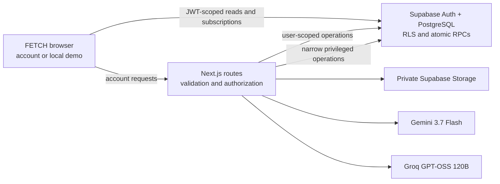
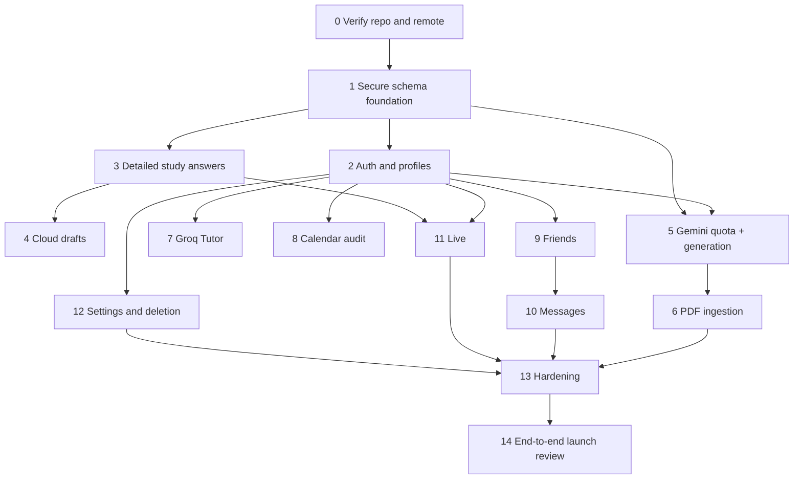

# FETCH Backend 2.0 — Production Architecture and Implementation Plan

**Planning only.** I inspected the current `main` checkout and made no repository changes. The local working tree was clean. Baseline verification passed: **32 unit tests** and **TypeScript typecheck**. I did not verify the linked Supabase project, configured credentials, or live provider calls; those are explicit Phase 0 checks.

## 1. Executive backend assessment

FETCH already has a useful backend foundation. Keep its Next.js App Router structure, Supabase SSR clients, owner-scoped StudyPack and Calendar reads, private source and answer tables, server-side attempt scoring, Tutor history, and the clear separation between account data and browser-local demo data.

The largest production gaps are:

1. **Generation can bypass its future quota.** The authenticated `create_study_pack` RPC currently accepts arbitrary caller-supplied questions. A user can call it directly, without AI generation or accounting.
2. **Generation can incur unauthenticated AI cost.** `/api/generate` selects the provider before it decides whether the request has an account.
3. **Study answers are not persisted individually.** `study_sessions` stores only summary counts.
4. **Attempt idempotency is incomplete.** A reused `clientAttemptId` can return an existing attempt while echoing a different requested `packId`; concurrent identical calls can still race to the unique constraint.
5. **Social schema permissions are unsafe for launch.** Authenticated users can create a conversation and insert themselves into an arbitrary conversation; all authenticated users can read Live room rows.
6. **Account draft keys use the literal scope `account`.** Drafts on a shared browser are not separated by user ID.
7. **Auth is incomplete.** Email flows exist, Google OAuth does not; signup is intentionally gated pending approved Terms and Privacy documents.
8. **PDF, Friends, Messages, and Live are UI previews.** Their tables provide a starting point, but the production workflows do not exist.

The correct direction is **incremental hardening on Supabase PostgreSQL**, with Next.js as the trusted application boundary for provider calls and privileged operations. Preserve the visual design and connect each existing surface as its backend becomes real.

The repository’s `PRODUCT.md` still says **10** monthly AI StudyPacks and OpenAI. This brief supersedes those points: **Free = 15 successful AI StudyPacks per UTC calendar month**, Gemini 3.7 Flash for generation, Groq GPT-OSS 120B for Tutor. Retain the existing **3–20 questions** bound.

## 2. Verified current inventory

| State | Verified features |
|---|---|
| **Working in code** | Supabase SSR clients and cookie refresh; email/password login path; password recovery UI; account workspace reads; private StudyPack source and answer tables; server-side grading RPC; summary attempt persistence; account Calendar CRUD; browser-local demo; browser-local quiz draft recovery; OpenAI generation and Tutor adapters when configured; deterministic development fixture; Vitest and Playwright setup. |
| **Partial** | Signup and callback profile provisioning; email confirmation configuration; attempt idempotency; source grounding; Tutor rate limiting and conversation history; account Settings; Progress analytics; protected account UX. |
| **Scaffolded** | `friend_requests`, `conversations`, `conversation_members`, `messages`, `live_rooms`; Friends, Messages, and Live screens. Existing social grants and policies are **not** suitable to expose as production features. |
| **Missing** | Google OAuth; per-answer history; cloud quiz drafts; Gemini and Groq adapters; generation quota and idempotency; PDF Storage and extraction; real friends, direct messaging, Live game state and scoring; full account export and deletion; production integration and RLS tests. |

Key evidence: [schema](<C:/Users/LEGION/Documents/FETCH 2.0/supabase/schemas/core.sql>), [generation route](<C:/Users/LEGION/Documents/FETCH 2.0/src/app/api/generate/route.ts>), [StudyPack adapter](<C:/Users/LEGION/Documents/FETCH 2.0/src/lib/ai/study-pack.ts>), [Tutor route](<C:/Users/LEGION/Documents/FETCH 2.0/src/app/api/tutor/route.ts>), [attempt route](<C:/Users/LEGION/Documents/FETCH 2.0/src/app/api/study-packs/[packId]/attempts/route.ts>), and [feature availability contract](<C:/Users/LEGION/Documents/FETCH 2.0/src/lib/feature-availability.ts>).

The project overview describes a development migration as applied, but that is documentation evidence only. Phase 0 must compare **actual remote migration history and schema** before further migration work.

## 3. Target system and trust boundaries

- **Browser:** untrusted inputs, local demo state, immediate local draft recovery. It never supplies an authoritative score, quota balance, owner ID, or AI output to persistence.
- **Next.js:** validates request bodies, resolves the authenticated user, calls Gemini/Groq, enforces request and provider limits, and maps errors to stable codes.
- **PostgreSQL:** owns identity relationships, RLS, invariants, attempt scoring, quota reservation, idempotency, friendship transitions, and Live scoring.
- **Private schema:** source text, answer keys, Tutor history, usage records, and internal configuration.
- **Storage:** private PDF objects only. A URL is never public merely because its path is known.
- **Realtime:** notification and synchronization transport. Database rows and authorization remain authoritative.

A **server-only Supabase privileged key** is justified for AI pack finalization and Auth-user deletion because a public RPC that accepts generated content would bypass quota. Keep it in one isolated server module, never in `NEXT_PUBLIC_`, and never use it for ordinary account reads. The privileged finalization function must check a verified owner ID, reservation token, request hash, and state before writing.

## 4. Database architecture

### Preserve and modify

| Existing table | Plan |
|---|---|
| `public.profiles` | Keep identity model. Limit general reads; expose a narrow discovery result instead of the whole table. Preserve unique username. Add no speculative columns. |
| `public.study_packs` | Keep metadata. Add `archived_at` and optional `source_document_id`; treat ready packs and questions as immutable. |
| `public.questions` | Keep public-to-owner prompts and choices; forbid client writes. |
| `private.study_sources`, `private.question_keys` | Preserve private location and owner checks. Store normalized PDF text in sources; never put keys in exposed tables. |
| `public.study_sessions` | Keep completed summary; require non-null client attempt ID for new account attempts, add request hash, and make completion transactionally idempotent. |
| `public.calendar_events` | Preserve; audit date/time consistency and linked-pack behavior. |
| `private.tutor_*` | Preserve history and rate-bucket concept; adapt limit configuration and Groq provider. |
| `public.friend_requests` | Tighten state transitions; represent one unordered pair uniquely. |
| `public.conversations`, `conversation_members`, `messages` | Lock direct membership creation behind atomic server operations. Add a direct-pair uniqueness key and message client ID. |
| `public.live_rooms` | Replace broad read/create access with membership-scoped lifecycle operations. Add expiration and state version. |

### Add only for required behavior

| New table | Core keys and constraints |
|---|---|
| `public.study_session_answers` | `(session_id, question_id)` unique; user/pack ownership derived through session; submitted text, correctness, answered time, ordinal. No answer key copy. |
| `public.study_session_drafts` | Unique `(user_id, pack_id)`; validated answer JSON, current position, revision, updated/expiry time; no answer keys. |
| `private.generation_requests` | Unique `(owner_id, request_id)`; payload hash, UTC month key, state, lease/fencing token, pack ID, timestamps, failure class. |
| `private.monthly_ai_usage` | Primary key `(owner_id, month_key)`; reserved and committed counts, nonnegative checks. |
| `private.account_entitlement_overrides` | Optional allowance override and effective dates. Default Free allowance is 15; no payments or tier billing. |
| `private.source_documents` | Owner, storage path, size, hash, extraction status, linked pack, cleanup state. |
| `public.friendships` | One canonical unordered user pair, unique constraint, creation time. |
| `public.user_blocks` | Blocker/blockee unique pair, no self-block. Include only if the UI provides blocking in this milestone; otherwise implement equivalent safety before messaging launch. |
| `public.live_room_members` | Unique room/user, role, join/leave state, score derived by server. |
| `public.live_room_questions` | Room position, immutable question reference or snapshot, reveal/close times. Never expose correct answers during play. |
| `public.live_answers` | Unique `(room_id, question_position, user_id)`, submitted text, correctness, server points/time. |
| `private.account_preferences` | Only current settings: discoverability, messaging permission, notification choices if the UI actually exposes them. |

Use indexes for owner+created time, pack+position, user+completed time, request owner+month, discovery username, request recipient+status, friendship pair, message conversation+created+ID, and Live room+state. Add indexes with each feature, based on its real queries.

**Historical integrity:** ready StudyPacks are immutable. Normal “remove” means archive, preserving questions and attempts for Progress. A separately confirmed permanent deletion may remove the pack and its historical analytics; account deletion removes all owned data. This avoids unnecessary question snapshots now. If editing ready packs is later introduced, version questions before enabling it.

## 5. Data classification

| Class | Data | Allowed access |
|---|---|---|
| Profile discoverable | User ID, username, chosen display name, approved avatar | Controlled, bounded discovery endpoint; friends/conversation peers. |
| Account private | Preferences, calendar, drafts, usage balance, export | Owner and trusted server operations. |
| Study private | Source text/PDF, questions, answer submissions, scores, keys | Owner; keys only through controlled grading/review, never direct table access. |
| Social shared | Requests, friendship, direct messages, Live room data | Only relevant participants, with blocking/privacy rules. |
| Security sensitive | API keys, service key, reservation tokens, Auth data, internal rate buckets | Server/private database only; never client bundles or logs. |

## 6. Auth, study, AI, PDF, quota, social, and Realtime decisions

**Auth.** Continue using one Supabase Auth user ID and one profile row for both password and Google identities. Provision the minimal profile via a carefully scoped `auth.users` trigger with `ON CONFLICT DO NOTHING`; follow with a server-side `ensure_profile` path for existing users and metadata conflict repair. Do not use editable user metadata for authorization. Let users choose a unique username after OAuth if none is available. Preserve the public signup gate until approved Terms and Privacy documents exist. The current `?test_signup=1` path is a development convenience, not a production access-control boundary; remove or server-gate it before launch. Use exact redirect allowlists and handle missing/expired callback codes. Supabase documents PKCE cookie flows and Google setup for SSR applications. [SSR Auth](https://supabase.com/docs/guides/auth/server-side/advanced-guide), [Google Auth](https://supabase.com/docs/guides/auth/social-login/auth-google).

**Study and grading.** A submitted account answer is graded once server-side and locked for that attempt. Return immediate feedback for that answered question, but never expose a general answer-key lookup. Completing the attempt atomically inserts every answer, derives score from those rows, and returns the persisted result. Use exact normalized match initially; do not add paid AI grading. Progress derives from persisted answers and summaries. Smart Review may use missed-question counts later; do not claim topic intelligence now.

**Gemini.** Replace the current OpenAI generation adapter behind a small `StudyPackGenerator` interface. `GEMINI_STUDYPACK_MODEL=gemini-3.7-flash`; the model supports structured outputs. Validate the returned schema, count, unique prompts/options, answer-in-options, and source quotations. Normalize Unicode spaces and repeated whitespace for quote matching; allow only narrowly defined punctuation folding. Reject unsupported quotes and perform at most one bounded repair/regeneration, then fail without persisting or charging quota. A matching quote is evidence of quotation presence, **not proof that the whole answer follows from it**; contract tests and manual educational review must check semantic grounding. [Gemini model](https://ai.google.dev/gemini-api/docs/models/gemini-3.7-flash).

**Quota and idempotency.** One unit means **one validated, persisted, ready AI-generated StudyPack**. Demo fixtures, failed calls, failed validation, and unsaved results consume zero. The month key is `YYYY-MM` in **UTC**, fixed at reservation time; no reset job. For each `(owner_id, request_id)`, reject a changed payload hash, return an existing completed pack, or report an in-progress request. The reservation transaction locks the owner/month usage row, expires stale reservations, and increments reserved only if `committed + reserved < allowance`. Gemini runs outside the transaction. Final persistence, request completion, reserved decrement, and committed increment happen **in one transaction**, guarded by a fencing token. Failure releases reservation. A lost response returns the same pack. Stale workers cannot commit after their lease has been replaced.

**PDF.** Choose **server-side text extraction first**, then reuse the text generation and quote verifier. It gives independent grounding, predictable privacy behavior, and one generation pipeline. Start with 10 MiB, 25 pages, 20,000 extracted characters, and explicit rejection of encrypted, malformed, oversized, image-only, or insufficient-text PDFs. Do not silently truncate a learner’s document. A later opt-in scanned-PDF path may use native Gemini PDF understanding only after it has an independently verifiable extraction/citation strategy. Gemini supports native PDF input, but that alone does not satisfy the requested independent grounding check. [Gemini document processing](https://ai.google.dev/gemini-api/docs/document-processing). Validate magic bytes and MIME server-side, use a private bucket, owner-scoped object paths, bounded parser resources, and cleanup for orphan uploads.

**URL/video.** Keep Link labeled unfinished and schedule it immediately after PDF as a separate follow-up milestone. Do not mix an SSRF-safe fetcher into the PDF release. A future URL route must restrict to HTTPS, reject redirects to private/loopback/link-local/metadata addresses, re-resolve DNS on redirects, cap bytes/time/content types, and reject unsupported hosts. Video transcript ingestion remains separate.

**Tutor.** Keep the route’s ownership check, private source retrieval, streaming UX, history, timeout, and the existing **10 requests per fixed 10-minute bucket** as the initial abuse limit. Move the limit value to private configuration so it can change without schema redesign. Replace only the provider adapter with Groq `openai/gpt-oss-120b`; cap input history and output, and persist only a completed exchange. Provider failures return a stable error and do not save a partial reply. The model and streaming API are documented by Groq. [Groq model](https://console.groq.com/docs/model/openai/gpt-oss-120b), [streaming](https://console.groq.com/docs/text-chat).

**Friends and Messages.** Discovery returns only narrow profile fields for exact/prefix username searches, with result and request limits. Request acceptance atomically creates one canonical friendship. Direct conversation creation is allowed only for current friends, produces exactly two immutable members, and returns an existing pair conversation if present. Sending checks friendship/block status in addition to membership. Messages are paginated by `(created_at, id)` and deduplicated by sender/client ID. Realtime subscribers refetch on reconnect and use event IDs to suppress duplicates.

**Live.** A host selects an owned ready pack, creates an unguessable server-generated code, and admits at most 12 authenticated participants. Lobby, active, complete, expired are explicit states. Host disconnect does not erase the room; state persists until expiry. A reconnect reuses the same membership. Start snapshots the playable question order; the server owns timing and advances state. A submission references only room/question and answer; scoring happens in one database transaction with a unique answer constraint. No client score mutation exists. Realtime updates lobby, current question, and leaderboard after commits. Use private authorized channels or tightly scoped Postgres changes; subscription permission must be tested separately from row RLS. [Supabase Realtime authorization](https://supabase.com/docs/guides/realtime/broadcast).

## 7. RLS matrix

`—` means no direct client grant; controlled RPC or trusted server operation only. Every exposed table must have RLS enabled and explicit grants, since Supabase’s Data API exposure defaults are changing. [Supabase changelog](https://supabase.com/changelog?types=breaking-change).

| Table | SELECT | INSERT | UPDATE | DELETE |
|---|---|---|---|---|
| `profiles` | Self; peer fields via narrow discovery API | Provisioning only | Self, allowed editable fields | Auth deletion only |
| `study_packs` | Owner | Trusted finalization | Trusted status/archive | Confirmed deletion only |
| `questions` | Pack owner | Trusted finalization | — | Pack deletion only |
| `private.study_sources` | Narrow owner RPC | Trusted finalization | — | Pack/account deletion |
| `private.question_keys` | Grading/review function only | Trusted finalization | — | Pack/account deletion |
| `study_sessions` | Owner | Completion RPC | — | Account deletion |
| `study_session_answers` | Owner | Completion RPC | — | Account deletion |
| `study_session_drafts` | Owner | Owner with validated API | Owner with revision check | Owner |
| `calendar_events` | Owner | Owner, owned linked pack | Owner, immutable user ID | Owner |
| `private.generation_requests` | Trusted API status only | Reservation RPC | State-transition RPC | Retention cleanup |
| `private.monthly_ai_usage` | Trusted balance API only | Reservation RPC | Reservation/finalization RPC | Retention cleanup |
| `private.account_entitlement_overrides` | Trusted entitlement API only | Admin only | Admin only | Admin only |
| `private.source_documents` | Owner via API | Upload API | Processing API | Cleanup/account deletion |
| `private.tutor_conversations/messages/rate_limits` | Owner through narrow RPC | Tutor RPC | Tutor RPC where needed | Owner deletion/retention |
| `friend_requests` | Sender/recipient | Sender via RPC | Recipient transition via RPC | Sender cancel/recipient decline via RPC |
| `friendships` | Either member | Acceptance RPC | — | Member removal RPC |
| `user_blocks` | Blocker | Blocker | — | Blocker |
| `conversations` | Both members | Direct-pair RPC | — | Controlled cleanup |
| `conversation_members` | Members | Direct-pair RPC | — | Controlled cleanup |
| `messages` | Current authorized member | Send RPC as self | — | Sender delete only if product supports it |
| `live_rooms` | Host/member; join lookup through narrow API | Host-create RPC | Host/game RPC | Expiry/account cleanup |
| `live_room_members` | Room members | Join RPC | Controlled leave/score RPC | Cleanup |
| `live_room_questions` | Room members, without keys | Start RPC | Game transition RPC | Cleanup |
| `live_answers` | Own answer; aggregate scores to room | Submit-and-grade RPC | — | Cleanup |
| `private.account_preferences` | Owner | Provisioning/owner API | Owner | Account deletion |
| `storage.objects` PDF bucket | Owner-scoped authenticated access | Owner path, PDF bucket only | — | Owner or cleanup service |

The present `profiles_read_authenticated`, `conversations_create`, `members_join_self`, and `rooms_read_authenticated` policies need replacement before those surfaces launch. A `SECURITY DEFINER` function must pin `search_path`, explicitly verify identity and object relationships, and have its `EXECUTE` grants audited. Private helper functions must not be callable by ordinary clients merely because they live outside the exposed schema.

## 8. API and RPC inventory

| Route / RPC | Action | Auth; limit | Main errors |
|---|---|---|---|
| `GET /api/workspace` | Change: paginate packs/attempts, stop unbounded fetch | Account; read limit | `AUTH_REQUIRED`, `STORAGE_UNAVAILABLE` |
| `POST /api/generate` | Change: authenticated Gemini flow with request ID | Account; 15/month plus short-window abuse limit | `INVALID_SOURCE`, `QUOTA_EXCEEDED`, `REQUEST_IN_PROGRESS`, `GENERATION_FAILED` |
| `POST /api/study-packs/:id/answer` | Change: bound to draft/attempt; one locked answer | Owner; per-question | `PACK_NOT_FOUND`, `ANSWER_ALREADY_SUBMITTED` |
| `POST /api/study-packs/:id/attempts` | Change: atomic detailed answers and idempotency | Owner; client attempt ID required | `ATTEMPT_CONFLICT`, `PACK_NOT_FOUND` |
| `GET/POST /api/calendar-events` | Preserve/harden | Account; bounded list/write | `INVALID_EVENT`, `PERMISSION_DENIED` |
| `PATCH/DELETE /api/calendar-events/:id` | Preserve/harden | Owner | `EVENT_NOT_FOUND` |
| `GET/POST /api/tutor` | Change provider to Groq; keep history/stream | Account; 10/10 min initially | `TUTOR_LIMIT`, `PROVIDER_UNAVAILABLE` |
| `GET/PUT/DELETE /api/study-drafts/:packId` | New cloud draft and revision contract | Owner; debounce writes | `DRAFT_CONFLICT`, `PACK_NOT_FOUND` |
| `POST /api/pdf-uploads`; `POST /api/pdf-uploads/:id/generate` | New private upload, extract, generate | Account; size/page and generation limits | `UPLOAD_INVALID`, `PDF_UNREADABLE`, `QUOTA_EXCEEDED` |
| `GET /api/ai-usage` | New authoritative allowance display | Account | `AUTH_REQUIRED` |
| `GET /api/people`; `GET/POST/PATCH/DELETE /api/friends...` | New controlled discovery/request/friend flows | Account; discovery/request buckets | `USER_NOT_FOUND`, `REQUEST_CONFLICT`, `BLOCKED` |
| `GET/POST /api/conversations`; `GET/POST /api/conversations/:id/messages` | New direct messages, cursor paging | Member; send bucket | `CONVERSATION_NOT_FOUND`, `PERMISSION_DENIED` |
| `POST /api/live/rooms`; `POST /api/live/join`; room start/advance/answer routes | New Live lifecycle | Authenticated host/member; creation/join buckets | `ROOM_NOT_FOUND`, `ROOM_FULL`, `ROOM_STATE_CONFLICT` |
| `GET/PATCH /api/account/profile`; `GET /api/account/export`; deletion flow | New real Settings | Account; recent auth for deletion | `USERNAME_TAKEN`, `EXPORT_FAILED`, `REAUTH_REQUIRED` |
| Existing `public.create_study_pack`, `grade_study_answer`, `complete_study_attempt` | Replace/revoke unsafe signatures in staged migration | Narrow grants only | Stable mapped errors |

Every API error should return `{ code, message, requestId }`; the message is safe for users, while logs contain provider/database error class and request ID, never source text or secrets.

## 9. State, observability, tests, migration, and risks

**State and idempotency:** Generation is `reserved → processing → committed | released | expired`; account attempt is `draft → submitted`, with an immutable completion ID; Live is `lobby → active → complete | expired`. Only database transactions advance authoritative state. Client retries carry the same ID. Realtime events carry IDs/versions and prompt a database refresh after reconnect.

**Observability:** Log request ID, user hash or internal ID, operation, provider/model, latency, token/usage counts if available, quota transition, error code, and retry count. Never log submitted notes, PDFs, answers, Tutor messages, credentials, or full SQL errors. Track failed orphan cleanup and aged reservations. Start with structured application logs and Supabase diagnostics; no paid monitoring dependency.

**Test architecture:** Keep Vitest and Playwright. Add a local Supabase integration suite that applies migrations to a disposable project and exercises RLS as owner, stranger, friend, member, and non-member. Test atomic races with parallel calls, not mocks. Mock provider adapters in CI and run optional, manually invoked live Gemini/Groq contract checks. E2E must cover password and Google auth, paste and PDF StudyPacks, quota, cross-browser draft recovery, detailed attempt history, two-user social/messaging, a third-user denial, and two-user Live/reconnect/score tampering.

**Migration strategy:** The declarative source is `supabase/schemas/core.sql`; synchronize and review generated migrations, then apply to development before production. The checked-in `20260925000000_idempotent_study_attempts.sql` is hand-authored, so Phase 0 must verify that declarative state, migration history, and the remote schema agree. Use additive columns/tables first, backfill, switch routes, verify, then revoke old RPCs and policies. Preserve a backup and a tested rollback path for each data-affecting release. Current Supabase declarative tooling compares schema files with migration history, so inspect the generated diff carefully. [Declarative schemas](https://supabase.com/docs/guides/local-development/declarative-database-schemas).

**Risk register**

| Severity | Risk | Mitigation |
|---|---|---|
| Critical | Public pack-persistence RPC bypasses quota; direct social membership abuse; Live score tampering | Revoke unsafe grants before feature exposure; atomic trusted RPCs; adversarial RLS tests. |
| Critical | Answer/source leakage through RPCs, Storage, or Realtime | Private schema/bucket, narrow result shapes, owner/member policies, third-account tests. |
| High | Duplicate quota consumption or packs after timeout/race | Request hash, unique key, reservation row lock, fencing token, atomic finalization. |
| High | Migration or deletion data loss | Additive rollout, backup, backfill validation, explicit archive versus permanent deletion. |
| High | PDF parser abuse or private file exposure | Size/page/time caps, magic-byte check, private bucket, cleanup jobs and policy tests. |
| High | Message privacy or forged membership | Canonical pair RPC, immutable two-person membership, member-only read/send/subscribe. |
| High | Realtime reconnect race or duplicate Live answers | Database state versions, unique answer constraints, refetch-on-reconnect. |
| Medium | Gemini/Groq outage or malformed output | Timeout, bounded retry, validated schema, stable errors, release reservation. |
| Medium | Cloud/local draft conflict | Revision check, explicit conflict choice, account-specific local keys. |
| Medium | Unbounded history and discovery queries | Keyset pagination and matching indexes. |
| Low | UI availability text drifts from deployed capability | Update feature contract only after each exit gate passes. |

## 10. Dependency graph

## 11. Phased implementation plan and Gemini worker handoffs

Each handoff below is intended to be run **one phase at a time**. The worker must inspect the listed files again at execution time, follow the repository’s Next.js instructions, and report a reviewed migration diff before applying it.

### Phase 0 — Verify the baseline and freeze contracts

- **Goal:** Establish the actual remote schema, configured integrations, current routes, and launch contracts.
- **Why this phase exists:** Repository documentation claims some remote setup that was not independently verified here.
- **Verified current state:** Local `main` is clean; 32 unit tests and typecheck pass; OpenAI and Free 10 remain in docs.
- **Dependencies:** None.
- **Database changes:** None.
- **API changes:** None.
- **Server changes:** None.
- **Client integration required:** None.
- **Existing files likely to change:** Documentation only after findings are confirmed: `PRODUCT.md`, `README.md`, `docs/INTEGRATIONS.md`.
- **Proposed new files:** An architecture decision record or verification checklist under `docs/`.
- **RLS / security implications:** Record current grants and policies before touching them.
- **Migration requirements:** Compare local migration history, declarative schema, and linked development database; no writes yet.
- **Edge cases:** Missing local CLI, remote access, provider credentials, or legal documents.
- **Failure states:** Mark unverified external state clearly; do not infer readiness.
- **Concurrency concerns:** None.
- **Acceptance criteria:** Signed-off baseline inventory, endpoint map, environment contract, and migration drift report.
- **Tests:** Existing `npm test`, `npm run typecheck`; inspect `npx supabase --help` before CLI use.
- **Manual verification:** Check auth provider configuration, callback allowlist, email confirmation, production legal status, Storage and Realtime settings.
- **Exit gate:** No unexplained schema drift.
- **Do not change:** Application behavior or database.

**Gemini implementation handoff**

- **Objective:** Produce a verified baseline report; implement nothing.
- **Prerequisites:** Repository checkout and read-only development-project access.
- **Files to inspect first:** `AGENTS.md`, `package.json`, `PRODUCT.md`, `DESIGN.md`, `README.md`, `docs/FETCH-PROJECT-OVERVIEW.md`, `docs/INTEGRATIONS.md`, `docs/surfaces/fetch-core.md`, `supabase/schemas/core.sql`, all migrations, routes and tests.
- **Ordered tasks:** Inventory routes/tables/UI states → inspect migration history and remote policies → confirm env/provider/legal status → report drift and decisions.
- **Database work:** Read-only comparison.
- **API work:** Inventory only.
- **Frontend connection work:** Inventory only.
- **Security constraints:** Do not print secrets or source data.
- **Do not change:** Code, schema, or production state.
- **Acceptance criteria:** Every “working” claim has code or live-system evidence.
- **Test commands:** `npm test`, `npm run typecheck`, `npm run lint`; discover Supabase CLI commands with `--help`.
- **Manual checks:** Dashboard Auth, Storage, Realtime, and callback settings.
- **Definition of complete:** Written verification report and resolved migration baseline.

### Phase 1 — Secure schema foundation

- **Goal:** Close current direct-RPC and social-policy bypasses and establish additive foundation tables.
- **Why this phase exists:** Future quota and social controls are ineffective while current broad grants remain.
- **Verified current state:** Authenticated `create_study_pack` accepts arbitrary question JSON; conversation self-join and all-room reads are allowed by existing policies.
- **Dependencies:** Phase 0.
- **Database changes:** Add generation request/usage tables, answer/draft tables, source-document metadata, and needed constraints; stage new secure RPCs.
- **API changes:** Make account generation authenticated before provider selection; route demo fixtures through an explicitly local/demo path.
- **Server changes:** Isolate privileged Supabase client; stable error helper.
- **Client integration required:** Preserve demo generation UX; show account auth/configuration errors truthfully.
- **Existing files likely to change:** `supabase/schemas/core.sql`, `/api/generate`, `src/lib/supabase/authorization.ts`, `src/lib/feature-availability.ts`.
- **Proposed new files:** `src/lib/server/privileged-supabase.ts`, `src/lib/api-errors.ts`, integration/RLS tests.
- **RLS / security implications:** Revoke unsafe old RPC grants and broad social mutations after replacement routes are ready.
- **Migration requirements:** Additive migration, deploy compatible server code, then revoke; review generated diff and advisors.
- **Edge cases:** Existing users/packs, in-flight requests during deployment.
- **Failure states:** Return 503 for unavailable persistence, never silently save a fixture as AI.
- **Concurrency concerns:** Introduce unique request and usage keys now.
- **Acceptance criteria:** Direct authenticated RPC calls cannot create AI packs or arbitrary conversation membership.
- **Tests:** Grant/RLS tests and generation auth tests.
- **Manual verification:** Attempt the forbidden RPCs with a normal user JWT.
- **Exit gate:** No known high-impact direct bypass remains.
- **Do not change:** Visual design, demo data format, working Calendar.

**Gemini implementation handoff**

- **Objective:** Establish secure boundaries before feature work.
- **Prerequisites:** Phase 0 drift report.
- **Files to inspect first:** `core.sql`, both migrations, `/api/generate`, Supabase clients, `create-pack-panel.tsx`.
- **Ordered tasks:** Add new schema objects → create replacement trusted boundaries → switch route → revoke old grants → run RLS/advisor checks.
- **Database work:** Declarative SQL first; generate and review migration.
- **API work:** Authenticate account generation before any provider call.
- **Frontend connection work:** Keep labeled demo fixture behavior and surface stable errors.
- **Security constraints:** Privileged key only in isolated server module; ordinary reads remain user-scoped.
- **Do not change:** Existing shell, styling, or unrelated features.
- **Acceptance criteria:** Forbidden direct calls fail; authorized existing study path remains usable.
- **Test commands:** `npm test`, `npm run typecheck`, `npm run lint`, local Supabase integration suite.
- **Manual checks:** Call old RPC and self-join from a normal account.
- **Definition of complete:** Reviewed migration applied to development and bypass regression tests green.

### Phase 2 — Production auth and profiles

- **Goal:** Support password and Google sign-in through one reliable profile model.
- **Why this phase exists:** OAuth is absent and callback/client profile upserts can overwrite metadata or fail on username conflicts.
- **Verified current state:** Password login, callback, recovery, reset, and a legal signup gate exist.
- **Dependencies:** Phase 1.
- **Database changes:** Minimal profile provisioning trigger and existing-user repair function; keep username unique.
- **API changes:** Add profile completion endpoint if OAuth supplies no usable username.
- **Server changes:** Validate callback destination and recovery type; protect account-only mutations.
- **Client integration required:** Google button, confirmation/recovery states, unique username completion.
- **Existing files likely to change:** `src/app/auth/callback/route.ts`, auth components, workspace layout, `supabase/config.toml`.
- **Proposed new files:** Profile ensure/complete route and auth integration tests.
- **RLS / security implications:** Metadata is display input, never an authorization claim; profile trigger has tightly scoped privileges.
- **Migration requirements:** Backfill missing profiles before enforcing assumptions.
- **Edge cases:** Existing user, OAuth same email, username collision, expired callback, recovery callback.
- **Failure states:** Clear recovery path without leaking account existence.
- **Concurrency concerns:** Concurrent callback/profile creation must be idempotent.
- **Acceptance criteria:** Both methods resolve to the same Auth user/profile model; signup remains gated until legal readiness.
- **Tests:** Auth callback, redirect, profile race, owner isolation.
- **Manual verification:** Two auth methods, logout, refresh, reset, expired link.
- **Exit gate:** Auth E2E passes and legal gate remains truthful.
- **Do not change:** Demo entry or approved legal policy.

**Gemini implementation handoff**

- **Objective:** Complete account authentication without opening public registration prematurely.
- **Prerequisites:** Phase 1 secure schema.
- **Files to inspect first:** Auth components, callback, Supabase SSR clients, proxy, profiles schema.
- **Ordered tasks:** Provisioning migration → Google provider configuration → callback handling → UI connection → auth E2E.
- **Database work:** Idempotent profile trigger/backfill.
- **API work:** Username completion and callback error mapping.
- **Frontend connection work:** Add Google action and accurate status screens.
- **Security constraints:** Exact redirect allowlist; no authorization from user metadata.
- **Do not change:** Public signup gate until approved Terms and Privacy exist.
- **Acceptance criteria:** Email and Google users reach owned workspace with one profile each.
- **Test commands:** `npm test`, `npm run typecheck`, auth Playwright suite, Supabase RLS tests.
- **Manual checks:** Google consent, email confirmation, reset, expired code.
- **Definition of complete:** All auth journeys and profile conflict cases pass.

### Phase 3 — Detailed account study history

- **Goal:** Persist every submitted answer and make completion truly atomic.
- **Why this phase exists:** Summary-only sessions cannot support honest question-level review.
- **Verified current state:** Private keys and server scoring exist; only session summary persists.
- **Dependencies:** Phase 1; Phase 2 for full account E2E.
- **Database changes:** `study_session_answers`, request hash, immutable ready-pack rule, archive semantics.
- **API changes:** Bound answer checking to one draft/attempt; require `clientAttemptId`; return persisted result.
- **Server changes:** Atomic completion validates full question set, locks idempotency key, inserts answer rows, computes summary.
- **Client integration required:** Keep immediate feedback and Progress flow; use server result only.
- **Existing files likely to change:** Study RPCs, attempt/answer routes, `study-session.tsx`, workspace/Progress reads.
- **Proposed new files:** Answer-history query/route and DB concurrency tests.
- **RLS / security implications:** Key access only inside grading; no direct answer-key lookup.
- **Migration requirements:** Additive table; old summary attempts remain valid but have unknown per-answer history, not fabricated backfill.
- **Edge cases:** Pack archived during attempt, duplicate IDs, incomplete/extra answers.
- **Failure states:** Preserve local draft on failed save.
- **Concurrency concerns:** Same attempt ID with same payload returns same result; changed payload returns conflict.
- **Acceptance criteria:** One row per answer, authoritative score equals those rows, no duplicates.
- **Tests:** Unit scoring plus database race and unauthorized read tests.
- **Manual verification:** Complete, refresh/retry, inspect Progress and answer history.
- **Exit gate:** Detailed history is correct and private.
- **Do not change:** Demo exact-match behavior.

**Gemini implementation handoff**

- **Objective:** Persist detailed account attempts securely.
- **Prerequisites:** Phase 1 tables and secure grants.
- **Files to inspect first:** `complete_study_attempt` SQL, attempt/answer routes, `study-session.tsx`, `study-stats.ts`.
- **Ordered tasks:** Add answer table → replace completion RPC → add request-hash conflict behavior → connect result/history → test races.
- **Database work:** One transaction for answer inserts and derived summary.
- **API work:** Stable conflict/error codes; require client attempt ID.
- **Frontend connection work:** Keep retryable draft until persisted confirmation.
- **Security constraints:** No key rows or client-calculated score in authoritative writes.
- **Do not change:** Demo quiz flow or visual hierarchy.
- **Acceptance criteria:** Every answer survives cross-device load.
- **Test commands:** Unit, typecheck, RLS/integration, study Playwright.
- **Manual checks:** Duplicate and changed-payload retry.
- **Definition of complete:** Summary and answer rows agree for all new attempts.

### Phase 4 — Local-first cloud drafts

- **Goal:** Resume an account quiz on another browser while keeping immediate local recovery.
- **Why this phase exists:** Current account drafts are browser-only and share the generic `account` local key.
- **Verified current state:** Versioned local draft schema and 30-day expiration exist.
- **Dependencies:** Phase 3.
- **Database changes:** Owner-scoped `study_session_drafts` with revision and expiry.
- **API changes:** GET/PUT/DELETE draft by pack.
- **Server changes:** Validate payload, pack fingerprint, revision, and ownership.
- **Client integration required:** Key local storage by actual user ID; debounce sync; offer explicit conflict choice when local/cloud revisions differ.
- **Existing files likely to change:** `study-session-draft.ts`, `study-session.tsx`, workspace provider.
- **Proposed new files:** Draft route, sync helper, conflict tests.
- **RLS / security implications:** Cloud draft contains answers but no keys; user ID never trusted from body.
- **Migration requirements:** Additive table; local drafts migrate only within the signed-in user scope.
- **Edge cases:** Offline edits, two tabs, different devices, pack archived, expired draft.
- **Failure states:** Local copy stays usable; show sync status.
- **Concurrency concerns:** Compare-and-swap revision; no silent last-write-wins across devices.
- **Acceptance criteria:** Refresh and cross-device resume restore the same position and answers.
- **Tests:** Conflict/offline unit tests, owner RLS tests, cross-browser E2E.
- **Manual verification:** Disconnect, answer, reconnect, resume elsewhere.
- **Exit gate:** No cross-account local draft bleed.
- **Do not change:** Demo local-first persistence.

**Gemini implementation handoff**

- **Objective:** Add cloud sync to existing drafts.
- **Prerequisites:** Phase 3 attempt model.
- **Files to inspect first:** `study-session-draft.ts`, its tests, `study-session.tsx`, auth context.
- **Ordered tasks:** Add draft schema/API → user-specific local key → debounced sync → conflict UI → offline/E2E checks.
- **Database work:** Owner-scoped draft row and revision constraint.
- **API work:** Validated GET/PUT/DELETE.
- **Frontend connection work:** Local save first, sync second.
- **Security constraints:** Never sync correct answers/keys as draft data.
- **Do not change:** Demo recovery format unless migration is provided.
- **Acceptance criteria:** Two-device and shared-browser tests pass.
- **Test commands:** `npm test`, typecheck, draft Playwright, RLS suite.
- **Manual checks:** Offline/reconnect and concurrent device edit.
- **Definition of complete:** Recoverable drafts with explicit conflict handling.

### Phase 5 — Gemini generation, quota, and idempotency

- **Goal:** Ship source-grounded, server-authoritative 15/month AI StudyPacks.
- **Why this phase exists:** Current adapter is OpenAI, lacks quota/idempotency, and does not verify quote presence.
- **Verified current state:** Zod input, 3–20 count, 80–20,000 source length, structured OpenAI output, private pack persistence.
- **Dependencies:** Phases 1–2; Phase 3 recommended.
- **Database changes:** Finalize usage/reservation/finalization functions and entitlement override lookup.
- **API changes:** Require `requestId`; add usage endpoint and stable errors.
- **Server changes:** Gemini adapter, timeout/retry, quote normalization, duplicate detection, reservation/fencing lifecycle.
- **Client integration required:** Generate one UUID per action, reuse on retry; show remaining server balance.
- **Existing files likely to change:** `/api/generate`, `src/lib/ai/study-pack.ts`, create panel, pricing/feature copy, docs.
- **Proposed new files:** `src/lib/ai/gemini-study-pack.ts`, grounding helper, quota client/contract tests.
- **RLS / security implications:** No direct caller-supplied pack persistence; key server-only.
- **Migration requirements:** Deploy new transaction functions then revoke old RPC.
- **Edge cases:** Month rollover, lost response, stale lease, malformed output.
- **Failure states:** Failed generation releases reservation and does not create a pack.
- **Concurrency concerns:** Simultaneous 15th/16th request; same-key duplicate; stale-worker fencing.
- **Acceptance criteria:** Exactly 15 successful Free packs max per UTC month; one key creates at most one pack.
- **Tests:** Unit grounding/provider; DB quota races; mocked API; optional live provider.
- **Manual verification:** Retry lost response, 16th request, source quote mismatch.
- **Exit gate:** Usage count equals ready AI packs under race tests.
- **Do not change:** Demo fixture or question count maximum.

**Gemini implementation handoff**

- **Objective:** Replace OpenAI generation with Gemini and enforce quota atomically.
- **Prerequisites:** Secure privileged boundary and usage tables.
- **Files to inspect first:** Generation route, current adapter, SQL pack persistence, create panel, env/docs.
- **Ordered tasks:** Provider interface → Gemini adapter → grounding validator → quota RPCs → atomic finalization → client request ID and balance → tests.
- **Database work:** Reservation/commit/release with UTC month and fencing token.
- **API work:** `requestId`, stable status/errors, authoritative usage GET.
- **Frontend connection work:** Reuse request ID across retries; update Free copy to 15.
- **Security constraints:** Never expose Gemini key or permit direct pack writes.
- **Do not change:** Demo mode and 3–20 question bound.
- **Acceptance criteria:** Failed requests consume zero; duplicate completed requests return the same pack.
- **Test commands:** Unit, typecheck, generation API/RLS/concurrency, optional live Gemini check.
- **Manual checks:** 15th/16th request and network retry.
- **Definition of complete:** Grounded persisted packs and exact quota accounting.

### Phase 6 — Private PDF ingestion

- **Goal:** Turn the existing PDF tab into a real account feature.
- **Why this phase exists:** PDF is currently disabled preview UI.
- **Verified current state:** `source_type='pdf'` exists; no upload/extraction route or bucket exists.
- **Dependencies:** Phase 5.
- **Database changes:** Source-document metadata, pack link, cleanup state; private bucket policies.
- **API changes:** Authenticated upload and generate routes.
- **Server changes:** MIME/magic validation, bounded PDF extraction, normalized text, reuse Gemini pipeline.
- **Client integration required:** File selection, progress, useful errors, truthful availability.
- **Existing files likely to change:** `create-pack-panel.tsx`, feature availability, Storage config/schema, generation service.
- **Proposed new files:** PDF parser service, upload routes, PDF fixture tests.
- **RLS / security implications:** Private owner path and no public URL; parser input is untrusted.
- **Migration requirements:** Bucket/policy and metadata migration before enabling UI.
- **Edge cases:** Password-protected, scanned, oversized, malformed, too much text.
- **Failure states:** Cleanup orphan files; release quota on extraction/generation failure.
- **Concurrency concerns:** Reused upload/generation request ID must not duplicate packs.
- **Acceptance criteria:** Valid text PDF creates one grounded pack; invalid PDF creates none and consumes zero.
- **Tests:** Parser and upload validation, Storage RLS, PDF E2E.
- **Manual verification:** Valid, scanned, malformed, cross-user URL/object attempts.
- **Exit gate:** No public file access or orphaned failed uploads.
- **Do not change:** Link/video “coming soon” states.

**Gemini implementation handoff**

- **Objective:** Add secure PDF-to-StudyPack using the existing text pipeline.
- **Prerequisites:** Phase 5 generation contract.
- **Files to inspect first:** Create panel, generation service, source tables, Storage config, feature contract.
- **Ordered tasks:** Bucket/policies → upload validation → bounded extraction → generation reuse → cleanup → UI and tests.
- **Database work:** Private document metadata and pack association.
- **API work:** Upload and generate endpoints with request ID.
- **Frontend connection work:** Enable PDF tab only for account path after tests.
- **Security constraints:** Private bucket; no public URLs; no silent truncation.
- **Do not change:** URL/video ingestion.
- **Acceptance criteria:** PDF journey matches pasted-text quota and persistence behavior.
- **Test commands:** Unit, typecheck, Storage/RLS integration, PDF Playwright.
- **Manual checks:** Invalid/large/encrypted/scanned PDFs and owner isolation.
- **Definition of complete:** Secure working PDF flow with cleanup verified.

### Phase 7 — Groq Tutor

- **Goal:** Replace Tutor runtime provider while retaining useful existing behavior.
- **Why this phase exists:** Current Tutor is OpenAI-specific.
- **Verified current state:** Auth, ownership, private source retrieval, streaming, 12-message context, timeout, history, and 10/10-minute DB bucket exist.
- **Dependencies:** Phase 2; Phase 5 provider pattern.
- **Database changes:** Configurable private Tutor limit if not covered in Phase 1; otherwise none.
- **API changes:** Preserve `/api/tutor` shape and SSE event contract.
- **Server changes:** Typed Groq adapter with 120B model, timeout and output bounds.
- **Client integration required:** Only truthful provider-unavailable and retry states.
- **Existing files likely to change:** `/api/tutor`, Tutor availability checks, env/docs.
- **Proposed new files:** `src/lib/ai/groq-tutor.ts`, adapter contract tests.
- **RLS / security implications:** Selected owned source only; no unrelated pack context.
- **Migration requirements:** Small rate-limit configuration migration if needed.
- **Edge cases:** Cancelled stream, long history, pack deleted mid-turn.
- **Failure states:** No partial exchange saved.
- **Concurrency concerns:** Parallel Tutor calls count atomically.
- **Acceptance criteria:** Stream, save, reload, and limit work with Groq.
- **Tests:** Mocked stream, quota race, owner/stranger source tests.
- **Manual verification:** Optional live Groq dialogue and failed-stream case.
- **Exit gate:** No OpenAI runtime dependency remains.
- **Do not change:** Tutor layout or StudyPack ownership boundary.

**Gemini implementation handoff**

- **Objective:** Move Tutor to Groq GPT-OSS 120B.
- **Prerequisites:** Auth and provider boundary.
- **Files to inspect first:** Tutor route, Tutor page, private Tutor SQL, env/docs.
- **Ordered tasks:** Adapter → route swap → error/stream mapping → limit config → tests.
- **Database work:** Preserve history; adjust only limit configuration.
- **API work:** Maintain existing GET and SSE POST contract.
- **Frontend connection work:** Update availability/error labels.
- **Security constraints:** Send only intentionally selected, owned source.
- **Do not change:** Tutor UX and unrelated generation code.
- **Acceptance criteria:** Stored conversation reloads after completed stream.
- **Test commands:** Unit, typecheck, Tutor API/RLS, optional live Groq.
- **Manual checks:** Stream cancellation and 11th request.
- **Definition of complete:** Groq is the sole Tutor runtime provider.

### Phase 8 — Calendar and Progress completion

- **Goal:** Audit existing Calendar persistence and connect Progress to detailed answers.
- **Why this phase exists:** Calendar works in code but needs production isolation/timezone tests; Progress lacks question-level history.
- **Verified current state:** Account Calendar CRUD exists; demo Calendar stays local.
- **Dependencies:** Phases 3–4.
- **Database changes:** Indexes or date constraints only if audit shows need.
- **API changes:** Paginate history and expose bounded Progress aggregates.
- **Server changes:** Derive counts from persisted sessions/answers.
- **Client integration required:** Accurate loading, empty, error, and weak-pack states.
- **Existing files likely to change:** Calendar routes/schema, workspace route, Progress page.
- **Proposed new files:** Progress query helper/tests.
- **RLS / security implications:** Linked pack must be owner-owned on create/update.
- **Migration requirements:** Only reviewed additive fixes.
- **Edge cases:** Timezone/DST, all-day events, archived linked pack.
- **Failure states:** Calendar save and Progress load errors are distinct.
- **Concurrency concerns:** Two-device event edits may use updated-at checks if observed.
- **Acceptance criteria:** Calendar survives reload; Progress matches answer rows.
- **Tests:** Calendar integration and analytics fixtures.
- **Manual verification:** Timezone boundary and cross-account event access.
- **Exit gate:** No unbounded workspace history request.
- **Do not change:** Demo Calendar visuals.

**Gemini implementation handoff**

- **Objective:** Harden existing Calendar and make Progress data truthful.
- **Prerequisites:** Detailed answer history.
- **Files to inspect first:** Calendar routes/schema/page, workspace route, Progress/stats helpers.
- **Ordered tasks:** Audit ownership/timezone → add bounded queries → derive aggregates → connect UI → tests.
- **Database work:** Minimal constraints/indexes found necessary.
- **API work:** Bounded Calendar/history/Progress responses.
- **Frontend connection work:** Use persisted aggregates and clear errors.
- **Security constraints:** Owner-scoped reads and linked-pack checks.
- **Do not change:** Demo local Calendar.
- **Acceptance criteria:** Progress totals reconcile with database answers.
- **Test commands:** Unit, typecheck, Calendar/Progress integration and E2E.
- **Manual checks:** DST, all-day, archived pack, stranger access.
- **Definition of complete:** Accurate account planning and Progress surfaces.

### Phase 9 — Friends and controlled discovery

- **Goal:** Real friend discovery, requests, accept/decline/cancel/remove, and privacy.
- **Why this phase exists:** Friends UI is preview; current request policies are too permissive for robust transitions.
- **Verified current state:** Profiles and `friend_requests` table exist; no network behavior in Friends page.
- **Dependencies:** Phase 2.
- **Database changes:** Canonical friendships, optional blocks/preferences, pair uniqueness and transition RPCs.
- **API changes:** Bounded user search and request/friend endpoints.
- **Server changes:** Rate buckets and state-machine validation.
- **Client integration required:** Connect existing search/list/actions and remove preview copy only after E2E.
- **Existing files likely to change:** Friends page, profiles/request SQL, feature availability.
- **Proposed new files:** Friend API routes and RLS/concurrency tests.
- **RLS / security implications:** No email directory; exact/prefix username only; blocked/discoverability filtering.
- **Migration requirements:** Normalize existing request pairs before unique canonical constraint.
- **Edge cases:** Crossed requests, repeated acceptance, username changes, block after friendship.
- **Failure states:** Conflict and blocked states are explicit.
- **Concurrency concerns:** Two acceptance calls create one friendship.
- **Acceptance criteria:** Two accounts become friends once; third account cannot see request details.
- **Tests:** RLS, request races, two-user E2E.
- **Manual verification:** Search, send, cancel, decline, accept, remove.
- **Exit gate:** Friends feature can be marked available.
- **Do not change:** Other social UI styling.

**Gemini implementation handoff**

- **Objective:** Make Friends real and privacy-safe.
- **Prerequisites:** Reliable profiles and auth.
- **Files to inspect first:** Friends page, profiles/request schema, feature contract.
- **Ordered tasks:** Pair constraints/RPCs → discovery API → rate limits → UI connection → two-user tests.
- **Database work:** Friendships and narrow transitions; blocks only with actual UI behavior.
- **API work:** Search and request lifecycle.
- **Frontend connection work:** Replace preview actions with real statuses.
- **Security constraints:** No email exposure or arbitrary profile enumeration.
- **Do not change:** Messages implementation until Phase 10.
- **Acceptance criteria:** Duplicate/crossed requests resolve deterministically.
- **Test commands:** Unit, typecheck, RLS/concurrency, Friends Playwright.
- **Manual checks:** Two accounts plus unrelated third.
- **Definition of complete:** Persistent, authorized friendship lifecycle.

### Phase 10 — Persistent direct messages

- **Goal:** Secure two-person messaging with Realtime.
- **Why this phase exists:** Current UI messages exist only in memory, while schema allows unsafe membership insertion.
- **Verified current state:** Conversation/message tables exist; no message API or subscriptions.
- **Dependencies:** Phase 9.
- **Database changes:** Unique direct pair, client message ID, fixed two-member creation RPC, pagination index.
- **API changes:** Open conversation, list cursor page, send message.
- **Server changes:** Membership/friend/block checks and send rate limit.
- **Client integration required:** Fetch history, send, subscribe, reconnect/refetch, unread only if fully implemented.
- **Existing files likely to change:** Messages page, social SQL, feature availability.
- **Proposed new files:** Conversation/message routes and Realtime helper.
- **RLS / security implications:** Only authorized members read/send/subscribe; no arbitrary add-member grant.
- **Migration requirements:** Remove unsafe member insert policy once RPC works.
- **Edge cases:** Duplicate conversation creation, block during open chat, deleted account.
- **Failure states:** Pending send retries with same client ID.
- **Concurrency concerns:** Two users opening same pair simultaneously produce one conversation.
- **Acceptance criteria:** Message persists after refresh; third account is denied at API, SQL, and Realtime boundaries.
- **Tests:** Pair race, RLS, third-account E2E, reconnect.
- **Manual verification:** Two browsers send/receive, refresh, block behavior.
- **Exit gate:** Messages can be marked available.
- **Do not change:** Group messaging or presence claims.

**Gemini implementation handoff**

- **Objective:** Add secure direct messaging.
- **Prerequisites:** Friendship model.
- **Files to inspect first:** Message page, conversation/member/message SQL, Friends API.
- **Ordered tasks:** Lock membership → canonical pair RPC → paginated API → send idempotency → authorized Realtime → UI/E2E.
- **Database work:** Pair uniqueness and message indexes.
- **API work:** Open/list/send routes.
- **Frontend connection work:** Persisted conversation and reconnect behavior.
- **Security constraints:** Third account can neither query nor subscribe.
- **Do not change:** Group chat or unsupported online status.
- **Acceptance criteria:** One pair conversation and durable messages.
- **Test commands:** Unit, typecheck, RLS/race, messaging Playwright.
- **Manual checks:** Two users and malicious third.
- **Definition of complete:** Realtime messages remain correct after refresh/reconnect.

### Phase 11 — Live Competition

- **Goal:** Real synchronized StudyPack competition with server scoring.
- **Why this phase exists:** Existing Live screen and room table are preview only.
- **Verified current state:** `live_rooms` has host/pack/code/status; no members, question state, answers, or scoring.
- **Dependencies:** Auth, secure study keys, detailed grading model.
- **Database changes:** Room members, room questions, answers, expiration, version, constraints and scoring RPC.
- **API changes:** Create/join/get/start/advance/submit/end routes.
- **Server changes:** Secure code generation, owner/host/member checks, server clock, score rules.
- **Client integration required:** Lobby, synchronized question, answer, leaderboard, reconnect.
- **Existing files likely to change:** Live page, Live SQL, feature availability.
- **Proposed new files:** Live routes/services, Realtime hook, race/security tests.
- **RLS / security implications:** Member-only room state; no keys before reveal; no score write grant.
- **Migration requirements:** Replace broad room read/create policy.
- **Edge cases:** Host disconnect, duplicate join, expired room, pack archive, late answer.
- **Failure states:** Reconnect reads database state; failed event delivery does not lose game.
- **Concurrency concerns:** One answer per participant/question; version-checked transitions.
- **Acceptance criteria:** Two accounts finish one room with persistent server-derived scores; score tampering fails.
- **Tests:** State-machine unit, RLS, simultaneous answers, Live two-browser E2E.
- **Manual verification:** Host/participant reconnect, full room, guessed code, malicious score payload.
- **Exit gate:** Live can be marked available.
- **Do not change:** Tournament or group-chat scope.

**Gemini implementation handoff**

- **Objective:** Build the minimum secure multiplayer Live game.
- **Prerequisites:** Auth, study ownership, private keys.
- **Files to inspect first:** Live page, `live_rooms` SQL, grading RPC, Realtime config.
- **Ordered tasks:** State schema → create/join RPCs → start/advance → submit/score transaction → Realtime → UI and adversarial tests.
- **Database work:** Members/questions/answers, state/version constraints.
- **API work:** Authenticated room lifecycle routes.
- **Frontend connection work:** Existing Live surface becomes real lobby/game/result.
- **Security constraints:** Never accept client score or expose answer keys mid-game.
- **Do not change:** General StudyPack quiz scoring semantics.
- **Acceptance criteria:** Reconnect restores state and duplicate submissions do not score twice.
- **Test commands:** Unit, typecheck, RLS/concurrency, two-user Live Playwright.
- **Manual checks:** Host disconnect, participant reconnect, malicious score.
- **Definition of complete:** Real synchronized game with authoritative final results.

### Phase 12 — Account Settings, export, and deletion

- **Goal:** Make account controls genuinely cloud-backed.
- **Why this phase exists:** Account Settings currently cache profile changes and export only loaded browser data; deletion is disabled.
- **Verified current state:** Theme works locally; account profile/save/export are partial UI behavior.
- **Dependencies:** Auth and all data-owning features.
- **Database changes:** Only justified preference fields; deletion cascade audit.
- **API changes:** Profile/preferences GET/PATCH, full account export, reauthenticated deletion initiation.
- **Server changes:** Stream bounded export; isolate privileged Auth deletion and Storage cleanup with retryable workflow.
- **Client integration required:** Real save/export/delete status and confirmation; theme may stay local.
- **Existing files likely to change:** Settings page, profiles schema, Auth/server helpers.
- **Proposed new files:** Account routes and deletion/export tests.
- **RLS / security implications:** Export only owned records; shared messages require explicit policy for copies belonging to the requester; privileged deletion never client-callable without reauth.
- **Migration requirements:** Backfill preferences if added; test cascade before enabling deletion.
- **Edge cases:** User owns Live room, has shared conversations, pending upload, failed file cleanup.
- **Failure states:** Retry cleanup safely; do not claim deletion complete before Auth and objects are removed.
- **Concurrency concerns:** Freeze or reject new writes during deletion.
- **Acceptance criteria:** Cross-device profile changes appear; export covers defined owned data; deletion removes Auth user and private files.
- **Tests:** Export privacy, cascade, failed cleanup, reauth.
- **Manual verification:** Two-account shared conversation and owner deletion.
- **Exit gate:** Settings claims match actual behavior.
- **Do not change:** Browser-local theme behavior unless desired.

**Gemini implementation handoff**

- **Objective:** Connect Settings to account state and complete safe export/deletion.
- **Prerequisites:** Final data model and legal retention requirements.
- **Files to inspect first:** Settings page, profiles schema, all FK cascades, Storage paths, auth helpers.
- **Ordered tasks:** Profile/preferences API → export contract → deletion design/test → UI connection → privacy review.
- **Database work:** Minimal settings columns/table and cascade fixes.
- **API work:** Owner-only profile, export, and reauthenticated deletion.
- **Frontend connection work:** Real statuses; preserve local theme.
- **Security constraints:** Server-only privileged deletion; no other users’ private data in export.
- **Do not change:** Demo clear-data behavior.
- **Acceptance criteria:** Complete export and verifiable account/object removal.
- **Test commands:** Unit, typecheck, RLS/integration, account Playwright.
- **Manual checks:** Export contents and deletion with social data.
- **Definition of complete:** No fake account Settings actions remain.

### Phase 13 — Security, performance, and observability hardening

- **Goal:** Remove release-blocking cross-cutting weaknesses.
- **Why this phase exists:** Feature-local tests cannot prove whole-system privacy and scale behavior.
- **Verified current state:** Workspace history is unbounded; current tests lack live database RLS and provider contract coverage.
- **Dependencies:** Phases 1–12.
- **Database changes:** Query-driven indexes, retention/cleanup jobs or lazy cleanup, advisor fixes.
- **API changes:** Consistent error codes, pagination, request IDs, rate buckets.
- **Server changes:** Privacy-safe structured logs, alert thresholds, resource limits.
- **Client integration required:** Honest error/loading/reconnect states and truthful availability copy.
- **Existing files likely to change:** Workspace and new routes, feature contract, docs.
- **Proposed new files:** Security regression suite, observability helpers, runbook.
- **RLS / security implications:** Full table/RPC/Storage/Realtime audit.
- **Migration requirements:** Review additive performance migrations.
- **Edge cases:** Old data, expired reservations/rooms, partial deletions.
- **Failure states:** Recovery runbooks for provider, DB, Storage, Realtime outages.
- **Concurrency concerns:** Load-test generation, messaging, room joins, scoring.
- **Acceptance criteria:** No critical/high open security finding; bounded histories.
- **Tests:** Full unit/API/DB/E2E plus adversarial cases.
- **Manual verification:** Supabase security/performance advisors and production-like smoke tests.
- **Exit gate:** Security review signed off.
- **Do not change:** Visual identity or launch scope.

**Gemini implementation handoff**

- **Objective:** Perform cross-feature production hardening.
- **Prerequisites:** All feature exit gates.
- **Files to inspect first:** All routes, schema/policies, Storage policies, Realtime subscriptions, test suites.
- **Ordered tasks:** Threat review → RLS matrix execution → indexes/pagination → logs/errors → load/reconnect → fix findings.
- **Database work:** Only measured indexes and security corrections.
- **API work:** Stable contract and rate limits across routes.
- **Frontend connection work:** Truthful failure/reconnect states.
- **Security constraints:** Log metadata only.
- **Do not change:** Working UX without a demonstrated issue.
- **Acceptance criteria:** Threat matrix and advisors clean at agreed severity.
- **Test commands:** `npm test`, `npm run typecheck`, `npm run lint`, `npm run build`, full integration and Playwright.
- **Manual checks:** Outage and reconnect drills.
- **Definition of complete:** Reviewable security and performance report.

### Phase 14 — Full E2E and production-readiness review

- **Goal:** Prove the public launch journeys and decide release readiness.
- **Why this phase exists:** Passing isolated tests is not a launch decision.
- **Verified current state:** Current E2E suite focuses mainly on UI/demo behavior.
- **Dependencies:** All prior phases.
- **Database changes:** None except fixes discovered during review.
- **API changes:** None except fixes discovered during review.
- **Server changes:** None except fixes discovered during review.
- **Client integration required:** Final truthful feature badges and legal/auth states.
- **Existing files likely to change:** E2E tests and docs; defect fixes as needed.
- **Proposed new files:** Launch checklist, operations runbook, E2E fixtures.
- **RLS / security implications:** Repeat third-account denial after final deploy.
- **Migration requirements:** Rehearse production migration against a restored copy and verify rollback.
- **Edge cases:** Provider outage, lost response, device switch, reconnect, month rollover.
- **Failure states:** Any failed critical journey blocks release.
- **Concurrency concerns:** Repeat quota, friend, message, and Live races.
- **Acceptance criteria:** Complete study, PDF, social, and Live journeys pass on a production-like environment.
- **Tests:** Full CI plus optional live provider smoke tests.
- **Manual verification:** Password and Google users, two-user social/Live, third-user denial, export/deletion.
- **Exit gate:** Technical checks pass **and** approved Terms/Privacy and production credentials are available.
- **Do not change:** Public registration gate before legal approval.

**Gemini implementation handoff**

- **Objective:** Produce a go/no-go review with evidence.
- **Prerequisites:** Phases 0–13 complete and production-like environment.
- **Files to inspect first:** Launch runbook, migration list, feature contract, E2E suites, env contract.
- **Ordered tasks:** Migration rehearsal → full CI → complete user journeys → security denial checks → outage drills → report blockers.
- **Database work:** Verify schema and advisors; fixes require reviewed migrations.
- **API work:** Verify stable errors and rate limits.
- **Frontend connection work:** Confirm every availability label is truthful.
- **Security constraints:** Never bypass legal gate or use live secrets in test logs.
- **Do not change:** Scope or architecture without a documented defect.
- **Acceptance criteria:** All critical E2E and privacy checks pass.
- **Test commands:** `npm test`, `npm run typecheck`, `npm run lint`, `npm run build`, `npm run test:e2e`, Supabase integration suite.
- **Manual checks:** Full paste/PDF study journey; two-user Friends/Messages/Live; third-user access denial.
- **Definition of complete:** Evidence-backed launch decision with no unresolved critical or high issue.

## 12. Backend launch definition of done

- Password and Google auth work through one profile model; legal signup gate is removed **only after** approved Terms and Privacy are published.
- Supabase migrations, grants, RLS, Storage policies, and Realtime authorization are verified in the actual target environment.
- Gemini generation and PDF intake create only validated, grounded, privately persisted StudyPacks; Free usage is exactly 15 successful packs per UTC month.
- Duplicate generation and attempt requests return their original result or an explicit conflict; races do not double-charge or double-score.
- Every account answer is persisted, grading is server-authoritative, and Progress reconciles with saved answer rows.
- Account drafts recover locally, sync safely, and resume across devices without cross-user leakage.
- Groq Tutor streams, saves completed exchanges, respects limits, and sends only intentionally selected owned source material.
- Friends, Messages, and Live work for multiple real accounts; unrelated accounts cannot read, send, join, subscribe, or mutate scores.
- Calendar and Settings persist real account data; export and deletion are complete and privacy-reviewed.
- Full unit, API, database/RLS, concurrency, accessibility, and E2E gates pass; production logs exclude private learning content and secrets.
- Feature availability text reflects only shipped behavior.

**No implementation, migration, or repository modification was performed in this planning turn.**

## 13. Completeness audit and implementation clarifications

The plan above is preserved from the original architecture response. This section closes decisions that were implicit there and makes the original 25-part output request traceable. The final sentence of Section 12 describes the earlier architecture-planning turn; this Markdown document was created afterward.

### Required-output coverage

| Original requested output | Location in this document |
|---|---|
| 1. Executive backend assessment | Section 1 |
| 2. Current backend inventory | Section 2 |
| 3. Target system architecture | Section 3 |
| 4. Database architecture | Section 4 |
| 5. Data classification | Section 5 |
| 6. Auth architecture | Sections 3 and 6; Phase 2 |
| 7. Study architecture | Sections 4 and 6; Phases 3–4 and 8 |
| 8. AI architecture | Sections 3 and 6; Phases 5 and 7 |
| 9. PDF architecture | Sections 4 and 6; Phase 6 |
| 10. Entitlement and quota architecture | Sections 4, 6, and 9; Phase 5 |
| 11. Social architecture | Sections 4 and 6; Phases 9–10 |
| 12. Realtime architecture | Sections 3 and 6; Phases 10–11 |
| 13. Live Competition architecture | Sections 4 and 6; Phase 11 |
| 14. Storage architecture | Sections 3–4 and 6; Phase 6 |
| 15. Security model | Sections 3, 5, 7, and 9; Phase 13 |
| 16. RLS matrix | Section 7 |
| 17. API and RPC inventory | Section 8 |
| 18. State and idempotency model | Sections 6 and 9; Phases 3–5 and 11 |
| 19. Observability model | Section 9; Phase 13 |
| 20. Test architecture | Section 9; each phase's tests and exit gate |
| 21. Phased implementation plan | Section 11 |
| 22. Dependency graph | Section 10 |
| 23. Migration plan | Section 9; each phase's migration requirements |
| 24. Risk register | Section 9 |
| 25. Definition of done | Section 12 |

### Decisions the worker must not infer

- **Environment contract:** Keep `NEXT_PUBLIC_SUPABASE_URL` and `NEXT_PUBLIC_SUPABASE_PUBLISHABLE_KEY` public. Add server-only `GEMINI_API_KEY`, `GEMINI_STUDYPACK_MODEL=gemini-3.7-flash`, `GROQ_API_KEY`, and `GROQ_TUTOR_MODEL=openai/gpt-oss-120b`. Keep `FETCH_ENABLE_DEV_FIXTURE` development-only. Add a server-only Supabase privileged key only when the Phase 1 trusted finalization/deletion design requires it. Remove `OPENAI_API_KEY` and `OPENAI_MODEL` after both runtime adapters are replaced. Do not put AI or privileged keys in `NEXT_PUBLIC_` variables.
- **Account and demo access:** `/app` and the workspace shell may continue to offer browser-local demo mode. Every account API, direct Supabase table read, Storage operation, and Realtime subscription must independently require an authenticated account and its ownership or membership rule. A browser's `mode` flag is never an authorization credential.
- **Profile fields:** Keep `display_name`, unique `username`, and optional avatar. Add study subject/goal only when a real Settings or onboarding control persists and reads them. Store privacy and notification settings separately from discoverable profile fields. A Google identity without a usable unique username enters a profile-completion step.
- **Generation request contract:** The browser creates one UUID when the learner starts a Generate action and reuses it on network retry. The server hashes canonical validated input, including title, source hash, requested count, and source type. Reusing the UUID with changed input returns a conflict. A completed request returns the same `packId` and does not invoke Gemini again.
- **Attempt contract:** Each account attempt has one UUID and one immutable pack/question set. An answer may be checked once within that attempt; the server records or locks the checked state before returning feedback. Completion uses the same UUID, validates the exact question set, and persists every answer and the derived score in one transaction. A replay with changed answers returns a conflict.
- **Live scoring:** Launch scoring is deterministic: one point for a correct answer, zero for an incorrect or missing answer, with no client-timed bonus. The server decides question open/close times and correctness. Final score is the sum of committed `live_answers`. Use a cryptographically secure server-generated join code of at least eight uppercase base-32 characters, a unique constraint, bounded collision retries, and join-rate limits; migrate the current six-character constraint before enabling Live. Set an initial 12-participant maximum and explicit room expiry. These values are server configuration, not browser authority.
- **Blocking:** Because direct messaging checks blocks, implement `user_blocks` and its UI/action before declaring Messages available. Blocking must stop discovery where applicable, new friend requests, conversation creation, message sends, and Live joining where the blocked relationship is relevant. Existing shared history retention must be documented; blocking does not silently delete another person's messages.
- **Initial abuse limits:** Keep Supabase Auth's configured login/email limits; do not duplicate them with a weak browser counter. Start generation with its 15-per-UTC-month entitlement plus a configurable short-window request cap; keep Tutor at its existing 10-per-10-minute bucket. Add configurable server-side buckets for discovery, friend requests, message sends, room creation, and room joins. Choose and document exact launch values during Phase 0 against the actual provider plan and expected usage, then test boundary and parallel requests before exposing each feature. The monthly entitlement is separate from abuse-rate limits.
- **Export scope:** Include the requesting user's profile and preferences, StudyPack metadata and owned source references/content, questions, attempts and individual submitted answers, Calendar, friendship/request records, the requester's messages and conversation metadata, and owned Live participation/results. Exclude private answer-key rows, other people's source data, provider prompts/secrets, internal rate-limit/usage tokens, and other participants' private profile fields. Apply the final legal retention policy before deletion goes live.
- **URL and video status:** PDF is in this release. Link intake is a separate follow-up after PDF, and YouTube/video transcript ingestion remains separate. Keep their UI availability labels truthful until their own security and E2E gates pass.
- **Feature release rule:** Do not change a feature from Preview/Coming soon to Available solely because its table or endpoint exists. Change the availability contract only after the corresponding phase's security, persistence, failure, and multi-user checks pass.

### Evidence limits

This is a repository-informed implementation plan, not a certification of the live Supabase project. The initial inspection verified local code and baseline tests. Phase 0 must still verify the linked database, Auth settings, Google provider, Storage, Realtime, provider credentials, legal documents, and migration history. Later phases must re-check the relevant current Next.js and Supabase documentation before implementation because those APIs and deployment settings can change.

## 14. Original project brief (verbatim archival reference)

This appendix preserves the complete original request for audit. Its instruction to plan without implementing applied to the earlier architecture turn; the phased handoffs above describe subsequent implementation work.

~~~text
You are now acting as the SENIOR BACKEND ARCHITECT, SYSTEMS ENGINEER, DATABASE ARCHITECT, SECURITY REVIEWER, and IMPLEMENTATION PLANNER for my FETCH student-learning application.

Use the highest reasoning effort appropriate for this task.

IMPORTANT:

DO NOT begin implementation yet.
DO NOT modify the repository yet.
DO NOT write migrations yet.
DO NOT replace existing working architecture yet.

Your task in this turn is to:

INSPECT
→ VERIFY
→ UNDERSTAND
→ ARCHITECT
→ PLAN

the complete production backend evolution of FETCH.

The resulting implementation plan will later be executed phase-by-phase by another coding agent:

IMPLEMENTATION WORKER:
Antigravity + Gemini 3.8 Flash High

You remain responsible for:

- architecture
- database design
- security boundaries
- engineering decisions
- dependency ordering
- acceptance criteria
- implementation handoffs
- final technical review

==================================================
PROJECT REPOSITORY
==================================================

Repository:

https://github.com/janveryu2/Fetch-2.0-.git

Branch:

main

Treat the CURRENT repository as the source of truth.

Do not design from assumptions or from an older version of FETCH.

Before producing the architecture plan, deeply inspect:

- package.json
- AGENTS.md
- PRODUCT.md
- DESIGN.md
- README.md
- docs/FETCH-PROJECT-OVERVIEW.md
- docs/INTEGRATIONS.md
- docs/surfaces/fetch-core.md

and the current implementations under:

- src/app/
- src/app/api/
- src/components/
- src/lib/
- src/lib/ai/
- src/lib/supabase/
- supabase/schemas/
- supabase/migrations/
- tests/
- public/

Pay special attention to the CURRENT backend and integration code.

==================================================
CRITICAL PROJECT CONTEXT
==================================================

FETCH is NOT a frontend-only prototype anymore.

A meaningful backend foundation already exists.

The architecture currently includes or partially includes:

- Next.js App Router
- React
- TypeScript
- Tailwind
- Supabase SSR integration
- Supabase PostgreSQL
- Supabase Authentication
- Supabase Row Level Security
- account and demo-mode separation
- StudyPack persistence
- private study sources
- private answer keys
- server-side grading
- completed study attempts
- Calendar persistence
- AI generation infrastructure
- AI Tutor infrastructure
- browser-local quiz draft recovery
- API validation
- Vitest
- Playwright
- accessibility testing

DO NOT rebuild this backend simply because you would personally structure a greenfield application differently.

This is a BACKEND COMPLETION AND PRODUCTION-HARDENING project.

Preserve sound existing architecture.

Extend or refactor only where there is a measurable technical, security, data-integrity, scalability, or maintainability reason.

==================================================
FRONTEND STATUS
==================================================

The FETCH frontend has already undergone extensive refinement and is considered visually mature.

Do NOT redesign FETCH during this backend phase.

Preserve:

- FETCH blue identity
- FETCH dog mascot
- Fredoka + Nunito
- current application shell
- current navigation
- existing StudyPack workflow
- Home
- Progress
- Calendar
- Tutor
- Music Studio
- Friends
- Messages
- Live
- Settings
- responsive behavior
- light/dark themes

Backend implementation should CONNECT these existing surfaces to real production behavior rather than redesign them.

Only frontend changes required for truthful backend states, loading, errors, authentication, realtime behavior, or newly functional interactions should be proposed.

==================================================
APPROVED BACKEND PLATFORM
==================================================

Use:

SUPABASE

as the primary backend platform.

Supabase provides:

- PostgreSQL
- Auth
- Storage
- Realtime
- Row Level Security

We do NOT want to introduce a second standalone PostgreSQL database.

Supabase PostgreSQL should remain the application database unless repository evidence demonstrates a genuine architectural reason otherwise.

==================================================
APPROVED PRODUCTION AI ARCHITECTURE
==================================================

There are TWO runtime AI providers.

-----------------------------------
A. STUDYPACK / CONTENT GENERATION
-----------------------------------

Provider:

Google Gemini

Model:

Gemini 3.7 Flash

Use Gemini 3.7 Flash for:

- StudyPack generation
- pasted notes → questions
- PDF → study content
- structured question generation
- explanations
- future supported educational material ingestion where appropriate

This provider should be accessed SERVER-SIDE ONLY.

No Gemini API key may appear in client code or NEXT_PUBLIC variables.

-----------------------------------
B. FETCH AI TUTOR
-----------------------------------

Provider:

Groq

Primary Tutor model:

GPT-OSS 120B

Use it for:

- conversational tutoring
- StudyPack-grounded explanations
- concept explanations
- follow-up questions
- tutoring dialogue

The Groq key must also remain server-side.

-----------------------------------
C. PROVIDER ABSTRACTION
-----------------------------------

Do not tightly couple product business logic to provider SDKs.

Design typed provider boundaries.

Conceptually:

StudyPackGenerator
    ↓
GeminiStudyPackProvider

TutorProvider
    ↓
GroqTutorProvider

The exact naming may differ if repository conventions suggest something better.

We should be able to change:

GEMINI_STUDYPACK_MODEL

or

GROQ_TUTOR_MODEL

without rewriting application business logic.

Do NOT build unnecessary multi-provider complexity.

We only need enough abstraction to safely change models/providers later.

==================================================
IMPORTANT DISTINCTION
==================================================

Do NOT confuse:

Gemini 3.7 Flash
= AI running INSIDE FETCH

with:

Antigravity + Gemini 3.8 Flash High
= coding agent that will IMPLEMENT your plan.

These are completely separate roles.

==================================================
AUTHENTICATION REQUIREMENTS
==================================================

Production authentication should support BOTH:

1. Email + password
2. Google OAuth

from the public launch.

Use Supabase Auth.

Both authentication methods must resolve into the SAME application profile model.

Do not create separate account systems for Google and password users.

Design and verify:

- email signup
- email confirmation
- login
- logout
- Google OAuth
- OAuth callback
- password recovery
- password reset
- expired/invalid callback handling
- session refresh
- protected routes
- authenticated API routes
- account profile creation
- username uniqueness
- duplicate/conflicting metadata
- redirect validation
- account isolation

Existing auth code already exists.

Inspect it before recommending changes.

IMPORTANT:

The application currently contains public-registration/legal gating because Terms and Privacy documents were not approved previously.

Do NOT silently remove truthful legal gating unless actual approved legal documents are available.

Architecture should support public registration, but product/legal readiness must remain truthful.

==================================================
ACCOUNT / PROFILE MODEL
==================================================

Review the current profiles table and determine whether additional fields are required.

Potential concerns include:

- display name
- username
- avatar
- course/subject
- optional study goal
- privacy preferences
- notification preferences
- onboarding completion

Do not add fields merely because they might be useful someday.

Only add what current product requirements justify.

Profile creation must be reliable across:

- email signup
- confirmed signup
- Google OAuth
- account recovery
- existing users

Evaluate whether profile provisioning is best handled through:

- callback logic
- database trigger
- server RPC
- application logic

Choose the most reliable solution for the existing architecture and explain why.

==================================================
FREE PLAN / AI ALLOWANCE
==================================================

FETCH Free should receive:

15 AI-generated StudyPacks
per calendar month.

Existing earlier values should be treated as superseded.

The current requirement is:

FREE = 15 AI StudyPacks per calendar month.

Question limits should remain bounded according to the product's current limits unless repository/product evidence says otherwise.

No payments are being implemented yet.

Pro Max remains future-ready but is NOT part of this backend implementation unless needed only as an extensible entitlement concept.

Design the entitlement system so we can later add:

- Pro Max
- different monthly allowances
- promotions
- account overrides

without rewriting generation logic.

But avoid overengineering.

==================================================
AI USAGE ACCOUNTING
==================================================

The StudyPack quota MUST be enforced SERVER-SIDE.

Never trust a browser counter.

The system must protect against:

- multiple browser tabs
- retry requests
- network retries
- duplicate submissions
- concurrent requests
- API timeouts
- provider failures
- accidental double consumption

Design an atomic quota strategy.

Prefer a reservation/commit/release lifecycle if appropriate:

request
↓
idempotency check
↓
validate entitlement
↓
reserve usage
↓
call Gemini
↓
success?
 ├─ yes → persist StudyPack + commit usage
 └─ no  → release reservation

Do not consume a student's monthly allowance when FETCH itself fails before successfully producing an accepted StudyPack.

Define exactly what counts as ONE AI StudyPack.

Define calendar-month boundaries clearly and consistently.

Prefer a simple deterministic month key rather than scheduled reset jobs if possible.

==================================================
GENERATION IDEMPOTENCY
==================================================

StudyPack generation needs request-level idempotency.

Example failure:

Student clicks Generate
↓
request succeeds on server
↓
network response is lost
↓
browser retries
↓
FETCH accidentally creates another StudyPack

Prevent this.

Design an idempotency contract using a client-generated request ID or equivalent.

The same completed request should return the existing result rather than:

- create another StudyPack
- consume another quota unit
- call Gemini again

Handle stale/failed idempotency records safely.

==================================================
GEMINI STUDYPACK GENERATION
==================================================

The generation pipeline should be production-quality.

Required characteristics:

- authenticated account support
- demo mode remains clearly separate
- server-side API key
- Zod/input validation
- source length limits
- question-count limits
- provider timeout
- bounded retry behavior
- structured model output
- schema validation
- source-grounded content
- duplicate question detection
- useful errors
- privacy-safe logging
- idempotency
- monthly quota
- database persistence

The model must NOT be allowed to invent facts outside the learner's source when generating source-grounded questions.

==================================================
SOURCE-GROUNDING VERIFICATION
==================================================

Current generation architecture already asks for supporting source quotes.

Strengthen this.

Do not merely trust Gemini because it returned:

sourceQuote: "..."

Verify programmatically, where practical, that the supporting quote actually corresponds to the submitted source.

Design normalization that can tolerate harmless differences such as:

- repeated whitespace
- line breaks
- Unicode spacing
- simple punctuation normalization where justified

without accepting materially hallucinated content.

If a generated item fails grounding validation:

- reject it
- repair/regenerate it
or
- fail the generation safely

Determine the best bounded strategy.

Do not silently save hallucinated grounding citations.

==================================================
PDF STUDYPACK GENERATION
==================================================

PDF generation IS part of this backend release.

The frontend currently represents PDF as unfinished/coming soon.

We want it to become real.

Design a secure PDF ingestion pipeline.

Use Supabase Storage for private uploaded source documents unless another existing architecture clearly fits better.

Consider:

PDF selected
↓
client-side basic UX validation
↓
server-side validation
↓
authenticated upload
↓
private Supabase Storage
↓
secure processing
↓
source extraction / normalization
↓
Gemini 3.7 Flash
↓
structured questions
↓
grounding verification
↓
StudyPack persistence
↓
private source/answer persistence

Security requirements:

- private storage bucket
- owner-scoped access
- signed/authorized access
- MIME validation
- extension validation
- reasonable size limit
- page/processing limits where appropriate
- malicious/unparseable PDF handling
- failed upload cleanup
- failed generation cleanup
- no public source URLs
- no secrets in logs

Evaluate whether the best implementation is:

A. extract text server-side first and use the same text generation pipeline

B. use Gemini native PDF processing while preserving independent grounding

C. a hybrid strategy

Choose based on reliability, privacy, cost/quota, existing dependencies, and maintainability.

If scanned/image-based PDFs require different treatment, document it.

==================================================
OTHER MATERIAL INGESTION
==================================================

URL/Link ingestion already exists as a product concept but is not yet functional.

Do not accidentally expose it as complete.

Determine whether it belongs:

- in this backend milestone
or
- immediately after PDF

If included, address SSRF and unsafe URL-fetching risks.

Never allow unrestricted backend fetching of:

- localhost
- private network addresses
- metadata endpoints
- unsupported protocols

YouTube/video ingestion should remain separate unless there is a clear approved requirement and reliable transcript source.

==================================================
STUDYPACK DATA MODEL
==================================================

Review and preserve the current distinction among:

public StudyPack metadata/questions

and

private source/answer data.

Answer keys must never be downloadable before appropriate grading/review.

Review:

- study_packs
- questions
- private.study_sources
- private.question_keys

and all associated RPCs/policies.

Evaluate:

- delete behavior
- ownership
- status lifecycle
- generation failure states
- archival/deletion
- timestamps
- indexing

Do not expose private answer keys through the public schema.

==================================================
STUDY SESSION DATA MODEL
==================================================

Current completed study sessions primarily record summary statistics.

We now explicitly require:

SAVE EVERY ANSWER TO EVERY QUESTION.

This is important for future:

- Smart Review
- detailed analytics
- weak-question identification
- repeated-error tracking
- personalized review
- spaced repetition
- advanced Progress
- Pro Max analytics

Design an appropriate persistent model.

Possibly:

study_sessions

study_session_answers

but follow repository naming conventions and use the strongest relational design.

For each answer, consider storing:

- session
- question
- submitted answer
- correctness
- answered timestamp
- attempt/order if needed
- grading metadata where justified

Do not duplicate sensitive answer keys unnecessarily.

Determine whether question snapshots are necessary to preserve historical integrity if a StudyPack is edited or removed.

Consider what should happen to historical analytics if a StudyPack is deleted.

==================================================
SERVER-SIDE GRADING
==================================================

Preserve the existing core security principle:

CLIENT SUBMITS AN ANSWER.

SERVER CALCULATES CORRECTNESS.

The client must never calculate authoritative scoring.

For account sessions:

- answer key remains private
- grading happens server-side
- attempt score is server-authoritative
- final analytics derive from persisted answers

Prevent duplicate attempt submission.

Keep or improve the existing clientAttemptId/idempotency approach.

==================================================
PARTIAL CREDIT
==================================================

Do not invent sophisticated AI grading unless necessary.

Current exact-match grading is acceptable as a baseline.

If you recommend partial credit, define:

- deterministic behavior
- security
- cost
- reliability
- auditability

Do not introduce another paid AI call for every quiz answer unless clearly justified.

==================================================
INTERRUPTED QUIZ / SESSION RECOVERY
==================================================

The current frontend already supports browser-local quiz draft recovery.

Keep that.

For signed-in accounts, upgrade this toward:

LOCAL-FIRST + CLOUD-SYNCED DRAFTS.

Preferred experience:

student answers
↓
local draft saves immediately
↓
debounced account synchronization
↓
Supabase
↓
same session can resume on another device

If internet is unavailable:

local draft remains usable
↓
connection returns
↓
safe reconciliation

Design:

- in-progress session persistence
- draft answer storage
- current question position
- updated_at/versioning
- device conflicts
- completed cleanup
- expiration
- resume
- discard
- offline behavior
- cross-device behavior

Do not create an elaborate collaborative editing system.

Use the simplest robust conflict strategy.

==================================================
PROGRESS / SMART REVIEW FOUNDATION
==================================================

The backend should support honest Progress data.

Persist enough information for:

- total sessions
- score history
- total questions
- correct/incorrect counts
- pack-level history
- latest activity
- low-scoring pack recommendations
- question-level missed-answer history

Do NOT claim topic-level intelligence unless data supports it.

Design backend data so future Smart Review can be added without redesigning the entire study-session schema.

==================================================
AI TUTOR
==================================================

Replace the existing runtime OpenAI Tutor dependency with:

Groq
+
GPT-OSS 120B.

Preserve good existing Tutor behavior where possible:

- authentication
- StudyPack ownership
- private source retrieval
- prompt injection resistance
- streaming replies
- conversation history
- provider timeout
- failure recovery
- rate limiting

Design a typed Groq provider adapter.

Suggested environment design:

TUTOR_PROVIDER=groq
GROQ_API_KEY=
GROQ_TUTOR_MODEL=openai/gpt-oss-120b

Names may be adjusted to fit the repository conventions.

The Tutor should be able to receive selected StudyPack context.

Private learner materials must only be sent when:

- authenticated
- owned by the user
- intentionally selected or required by the interaction

Do not send every StudyPack or unrelated user information automatically.

==================================================
TUTOR RATE LIMITING
==================================================

The repository currently contains Tutor quota/rate-limit infrastructure.

Inspect it.

Determine whether the existing limit is appropriate for:

- Groq free-tier development
- first public release
- abuse prevention

Tutor rate limiting does NOT have to equal the 15 StudyPack/month allowance.

Keep Tutor conversational limits separately configurable.

Design the limit so changing provider quotas later does not require a schema rewrite.

==================================================
SOCIAL FEATURES — REQUIRED FOR LAUNCH
==================================================

Friends and Messages are NOT preview-only in the target public release.

We want REAL social functionality.

Review the existing:

- profiles
- friend_requests
- conversations
- conversation_members
- messages

and build on them.

Potential production model may include:

- friendships
- blocks
- message read state

if justified.

Do not add social tables merely because other social apps have them.

Support at minimum:

FRIENDS

- username/user discovery
- send friend request
- received requests
- outgoing requests
- accept
- decline
- cancel
- remove friend
- block if included in architecture
- prevent self-friending
- prevent duplicate friendships
- truthful presence/online states only if actually supported

MESSAGES

- create/open direct conversation
- persistent message history
- send message
- realtime receive
- pagination
- timestamps
- unread state if implemented
- conversation authorization
- block unauthorized members
- recover/reconnect safely

==================================================
SOCIAL PRIVACY
==================================================

Do not expose the entire student directory carelessly.

Design a controlled user-discovery strategy.

Consider:

- exact username search
- prefix search limits
- result limits
- rate limiting
- what profile fields are visible
- blocked users
- future privacy controls

Email addresses must NOT be exposed for general discovery.

Every social query must have appropriate RLS or server-side authorization.

==================================================
MESSAGING SECURITY
==================================================

Only conversation members may:

- read messages
- send messages
- subscribe to realtime updates

Prevent a user from:

- adding arbitrary users to conversations
- reading another conversation by guessing an ID
- spoofing sender IDs
- creating duplicate direct conversations unnecessarily

Use database constraints/RPCs where they improve atomicity.

==================================================
LIVE COMPETITION — REQUIRED FOR LAUNCH
==================================================

Live Competition must become a REAL multiplayer feature.

It is not remaining Preview-only.

Review the current live_rooms foundation.

Design the additional backend necessary for real multiplayer.

Potential concepts include:

- live_rooms
- live_room_members
- live_room_questions
- live_answers
- live_score_events / scores

Use the minimal robust relational model.

Required behavior:

Host creates room
↓
secure room code generated
↓
participants join
↓
lobby updates realtime
↓
host starts
↓
question state synchronized
↓
participants submit answers
↓
server validates
↓
server calculates score
↓
realtime leaderboard updates
↓
game completes
↓
final results persist where appropriate

==================================================
LIVE SCORING SECURITY
==================================================

CRITICAL:

THE CLIENT MUST NEVER SUBMIT AN AUTHORITATIVE SCORE.

Client sends:

question
answer
timing information as permitted

Backend determines:

- validity
- correctness
- points
- final score

Protect against:

- duplicate answer submission
- replay
- answering questions outside the active state
- users not in room
- room code guessing abuse
- reconnect duplicates
- host/client score tampering

==================================================
LIVE ROOM LIFECYCLE
==================================================

Define:

- lobby
- active
- complete
- expired

and any additional state only if necessary.

Define:

- host disconnect behavior
- participant reconnect
- duplicate join
- room expiration
- abandoned-room cleanup
- join-code collision handling
- maximum participants
- room authorization

Do not overbuild large-scale tournament infrastructure.

This is student StudyPack competition.

==================================================
SUPABASE REALTIME
==================================================

Use Supabase Realtime where it is appropriate for:

- live room membership
- live game state
- leaderboard updates
- messaging
- possibly presence

Do NOT use Realtime where ordinary HTTP/database loading is simpler.

Design subscriptions carefully.

Address:

- channel authorization
- reconnection
- duplicate events
- stale subscriptions
- cleanup on unmount
- mobile reconnect

==================================================
CALENDAR
==================================================

Account-backed Calendar CRUD already exists or partially exists.

Audit it.

Harden rather than rewrite where possible.

Verify:

- ownership
- linked StudyPack validation
- create
- update
- delete
- timezone behavior
- event ordering
- account isolation
- validation

Demo Calendar should remain local.

==================================================
SETTINGS BACKEND
==================================================

Connect appropriate Settings functions to real account state.

Consider:

- profile editing
- username changes
- optional avatar
- study preferences
- notification preferences
- account export
- account deletion
- privacy controls
- sign out

Theme may remain browser/local preference unless cross-device sync provides meaningful value.

==================================================
DATA EXPORT
==================================================

Authenticated users should eventually be able to export their FETCH account data.

Design a secure export endpoint or job.

Include appropriate owned data such as:

- profile
- StudyPacks metadata
- study attempts
- answer history
- Calendar
- social/account data where legally appropriate

Do not expose:

- private data belonging to other users
- conversation data in ways that violate other participants' privacy
- system secrets
- internal security metadata

Define what "Export my data" means clearly.

==================================================
ACCOUNT DELETION
==================================================

Design safe account deletion.

Consider:

- confirmation
- recent authentication if appropriate
- cascade behavior
- source files
- StudyPacks
- answer history
- messages
- friendships
- live rooms
- Storage objects
- Supabase Auth user record

The current project avoids a privileged service role.

If actual Auth-user deletion requires a server-only privileged key, design the narrowest safe mechanism.

Never expose such a key client-side.

Do not implement destructive deletion during architecture planning.

==================================================
SUPABASE STORAGE
==================================================

Production Storage should support private study documents.

Design:

- private PDF bucket
- path convention by user
- ownership policies
- upload
- read
- delete
- cleanup
- signed URLs only where necessary

No study-source upload should be public-by-default.

==================================================
ROW LEVEL SECURITY
==================================================

RLS is a major security boundary.

Audit EVERY exposed table.

For each table, document:

SELECT
INSERT
UPDATE
DELETE

authorization rules.

Test:

owner
stranger
friend
conversation member
non-member
live participant
non-participant
blocked user where applicable

Do not rely on frontend hiding for security.

==================================================
DATABASE FUNCTIONS / RPC
==================================================

The current database already uses narrow RPCs for private functionality.

Preserve this principle where appropriate.

Use RPCs for operations that must be:

- atomic
- ownership checked
- multi-table
- hidden from normal Data API exposure

Examples may include:

- StudyPack persistence
- grading
- attempt completion
- quota reservation
- friendship acceptance
- direct conversation creation
- Live answer scoring

Do NOT move every operation into an RPC unnecessarily.

==================================================
MIGRATION STRATEGY
==================================================

supabase/schemas/core.sql is currently the declarative schema source.

Preserve the repository's migration workflow unless a verified reason requires changing it.

For every proposed schema change:

- update declarative schema
- generate migration
- review migration
- apply to development
- verify
- test RLS
- inspect security/performance advisors

Never manually edit production tables outside the migration workflow.

==================================================
BACKWARD COMPATIBILITY
==================================================

Existing demo/local user data should continue to work where practical.

Do not break:

- browser demo StudyPacks
- browser demo attempts
- demo Calendar
- quiz draft recovery
- frontend visual flow

Account backend behavior may evolve separately from demo mode.

Keep demo and account behavior explicitly separated.

==================================================
FEATURE-AVAILABILITY CONTRACT
==================================================

The project already contains explicit feature availability/state language.

Backend work should update those states truthfully as features become real.

Examples:

PDF:
Coming soon → Available

Friends:
Preview → Account feature / Available

Messages:
Preview → Available

Live:
Preview → Available

Never advertise a backend capability before it actually exists and passes acceptance tests.

==================================================
SECURITY REQUIREMENTS
==================================================

Perform threat-oriented planning.

Address:

- authentication bypass
- RLS mistakes
- IDOR
- answer-key leakage
- private source leakage
- prompt injection
- malicious PDFs
- oversized payloads
- rate abuse
- duplicate requests
- race conditions
- SSRF if URL ingestion is added
- Realtime authorization
- message spoofing
- live score manipulation
- Storage exposure
- API-secret leakage
- verbose production errors
- unsafe logging

Never log full student study material unless explicitly required for local development and carefully protected.

Prefer metadata such as:

request ID
provider
latency
error class
usage count

over logging private source content.

==================================================
RATE LIMITING
==================================================

Design separate limits for:

- login-sensitive abuse where appropriate
- StudyPack generation
- Tutor
- user discovery
- friend requests
- message sends
- Live room creation
- room joins

Do not implement arbitrary limits without explaining the purpose.

Keep important limits configurable.

==================================================
OBSERVABILITY
==================================================

Design lightweight production observability.

We need useful information for debugging without collecting unnecessary student content.

Consider:

- request IDs
- provider latency
- provider error classification
- generation failures
- database/RPC failures
- quota events
- realtime reconnects
- Live room failures

Do not introduce a paid observability platform unless necessary.

The first architecture should work with application logging and extensibility.

==================================================
ERROR CONTRACT
==================================================

Standardize backend errors.

Avoid random user-facing strings from provider SDKs.

Prefer stable internal error codes such as conceptually:

AUTH_REQUIRED
QUOTA_EXCEEDED
INVALID_SOURCE
PROVIDER_UNAVAILABLE
GENERATION_FAILED
PACK_NOT_FOUND
PERMISSION_DENIED
UPLOAD_INVALID
ROOM_NOT_FOUND
ROOM_FULL

The UI may map these to friendly messages.

Do not leak:

- Gemini errors containing internals
- Groq internals
- SQL errors
- secrets
- storage paths unnecessarily

==================================================
PERFORMANCE
==================================================

Review:

- indexes
- pagination
- message history
- friend search
- StudyPack history
- Progress queries
- Realtime subscriptions
- N+1 queries
- large PDF handling

Do not prematurely optimize tiny datasets.

But do not ship obviously unbounded queries for:

- messages
- user discovery
- history
- social lists

==================================================
TESTING REQUIREMENTS
==================================================

The backend architecture must include a rigorous testing strategy.

Use existing:

- Vitest
- React Testing Library where relevant
- Playwright
- axe

and add database/integration verification appropriate to Supabase.

Test categories:

UNIT

- validation
- provider adapters
- source normalization
- grounding checks
- quota calculations
- idempotency
- scoring helpers

API / INTEGRATION

- auth requirements
- generation
- Tutor
- attempts
- PDF
- Calendar
- social
- Live
- settings

DATABASE / RLS

- owner can read
- stranger cannot
- conversation member can read
- non-member cannot
- Live participant access
- unauthorized mutations
- friend-request permissions

CONCURRENCY

- simultaneous generation requests
- quota race
- duplicate idempotency key
- duplicate friend acceptance
- duplicate room joins
- duplicate Live answers

E2E

Test real user journeys with test accounts.

==================================================
CRITICAL END-TO-END STUDY JOURNEY
==================================================

Verify:

Google OR email/password user
↓
sign in
↓
Home
↓
paste material
↓
generate StudyPack with Gemini
↓
quota decreases from server state
↓
open StudyPack
↓
start session
↓
answer questions
↓
refresh midway
↓
session restores
↓
complete session
↓
answers persist
↓
score persists
↓
Progress updates
↓
log in from another device/browser
↓
account history exists

Also test PDF instead of pasted material.

==================================================
SOCIAL E2E
==================================================

Use two test users.

USER A
↓
searches USER B
↓
sends request

USER B
↓
sees request
↓
accepts

both
↓
see friendship

USER A
↓
opens conversation
↓
sends message

USER B
↓
receives message realtime
↓
refreshes
↓
message remains

Then verify a third unrelated account cannot read that conversation.

==================================================
LIVE E2E
==================================================

Use at least two accounts.

Host
↓
creates room

Participant
↓
joins code

Both
↓
see lobby membership

Host
↓
starts

Both
↓
see synchronized question

Participant answers

Server
↓
grades answer
↓
updates score

Refresh/reconnect one client.

Verify game state recovers appropriately.

Attempt malicious client-submitted score mutation.

Verify backend rejects/ignores it.

==================================================
AI TEST STRATEGY
==================================================

Do not make normal CI depend on live Gemini/Groq availability.

Provider adapters should be mockable.

Use:

- deterministic test fixtures
- contract tests
- optional manually triggered live-provider tests

Real provider tests should be separately identifiable.

Do not burn free-tier quotas in normal unit test runs.

==================================================
ENVIRONMENT CONFIGURATION
==================================================

Review .env.example and propose the final environment contract.

Conceptually expect variables similar to:

NEXT_PUBLIC_SUPABASE_URL=
NEXT_PUBLIC_SUPABASE_PUBLISHABLE_KEY=

GEMINI_API_KEY=
GEMINI_STUDYPACK_MODEL=gemini-3.7-flash

GROQ_API_KEY=
GROQ_TUTOR_MODEL=openai/gpt-oss-120b

FETCH_ENABLE_DEV_FIXTURE=

Do not use NEXT_PUBLIC for AI secrets.

Only add further environment variables when actually necessary.

==================================================
NO PAYMENTS YET
==================================================

Do NOT implement:

- Stripe
- checkout
- payment verification
- Pro Max purchases

at this stage.

But do not architect Free-plan entitlements in a way that would make future Pro Max impossible.

==================================================
DEFAULT IMPLEMENTATION ORDER
==================================================

Use repository evidence to refine this order, but this is the preferred starting structure:

PHASE 0
Backend verification and architecture contracts

PHASE 1
Database/schema foundation and migrations

PHASE 2
Production authentication
Email/password + Google OAuth + profiles

PHASE 3
Core Study backend
StudyPacks + private sources + secure grading + detailed answer history

PHASE 4
Cloud-synced active study sessions
Local-first recovery + account sync

PHASE 5
Gemini StudyPack generation
Provider adapter + grounding + quota + idempotency

PHASE 6
PDF ingestion
Private Storage + Gemini generation

PHASE 7
Groq GPT-OSS 120B Tutor
Streaming + history + limits

PHASE 8
Calendar/account persistence completion

PHASE 9
Friends
Discovery + requests + friendships + privacy

PHASE 10
Messages
Persistent direct conversations + Realtime

PHASE 11
Live Competition
Rooms + membership + synchronized play + server-authoritative scoring

PHASE 12
Settings
Profile + export + account deletion + preferences

PHASE 13
Security / performance / observability hardening

PHASE 14
Full E2E and production-readiness review

You may merge or reorder phases when dependency analysis clearly justifies it.

Do NOT combine everything into one huge implementation task.

==================================================
IMPLEMENTATION WORKER CONTEXT
==================================================

The implementation worker will be:

Antigravity
+
Gemini 3.8 Flash High.

Your implementation plan must therefore be WORKER-READY.

Do not write vague instructions such as:

"Implement social backend."

Instead write exact engineering tasks.

==================================================
REQUIRED PHASE FORMAT
==================================================

For EVERY phase, provide:

PHASE TITLE

GOAL

WHY THIS PHASE EXISTS

VERIFIED CURRENT STATE

DEPENDENCIES

DATABASE CHANGES

API CHANGES

SERVER CHANGES

CLIENT INTEGRATION REQUIRED

EXISTING FILES LIKELY TO CHANGE

PROPOSED NEW FILES

RLS / SECURITY IMPLICATIONS

MIGRATION REQUIREMENTS

EDGE CASES

FAILURE STATES

CONCURRENCY CONCERNS

ACCEPTANCE CRITERIA

TESTS

MANUAL VERIFICATION

EXIT GATE

DO NOT CHANGE

==================================================
WORKER HANDOFF
==================================================

At the end of EACH phase include:

GEMINI IMPLEMENTATION HANDOFF

This section must contain only the context the worker needs to implement that phase.

Format:

OBJECTIVE

PREREQUISITES

FILES TO INSPECT FIRST

ORDERED TASKS

DATABASE WORK

API WORK

FRONTEND CONNECTION WORK

SECURITY CONSTRAINTS

DO NOT CHANGE

ACCEPTANCE CRITERIA

TEST COMMANDS

MANUAL CHECKS

DEFINITION OF COMPLETE

This should be independently understandable.

==================================================
REQUIRED FINAL ARCHITECTURE OUTPUT
==================================================

Your response must contain:

1. EXECUTIVE BACKEND ASSESSMENT

Explain:

- how mature the current backend already is
- what should be preserved
- what is incomplete
- the largest technical risks
- the correct production direction

2. CURRENT BACKEND INVENTORY

Categorize current features as:

WORKING
PARTIAL
SCAFFOLDED
MISSING

Do not guess.

Verify against current repository code.

3. TARGET SYSTEM ARCHITECTURE

Provide the final high-level architecture.

For example conceptually:

FETCH Client
↓
Next.js server/API layer
↓
Supabase + Gemini + Groq

Describe trust boundaries.

4. DATABASE ARCHITECTURE

Document:

existing tables
modified tables
new tables
private tables
indexes
constraints
relationships

Use a clear relational model.

5. DATA CLASSIFICATION

Classify data such as:

PUBLIC/PROFILE-DISCOVERABLE
ACCOUNT-PRIVATE
STUDY-PRIVATE
SOCIAL-SHARED
SECURITY-SENSITIVE

Explain where each class may be accessed.

6. AUTH ARCHITECTURE

Email/password + Google.

7. STUDY ARCHITECTURE

Generation, questions, sessions, detailed answers, grading, analytics.

8. AI ARCHITECTURE

Gemini 3.7 Flash
+
Groq GPT-OSS 120B

9. PDF ARCHITECTURE

10. ENTITLEMENT / QUOTA ARCHITECTURE

15 monthly Free AI StudyPacks.

11. SOCIAL ARCHITECTURE

Friends + Messages.

12. REALTIME ARCHITECTURE

Messages + Live.

13. LIVE COMPETITION ARCHITECTURE

14. STORAGE ARCHITECTURE

15. SECURITY MODEL

16. RLS MATRIX

For every relevant table list:

SELECT
INSERT
UPDATE
DELETE

and who is permitted.

17. API / RPC INVENTORY

List:

existing endpoint
preserve/change/new
purpose
auth requirement
rate limit
important errors

18. STATE / IDEMPOTENCY MODEL

19. OBSERVABILITY MODEL

20. TEST ARCHITECTURE

21. PHASED IMPLEMENTATION PLAN

22. DEPENDENCY GRAPH

Show important dependencies such as:

auth
↓
profile
↓
account storage

study schema
↓
answer persistence
↓
analytics

entitlement
↓
idempotency
↓
Gemini generation

friends
↓
direct conversation
↓
messages

Live room
↓
membership
↓
question state
↓
server scoring
↓
Realtime leaderboard

23. MIGRATION PLAN

24. RISK REGISTER

Classify risks:

CRITICAL
HIGH
MEDIUM
LOW

Include:

- RLS regression
- data loss
- duplicate quota consumption
- AI provider failure
- PDF privacy
- message privacy
- Realtime race conditions
- Live cheating
- session conflict
- migration risk

25. DEFINITION OF DONE

Provide a complete backend launch checklist.

==================================================
IMPORTANT ARCHITECTURAL PRINCIPLES
==================================================

1. Preserve working code.

2. Prefer incremental migrations over rewrites.

3. PostgreSQL/Supabase is the system of record.

4. Browser state is not authoritative for account data.

5. Client-submitted scores are never trusted.

6. Private answer keys remain private.

7. Private source material remains private.

8. AI API keys remain server-only.

9. AI quotas are server-authoritative.

10. Generation must be idempotent.

11. Database constraints enforce important invariants.

12. RLS is security, not convenience.

13. Realtime does not replace authorization.

14. Provider failures must be recoverable.

15. Demo mode remains clearly browser-local.

16. Account mode becomes genuinely cloud-backed.

17. No fake production behavior.

18. No unnecessary paid services.

19. No payments yet.

20. Do not overengineer hypothetical future requirements.

==================================================
DECISION AUTHORITY
==================================================

You may make normal engineering decisions without asking me.

Examples:

- table names
- index strategy
- sensible API structure
- component/server boundaries
- transaction boundaries
- conflict-resolution strategy
- reasonable upload limits
- pagination strategy
- RLS implementation details

Document important decisions.

Only stop for questions if the issue is truly product-blocking, such as:

- unavailable credentials
- legal requirements
- irreversible data destruction
- unknown provider capability required for implementation
- major contradiction in product requirements
- paid third-party service requirement

Do not stop for ordinary implementation details.

==================================================
FINAL INSTRUCTION
==================================================

This is NOT a greenfield architecture exercise.

FETCH already has:

a polished frontend
+
a meaningful backend foundation.

Your job is to turn the existing codebase into a secure, production-capable full-stack learning platform.

Do not propose rebuilding everything.

Inspect the current repository first.

Reuse good architecture.

Identify weak architecture.

Extend deliberately.

Secure every data boundary.

Make the implementation plan detailed enough that Antigravity + Gemini 3.8 Flash High can execute one phase at a time without inventing major architectural decisions.

DO NOT IMPLEMENT YET.

Return the complete:

FETCH BACKEND 2.0
PRODUCTION ARCHITECTURE
+
PHASED IMPLEMENTATION PLAN
+
GEMINI WORKER HANDOFFS.
~~~
