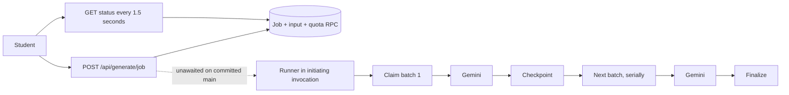
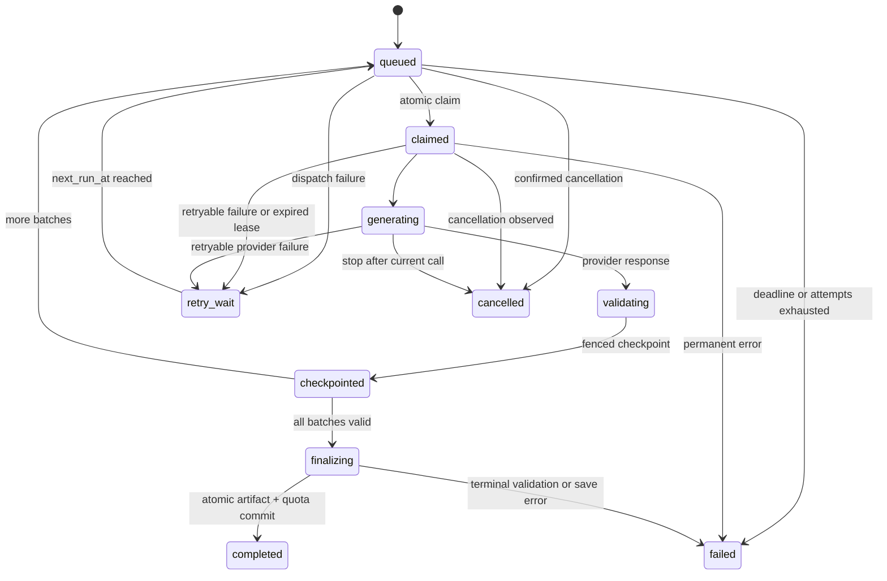

# FETCH generation reliability and loading system: implementation plan

**Role and scope:** This is an architecture handoff for Antigravity + Gemini 3.8 Flash High. I inspected the repository, screenshot, public site, installed Next.js guide, and current platform documentation. I did **not** modify files, create a migration, generate cards, change production data, commit, or deploy.

## Evidence rules

- **VERIFIED** means directly observed in the screenshot, repository, read-only probes, or cited platform documentation. A repository finding does not prove that the same code and migration are deployed.
- **LIKELY** means the evidence supports a mechanism, but the decisive production record is missing.
- **HYPOTHESIS** means a specific explanation that Phase 0 must test.
- **NOT VERIFIED** means the available evidence cannot establish the claim.

The historical one-hour job’s exact cause is **NOT VERIFIED**. It must stay that way. Phase 0 will use a **new controlled test job** to reproduce a stranded state and collect the missing lifecycle evidence. An induced or newly observed failure will establish a failure mechanism; it will not retroactively prove what happened to the historical job.

## 1. Executive assessment and verified findings

**VERIFIED:** The screenshot shows a 15-card request displayed as “Generating cards…” and “Queued in generation pipeline…” after the reported hour. The client can display that state indefinitely because failed status polls are silently ignored and no stale-job threshold is rendered in the [create panel](<C:/Users/LEGION/Documents/FETCH 2.0/src/components/study/create-pack-panel.tsx:72>).

**VERIFIED:** Committed remote `main` is `9bfc6d38b2e103fa85540e2dafb948986a8a7a6a`. Its [POST job route](<C:/Users/LEGION/Documents/FETCH 2.0/src/app/api/generate/job/route.ts:131>) calls `runGenerationJob(jobId)` without awaiting completion, then returns. There is no independent dispatch or watchdog in that committed path. Whether a particular invocation continued after its response is **NOT VERIFIED**. The production deployment SHA is also **NOT VERIFIED**.

**VERIFIED:** The working tree has uncommitted changes to that route and the status route. They replace fire-and-forget execution with Next.js `after()` and start another runner from GET polling. `after()` can run after a response on Vercel, but only within the function’s duration; it is an invocation-lifetime primitive, not a durable queue. Poll-triggered execution can overlap because the current claims and checkpoints do not enforce fencing. **Do not ship those local changes as the final recovery architecture.** [Next.js `after()`](https://nextjs.org/docs/app/api-reference/functions/after), [Vercel function duration](https://vercel.com/docs/functions/configuring-functions/duration).

**VERIFIED:** The [runner](<C:/Users/LEGION/Documents/FETCH 2.0/src/lib/ai/durable-generation.ts:573>) gives flashcards the quiz planner’s 10-item batches and executes them serially. It ignores batch-claim results, does not resume from completed checkpoints, has no explicit deadline on flashcard or summary provider fetches, and does not check cancellation in those two artifact branches. It can use deterministic fixture output when `GEMINI_API_KEY` is absent, including in a production process; that must be prohibited for account-backed production generation.

**VERIFIED:** The existing [batch claim RPC](<C:/Users/LEGION/Documents/FETCH 2.0/supabase/migrations/20260926070000_v5_corrections.sql:398>) can replace an active lease. Its checkpoint RPC has no lease-owner or fencing-token argument. Consequently, a stale or overlapping runner can write after a newer runner has taken over. `accepted_count` can be set from an individual runner’s in-memory count instead of recomputed from persisted checkpoints.

**VERIFIED:** An untracked local [quota repair migration](<C:/Users/LEGION/Documents/FETCH 2.0/supabase/migrations/20260926090000_repair_quota_architecture.sql>) uses canonical `owner_id`, `month_key`, `reserved_count`, and `committed_count`. Earlier committed migrations contain `count`/`user_id` references. Its production deployment is **NOT VERIFIED**. Phase 0 must inspect the deployed schema and routine definitions before any migration is selected.

## 2. Historical incident root-cause record

| Required evidence | Historical job |
|---|---|
| Reproduced | **NOT VERIFIED** |
| Job ID | **NOT VERIFIED** |
| Exact database status and stage | **NOT VERIFIED**; screenshot text is client state |
| Job input and batch rows | **NOT VERIFIED** |
| Quota reservation | **NOT VERIFIED** |
| Worker started / claimed | **NOT VERIFIED** |
| Last heartbeat / progress | **NOT VERIFIED**; current design has no dedicated heartbeat |
| Gemini request / response | **NOT VERIFIED** |
| Provider latency, error, or rate limit | **NOT VERIFIED** |
| Vercel invocation outcome | **NOT VERIFIED** |
| Final historical cause | **NOT VERIFIED** |

**LIKELY systemic explanation:** A job can be persisted as `status=in_progress, stage=queued` while the only attempted runner is tied to an HTTP invocation; no independent process guarantees a claim or closes the job. This explains how the architecture permits an hour-long wait, but does **not** establish that it caused this particular wait.

**HYPOTHESES for a new controlled reproduction**, in priority order:

1. The initiating invocation returns and unawaited work stops before its first stage update. Prediction: POST returns a job ID, the worker log ends at response or first await, the row remains queued, and no provider request occurs.
2. The runner’s initial RPC fails; its direct-table fallback cannot read the private table and returns before entering its failure handler. Prediction: no claim, no provider request, and an RPC or schema error near the POST invocation.
3. The worker progresses, but GET polling fails and the client retains its initial `queued` state. Prediction: database stage advances while browser network traces show rejected or failed status requests.
4. A lease or concurrent runner corrupts progress. Prediction: multiple worker invocation IDs or fencing tokens are associated with the same batch and later checkpoints regress counts or stage.
5. Provider work stalls after claim. Prediction: provider request starts and lacks a timely response; database stage should already be `batching`, which is why this is a lower-ranked explanation for the screenshot.

Phase 0 must test and report each prediction. It must not substitute code review for a runtime trace.

## 3. Current architecture and timing

The [start RPC](<C:/Users/LEGION/Documents/FETCH 2.0/supabase/migrations/20260926030000_durable_large_generation.sql:88>) represents a newly created job as `status=in_progress` with `stage=queued`. The client’s [poller](<C:/Users/LEGION/Documents/FETCH 2.0/src/components/study/create-pack-panel.tsx:81>) does not distinguish a healthy queue, dead worker, or failed poll.

| 15-card timing component | Current measured value |
|---|---|
| POST and job creation | **NOT VERIFIED** |
| Queue wait | **NOT VERIFIED** |
| Gemini call 1 | **NOT VERIFIED** |
| Checkpoint 1 | **NOT VERIFIED** |
| Gemini call 2 | **NOT VERIFIED** |
| Grounding and validation | **NOT VERIFIED** |
| Final save | **NOT VERIFIED** |
| Total | Reported at least about one hour without a deck; exact event times **NOT VERIFIED** |

Do not publish invented timing numbers. The code establishes the **number and sequence** of planned calls, not their runtime latency.

## 4. Phase 0: controlled reproduction and evidence capture

Use a dedicated test account, synthetic nonprivate source, and an isolated Supabase project whose schema and settings match production. Deploy the same immutable application commit to a Vercel preview environment. First run the unmodified path repeatedly; then use **staging-only fault controls** to stop execution (a) immediately after acknowledgement, (b) after worker claim, (c) during a provider wait, and (d) after a checkpoint. A forced failure demonstrates recovery requirements, while a naturally observed failure can identify the unfixed path.

Each run must produce a correlation bundle:

| Layer | Capture |
|---|---|
| Browser | Request ID, job ID, POST response time, GET status responses and errors, visible stage |
| Job row | `created_at`, status/stage transitions, owner-scoped quota month, `updated_at`, accepted count, cancel/failure fields |
| Worker | invocation ID, claim/start/heartbeat/progress timestamps, lease owner, fencing token, attempt |
| Provider | model, request start, response end, HTTP status, 429 `Retry-After`, safe error class, token usage |
| Batches | batch number, allocated count, claim, lease expiry, attempt, accepted count, checkpoint timestamp |
| Vercel | deployed SHA, region, configured duration, start/end/timeout/crash, whether execution continued after POST response |
| Supabase | migration versions, deployed RPC definitions, Cron run history and later `pg_net` delivery when enabled |
| Accounting | original reservation month, reserved and committed deltas, terminal release or commit |

Create an append-only, private generation event record before measuring if logs alone cannot provide these boundaries. Do not put source text, answers, or API keys in it. A red-capable probe should assert that a newly acknowledged job remaining `queued` with no claim beyond the chosen threshold is a failure, and report the last recorded boundary. The historical incident remains **NOT VERIFIED**, even if the probe reproduces the same visible symptom.

## 5. Architecture comparison and decision

| Option | Reliability / recovery | Latency | Complexity | Free-tier and cost behavior | Scaling verdict |
|---|---|---|---|---|---|
| **A. Current invocation promise** | No independent pickup or bounded recovery | Can be fast when it finishes | Low initially | May waste function duration and strand quota | Reject |
| **B. Database-backed worker, existing batching** | Durable job plus watchdog; fenced resume | Still serial 10-card calls | Medium | Reuses Supabase and Vercel | Safe reliability baseline |
| **C. B plus artifact-specific batching** | Same durability | Fewer calls for flashcards | Medium | Fewer Gemini requests and often fewer tokens | **Recommended initial release** |
| **D. C plus controlled batch parallelism** | Safe only with fenced per-batch claims and global admission | Potentially lower 30–50-card latency | Higher | Can hit project RPM/TPM and connection limits | Benchmark-gated follow-up |

**Chosen architecture:** Supabase Postgres remains the source of truth for jobs, checkpoints, leases, quota, and retry schedule. A secured Vercel endpoint processes **one bounded step and awaits it before responding**. Job creation emits a best-effort post-commit `pg_net` wake-up for low queue latency. Supabase Cron scans queued and stale work every approximately 10 seconds and redispatches; it is the recovery backstop. A failed or duplicated HTTP notification does not erase the persisted job. `pg_net` starts requests after transaction commit, and Supabase Cron supports scheduled SQL or HTTP work. Store the worker secret in Supabase Vault and Vercel server settings. Verify the actual extension availability and plan limits before implementation. [`pg_net`](https://supabase.com/docs/guides/database/extensions/pg_net), [Supabase Cron](https://supabase.com/docs/guides/cron), [scheduled functions and Vault](https://supabase.com/docs/guides/functions/schedule-functions).

This retains the current Node generation code. A Supabase Edge Function worker is an alternative, but would require a port and attention to its documented wall-clock and CPU limits. `EdgeRuntime.waitUntil` by itself is also invocation-bound, so it would still need database recovery. A new paid queue is unnecessary at this stage. [Supabase Edge limits](https://supabase.com/docs/guides/functions/limits), [background tasks](https://supabase.com/docs/guides/functions/background-tasks).

## 6. State machine, idempotency and worker contract

Keep the public API’s existing terminal `status` vocabulary during migration: `in_progress`, `completed`, `failed`, `cancelled`. Add internal execution state and retry fields rather than abruptly breaking current clients.

**Claim:** In one transaction, select eligible work with row locking, refuse an active lease, increment a monotonic fencing token, set owner and expiry, and record invocation/attempt. Return `already_completed`, `busy`, `cancelled`, or `claimed` explicitly. The worker must check the result before calling Gemini.

**Checkpoint:** Require `(job_id, batch_number, lease_owner, fencing_token)` and reject stale or terminal writes. Persist validated items once; derive `accepted_count` from completed batch rows. Never accept a runner’s in-memory count as the authoritative total.

**Resume:** Read completed checkpoints and skip them. Maintain stable ordering by batch number and within-batch position. Finalize from persisted checkpoints under the same job lock; validate count, uniqueness, structure, source grounding, cancellation, and quota reservation. Exactly one ready artifact and one quota commitment may result.

**Admission:** Initially allow at most one active generation per account, enforced with a partial unique index or equivalent transaction lock rather than only a precheck. Return the existing active job ID on conflict so another tab can reattach. Limit global provider concurrency separately.

## 7. Watchdog, retry, cancellation and failure UX

The numbers below are **provisional operating settings**, to adjust from Phase 0 and benchmark measurements.

| Condition | Backend action | User-visible action |
|---|---|---|
| Queued with no claim for 15 seconds | Record dispatch failure and redispatch | “FETCH is finding a worker. You can leave this page.” |
| No worker heartbeat for 20 seconds | Record suspected stall; do not steal a live lease | “Still working” with elapsed time |
| Lease expires after about 75 seconds | Fence old worker and reclaim if eligible | Show “Retrying generation” and attempt |
| Provider timeout | Abort request at about 45 seconds; classify retryable | Preserve accepted checkpoints; no fake progress |
| 429 | Honor `Retry-After` within a cap; global admission slows new starts | Explain temporary provider capacity |
| 5xx/network error | Bounded jittered backoff | Retry state and next-action message |
| Invalid key/model, permission error | Terminal failure | Useful error without raw provider body |
| Invalid or ungrounded output | One bounded repair/regeneration; then fail | Explain that a safe deck could not be made |
| Attempts or job deadline exhausted | Mark failed and release reservation once | Retry as a **new** logical request after accounting confirms |
| Cancel requested | Stop future batches; check under finalization lock; release once | “Stopping…” until `cancelled` is confirmed |

Begin with an initial attempt plus two retries per step, jittered backoff around 2, 10, and 30 seconds, and an absolute job deadline based on artifact size. Establish the final deadlines from measurements, with a clear upper bound well below an hour. Cron must also detect a job that never receives a claim. Dispatch attempts and provider attempts need separate counters. Monitor Cron and `pg_net` failures; neither should be a silent point of failure.

The current client says “Quota was not charged” once it sees `cancelled`, while older code paths can set a terminal status without the canonical release RPC. Replace that promise with copy derived from a confirmed accounting transition. Cancellation must work for flashcards and summaries as well as quizzes.

## 8. Flashcard, quiz and summary performance design

| Artifact | Proposed initial strategy | Quality and recovery rule |
|---|---|---|
| Flashcards | Benchmark a single call up to 15–20 cards; split larger decks into source-aware batches | Exact source quote, concise recall prompt, nonduplicate front/answer, exact accepted count |
| Quiz | Keep smaller batches while benchmarking 8–10 items | Choices, answer key, explanation, quote and cross-batch deduplication must pass |
| Summary | One structured call if source fits the measured token budget; otherwise chunk and reduce | Validate complete schema and source support |
| PDF/scan | Upload and extraction precede generation; expose each stage truthfully | Extraction errors are distinct from Gemini errors |

**VERIFIED current model-call plan:** 5 cards → 1 call; 15 → 2; 30 → 3; 50 → 5, serially. The candidate flashcard plan is 1/1/2/3 calls using a 20-card upper bound, **subject to benchmark**.

**VERIFIED additional token risk:** [source splitting](<C:/Users/LEGION/Documents/FETCH 2.0/src/lib/ai/durable-generation.ts:79>) returns whole paragraphs when their count is at or below the target chunk count. A single very long paragraph can therefore be sent to multiple batches in full. Replace character-only assumptions with token-aware, source-coverage-aware chunking; test long single-paragraph PDFs and scans. Preserve exact quote provenance and enough context for meaningful cards.

Set `maxOutputTokens` from measured p95 output tokens per accepted item, schema overhead and a safety margin, bounded by the selected model’s limit. Current flashcard requests allocate 8,192 tokens regardless of batch size. Measure prompt, source, schema, aliases and quote lengths before removing fields. A source quote’s presence is necessary but does not by itself prove the answer’s meaning; sample semantic accuracy independently.

**Controlled concurrency:** start at **one provider call per job** and a conservative global cap derived from the project’s live Gemini RPM, input TPM and daily limit. Google states that limits vary by project/model and are visible in AI Studio. Test per-job concurrency two for 30–50-card jobs only after fenced checkpoints and global admission pass fault and rate-limit tests. For 1, 5 and 20 simultaneous 15-card users, a one-call strategy still creates 1, 5 and 20 requests; the 20-user burst must queue fairly instead of overloading Gemini. [Gemini rate limits](https://ai.google.dev/gemini-api/docs/rate-limits).

## 9. Benchmark plan and target SLOs

Run the **current and candidate** pipelines on a Vercel preview deployment with a matching staging database and dedicated test account. Use representative short, medium, and long synthetic sources. For each of 5, 15, 30, and 50 cards, record acknowledgement, queue wait, provider calls, provider time and token counts, validation, checkpoint, finalization, retries, accepted count and total. Include one and multiple concurrent users. Report p50 and p95 from enough samples; mark a small exploratory run as exploratory. Blind-review a sample for factual grounding, recall usefulness, concision and duplicates.

| Count | Current calls, **VERIFIED** | Queue/provider/validation/save/total baseline | Candidate calls, **HYPOTHESIS** |
|---:|---:|---|---:|
| 5 | 1 | **NOT VERIFIED** | 1 |
| 15 | 2 serial | **NOT VERIFIED** | 1 |
| 30 | 3 serial | **NOT VERIFIED** | 2 |
| 50 | 5 serial | **NOT VERIFIED** | 3 |

**Provisional service objectives:** acknowledgement p95 below 1 second; uncongested worker claim p95 below 5 seconds and typically below 2; 15-card deck p50 at or below 15 seconds and p95 at or below 45 seconds in healthy provider conditions; 100% of jobs reach completed, failed, cancelled, or an explicit bounded retry state before their deadline. Publish the actual figures after the benchmark. Queue delay caused by global rate admission must be visible.

**Progressive study decision:** defer partial-deck release. The current artifact and quota transaction assumes one ready deck. Early release would require a provisional artifact state, stable card ordering, safe card-level visibility, and one-charge accounting. Revisit only after the durable completed-deck path meets its SLOs. Before then, “first useful result” means the completed validated deck.

## 10. Premium FETCH generation experience

Use FETCH’s existing [design system](<C:/Users/LEGION/Documents/FETCH 2.0/DESIGN.md>): blue identity, pixel dog, Fredoka headings, Nunito interface type, friendly rounded surfaces, and light/dark themes. The generation component is an **operate** surface: progress clarity comes before decorative motion.

**Main panel content:**

- “FETCH is building your 15 flashcards.”
- Actual stages: preparing source, waiting for a worker or provider slot, generating batch N of M, validating source support, saving the deck.
- `8 / 15 accepted` only after eight items are validated and durably checkpointed. Label them “accepted,” not “ready to study,” until release is supported.
- Elapsed `00:12` calculated from server `createdAt`, updated locally once a second. Never show fabricated time remaining or percentage.
- One clear Cancel action and a “Keep studying elsewhere” link.
- At slow/stalled/retry/failed thresholds, replace optimistic copy with the corresponding real state and next action.

Motion can use the already installed `motion` package: subtle mascot breathing, one card joining a stack on a real checkpoint, short stage transitions and a completion check. Do not animate each timer tick. Keep the mascot still under reduced motion. Avoid a new large animation dependency, heavy blur, repeated bounce or fake bars. The [Web Interface Guidelines](https://raw.githubusercontent.com/vercel-labs/web-interface-guidelines/main/command.md) support semantic status announcements, visible focus, reduced motion, and overlays that do not cover focused controls.

**Accessibility:** `role="status"` and polite live announcements on stage or meaningful count changes; `role="alert"` for terminal failure; keyboard-operable Cancel/Retry; visual labels as well as color; no announcement every second. **Responsive:** verify 390, 768, 1024 and 1440 px in both themes.

## 11. Background generation and global completion

The workspace shell owns an owner-scoped active-jobs store. On mount, refresh and return to the tab, call a new `list_my_generation_jobs` RPC/API. Local storage may keep a job ID as a reconnection hint, but the database is authoritative and the hint must be scoped to the signed-in owner. Poll active jobs adaptively; stop on terminal status. Deduplicate completion notifications using job ID and terminal version.

Desktop: a compact task pill that expands to stages and a “Study now” link. Mobile: a narrow nonblocking banner above the bottom navigation. The panel must not cover the Tutor composer, quiz submit or persistent music player. Navigation to Tutor, Pomodoro or an existing StudyPack must not cancel generation. On completion while the app is open, show “Your Biology flashcards are ready” with “Study now.” After a closed-tab completion, show it on next visit. Do not promise OS push notification.

## 12. Project-wide loading taxonomy and inventory

| Pattern | Use |
|---|---|
| Instant, below roughly 300 ms | Keep action stable; no spinner flash |
| Short mutation | Button label/state, disable only the submitted action |
| Known-layout fetch | Skeleton matching final content |
| Long AI generation | FETCH staged panel, elapsed time, backend state, cancel/background |
| Streaming AI | First-token indicator, then progressive content |
| Upload and processing | Real upload bytes when transport supports them, then explicit extraction/OCR stage |
| Background work | Global task status and one completion notification |

| Surface | Current signal, **VERIFIED where inspected** | Target |
|---|---|---|
| Sign in, Google return, signup, logout, reset | Login/signup/reset have local loading labels; callback/logout need full audit | Button and redirect states; recoverable auth errors |
| Home, StudyPacks, AI usage | Workspace status with text loading | Layout-matched cards and usage skeleton |
| Pack generation, save, delete, artifact open | Generation is local to create panel; deck/summary readers use spinners or text | Shared long-operation panel; scoped mutation state; artifact skeleton |
| PDF upload/text extraction | “Extracting PDF text…” label | Upload bytes where measurable, extraction stage, failure recovery |
| Scan upload/OCR/review | Upload/extraction flags | Distinct upload, OCR and review preparation stages |
| Flashcard generation, opening, edit | Generation shares quiz copy; deck loading spinner | Artifact-specific copy, deck skeleton, scoped save |
| Quiz generation/submission/completion save | Generation shares planner; save flag | Real batch count and button save state |
| Summary generation/open | Single provider call; viewer loading spinner | Single-call stage and structured summary skeleton |
| Tutor context, send, first token, conversation save | Send/history flags and pulsing wait | Context skeleton, first-token state, stream, save feedback |
| Progress | Text “Loading your progress…” | Chart and metric skeletons |
| Calendar | Status notice | Inline save/delete feedback |
| Pomodoro | Mostly local timing | Avoid remote loader for local work; show status for any remote save |
| Music | Persistent local and YouTube player UI | Initialization/failure state; avoid covering global task panel |
| Friends and profiles | Loading text/flags | List/profile skeleton and scoped request/search state |
| Messages | Loading flag | Thread skeleton and send state |
| Live | Create/join/action flags | Room skeleton, question transition and leaderboard freshness |
| Settings | Several save flags | Shared button state, export progress, deliberate deletion state |

Build a small shared component family: `LoadingButton`, `SkeletonBlock`, domain skeletons, `ElapsedTimer`, `GenerationProgress`, `FetchLoadingMascot`, `BackgroundTaskIndicator`, and `StreamingIndicator`. Keep known-layout skeletons close to the final StudyPack card, progress chart, friend row, message thread and Tutor conversation. Avoid copying loader markup across pages. Loading states must have empty, error, retry and success outcomes.

## 13. Quota, database and API safety

**Canonical accounting contract:** `(owner_id, month_key, reserved_count, committed_count)`. The job records its original reservation month. Start reserves exactly once under the monthly usage row lock. Successful atomic finalization decrements reserved and increments committed once. Failure or confirmed cancellation decrements reserved once. Reusing a request ID or retrying a batch makes no new reservation. Terminal updates and accounting occur in the same database transaction.

Before migration, compare deployed schema, routine signatures, checks, indexes, extension settings and migration ledger with committed files **and** the untracked quota repair. Do not apply that file blindly or add `count`/`user_id` compatibility columns. Reconcile existing active reservations using a reviewed, operator-approved query before adding stronger constraints. Check the `scan` source type constraint as part of the contract audit.

**Proposed API:**

- `POST /api/generate/job` → `202 {jobId, status, stage, createdAt, reused}`; no worker promise in this route.
- `GET /api/generate/job/[jobId]` → owner-scoped status, stage, accepted/requested count, timestamps, attempt/retry data, safe failure class and accounting state.
- `GET /api/generate/jobs?active=1` → owner-scoped tasks for the app shell.
- `POST /api/generate/job/[jobId]/cancel` → cancellation requested or confirmed; never claim quota release prematurely.
- `POST /api/internal/generation/step` → server-authenticated, one bounded awaited step. Request contains job ID and nonce only; source is retrieved server side.

**Proposed RPCs:** atomic start and enqueue; claim eligible job/step; heartbeat; fenced batch checkpoint; finalize from checkpoints; request/confirm cancel; release; owner-scoped status/list; stale sweep. Restrict worker RPCs to service role. Never expose raw input or keys in owner status. Store wake-up credentials in Vault. `pg_net` response data is diagnostic and short-lived; the private job/event tables remain the durable record.

## 14. Observability and production checks

Persist milestones in `generation_jobs` where singular, and per-attempt/per-batch events in a private append-only table. Record `job_created_at`, `worker_claimed_at`, `generation_started_at`, `first_provider_request_at`, `first_provider_response_at`, batch completion, validation completion, finalization start, completion, `worker_last_seen_at`, and `last_progress_at`. Use server UTC timestamps and monotonic local durations within an invocation. Distinguish worker heartbeat from a meaningful progress change; `updated_at` alone is insufficient.

Calculate queue wait, provider latency per request and aggregate, grounding/validation time, database checkpoint and save time, and total latency. Emit requested, completed, failed, cancelled, stalled, dispatch retry and batch retry counters, with p50/p95 by artifact and count bucket. Log safe failure code, model, attempt, Vercel invocation ID and fencing token. **Never log private source text, answer keys, messages or API keys.**

Production canary checks: correct deployed SHA and migration version; fresh 5/15/30/50 jobs; duplicate POST; leave/reload/reopen; kill a staging worker at every transition; verify no old worker can checkpoint; 429/5xx/timeout; cancel before and during provider work; month boundary; empty/invalid model output; quota delta; one ordered artifact; no stale jobs past deadline. Check Cron and `pg_net` errors as well as Vercel logs.

## 15. File-by-file change map

| Area | Existing files to inspect and likely modify | Proposed new files |
|---|---|---|
| Job API | [POST route](<C:/Users/LEGION/Documents/FETCH 2.0/src/app/api/generate/job/route.ts>), [GET route](<C:/Users/LEGION/Documents/FETCH 2.0/src/app/api/generate/job/[jobId]/route.ts>), cancel route | Internal worker route; active-jobs route |
| Worker/provider | [durable-generation.ts](<C:/Users/LEGION/Documents/FETCH 2.0/src/lib/ai/durable-generation.ts>), [gemini-study-pack.ts](<C:/Users/LEGION/Documents/FETCH 2.0/src/lib/ai/gemini-study-pack.ts>), [privileged-supabase.ts](<C:/Users/LEGION/Documents/FETCH 2.0/src/lib/server/privileged-supabase.ts>) | Bounded-step orchestrator, error classifier, metrics adapter, benchmark harness |
| Database | [job migration](<C:/Users/LEGION/Documents/FETCH 2.0/supabase/migrations/20260926030000_durable_large_generation.sql>), [batch RPC migration](<C:/Users/LEGION/Documents/FETCH 2.0/supabase/migrations/20260926070000_v5_corrections.sql>), [untracked quota repair](<C:/Users/LEGION/Documents/FETCH 2.0/supabase/migrations/20260926090000_repair_quota_architecture.sql>) | Forward-only lease, event, retry, dispatch and Cron migrations after audit |
| Generation UI | [create-pack-panel.tsx](<C:/Users/LEGION/Documents/FETCH 2.0/src/components/study/create-pack-panel.tsx>), [app-shell.tsx](<C:/Users/LEGION/Documents/FETCH 2.0/src/components/app/app-shell.tsx>), [globals.css](<C:/Users/LEGION/Documents/FETCH 2.0/src/app/globals.css>) | Progress, mascot, elapsed timer, active-job provider and completion notice |
| Other loading | Auth, workspace pages and study/tool components in the inventory | Shared loading primitives and domain skeletons |
| Tests | [durable-generation unit tests](<C:/Users/LEGION/Documents/FETCH 2.0/tests/unit/phase3-durable-generation.test.ts>), [client lifecycle tests](<C:/Users/LEGION/Documents/FETCH 2.0/tests/unit/client-generation-lifecycle.test.ts>), Playwright specs | Claim/fencing/quota integration tests, interruption harness, performance and accessibility cases |

## 16. Risk register

| Risk | Control and release gate |
|---|---|
| Production code/schema differ from repository | Phase 0 deployment and migration audit before selecting migrations |
| Local `after()` poll patch starts overlapping runners | Remove from status GET; DB claim/fencing tests before worker rollout |
| Lost or failed `pg_net` notification | Persist job first; Cron sweep; dispatch-attempt deadline |
| Cron configuration or secret fails | Monitor run results; canary without wake-up; alert on queued age |
| Stale worker writes after takeover | Token required by every checkpoint/finalization; race test |
| Quota double charge or leak | Same-transaction state/accounting; reconciliation query and month-boundary tests |
| Missing Gemini key produces fixture cards | Production configuration guard; terminal safe failure |
| Larger batches truncate or reduce quality | Token and grounded-card benchmarks before adoption |
| Parallel requests exceed Gemini quota | Global admission based on live RPM/TPM; concurrency gate |
| Cancellation races with finalization | Check under job lock; accounting-confirmed UI |
| Global banner covers controls | Four viewport and fixed-dock collision tests |
| Decorative loading hides a dead task | Backend stale classification; terminal UX gate |

## 17. Phased implementation and Antigravity handoffs

The order places **evidence → reliable execution → recovery/accounting → speed → UX → broad loading → rollout**. This prevents the UI from displaying attractive but untrustworthy progress and prevents batch optimization from increasing duplicate-worker risk.

### Phase 0 — Controlled reproduction, instrumentation and contract audit

**Objective:** Reproduce a stranded state with a new controlled job and establish an event timeline. **Verified current state:** committed main and local changes differ; historical incident cause is **NOT VERIFIED**. **Root cause:** to be determined for the *new* run; do not assign one to the historical run. **Prerequisites:** staging Supabase, immutable Vercel preview of the relevant commit, test account, synthetic source, read-only production deployment/schema access. **Files to inspect:** job routes, runner, RPC migrations, existing tests and Vercel configuration. **Files to modify/new files:** staging-only instrumentation and an incident harness if existing logs cannot prove boundaries. **Database/migrations:** private event fields/table only as needed in staging; review deployed quota schema, constraints and migration ledger. **Worker/API:** instrument start, claim, provider and finish; no architecture replacement yet. **Frontend/performance/loading:** capture browser polling and elapsed display; measure 5/15/30/50 baseline. **Accessibility/responsive/failure:** record how poll failure and stalled status appear at 390 and 1440 px. **Tests:** natural repeated runs and controlled stop points. **Given/when/then:** given an acknowledged job, when the initiating response ends or worker is interrupted, then the harness records whether claim/provider/checkpoint occurred and catches a job that stays queued beyond threshold. **Production verification:** compare deployment SHA and schema; no fault injection in production. **Exit gate:** a red-capable reproduction, complete correlation bundle, baseline timings or explicit unavailable fields, and ranked tested hypotheses. **Do not change:** historical job, production data or user quota.

**ANTIGRAVITY + GEMINI 3.8 FLASH HIGH — IMPLEMENTATION HANDOFF:** **Objective/root cause/decision:** produce evidence; historical cause remains **NOT VERIFIED**; use a new controlled job. **Inspect:** files and records above. **Ordered tasks:** verify deployed contracts → add safe event capture → run normal jobs → end request and interrupt workers → correlate browser/Vercel/Supabase/Gemini → publish incident matrix. **Database/worker/API/frontend/loading:** instrument boundaries and a read-only status harness; no aesthetic redesign. **Performance target:** measured baseline, not a fabricated target. **Security/quota:** synthetic source, test account, no printed keys, reconcile reservation. **Test commands/targeted tests:** existing durable-generation and lifecycle Vitest suites plus signed-in staging E2E/status probe. **Production checks:** deployment SHA, migration ledger, function configuration. **Acceptance/rollback/do not change/complete:** evidence bundle is complete; remove or disable staging fault controls before rollout; no production mutation.

### Phase 1 — Canonical quota and durable dispatch

**Objective:** Make every acknowledged job independently discoverable and claimable. **Verified state/root cause:** current creation is invocation-dependent and quota migrations disagree in the repository. **Prerequisites:** Phase 0 schema audit and platform-limit verification. **Inspect:** creation/status routes, privileged Supabase adapter, job/quota RPCs. **Modify/new:** bounded worker endpoint and orchestrator; forward-only migration for claim, fencing, `next_run_at`, dispatch attempts, heartbeat and indexed eligibility; Vault/Cron/`pg_net` setup. **Database/migrations:** transactionally reserve and persist before wake-up; reconcile existing reservations; keep canonical columns. **Worker/API:** secure endpoint awaits one bounded step; POST returns immediately; GET becomes read-only. **Frontend/performance/loading:** preserve existing response contract until new UI arrives; measure queue wait. **Accessibility/responsive/failure:** existing textual status remains operable; dispatch failure gets a safe terminal code. **Tests:** lost/duplicate wake-up, claim race and request-end tests. **Given/when/then:** given a successful POST, when its invocation ends, then an independent invocation claims or the watchdog later handles the persisted job. **Production verification/exit:** canary survives request completion and produces one artifact/charge. **Do not change:** monthly usage schema to fake compatibility.

**ANTIGRAVITY + GEMINI 3.8 FLASH HIGH — IMPLEMENTATION HANDOFF:** **Objective/root cause/decision:** implement database-backed dispatch rather than `after()` or a client-triggered runner. **Inspect:** Phase 1 files. **Ordered tasks:** reconcile quota → migrate claim/fencing → secure endpoint → post-commit wake-up → Cron backstop → remove GET execution. **Database/worker/API/frontend/loading:** as above; keep UI truthful. **Performance target:** acknowledgement p95 under 1 second; uncongested claim p95 under 5 seconds. **Security/quota:** Vault secret, service-only worker RPCs, one reservation. **Test commands/targeted tests:** typecheck, lint, claim/quota integration and request-end E2E. **Production checks:** Vercel invocation and Cron/`pg_net` event match. **Acceptance/rollback/do not change/complete:** no acknowledged job depends on its POST invocation; feature flag can stop new dispatch while persisted jobs remain recoverable; no raw source in notifications.

### Phase 2 — Watchdog, retries, cancellation and resume

**Objective:** Make every crash or stall bounded and recoverable. **Verified state/root cause:** current claims ignore active leases, checkpoints lack fencing, completed batches are regenerated, and flashcard/summary cancellation is incomplete. **Prerequisites:** Phase 1 atomic claim. **Inspect/modify:** worker, cancel route, batch RPCs, finalizer and status contract. **New/database/migrations:** heartbeat, progress, attempt, deadline and safe failure fields; fenced checkpoint/finalization and stale sweep. **Worker/API:** classify errors, resume checkpoints, honor cancellation and `Retry-After`. **Frontend/performance/loading:** expose retry/stall/cancel confirmation; no endless queued animation. **Accessibility/responsive/failure:** actionable Retry/Cancel and polite state changes. **Tests:** kill before claim, during provider, after checkpoint and during finalization; stale writer and month-boundary races. **Given/when/then:** given an expired lease, when Cron sweeps, then exactly one successor resumes; given confirmed cancellation, then original-month reserved count falls once. **Production verification/exit:** fault-injection matrix passes and no job exceeds its deadline silently. **Do not change:** completed artifacts or accounting from an old worker.

**ANTIGRAVITY + GEMINI 3.8 FLASH HIGH — IMPLEMENTATION HANDOFF:** **Objective/root cause/decision:** bounded recovery with fenced resume. **Inspect:** Phase 2 files. **Ordered tasks:** heartbeat → provider abort → retry classification → checkpoint resume → cancellation lock → watchdog terminal transition. **Database/worker/API/frontend/loading:** implement confirmed state and quota outcome. **Performance target:** stale detection in tens of seconds, no hour-long active job without an explanation. **Security/quota:** terminal and accounting transitions in one transaction. **Test commands/targeted tests:** unit plus database concurrency tests and staging fault E2E. **Production checks:** failure code, attempts, reservation delta. **Acceptance/rollback/do not change/complete:** every injected failure recovers or fails once; disable retries independently if they misbehave, retaining safe terminal handling.

### Phase 3 — Flashcard speed and provider admission

**Objective:** Make 15-card decks materially faster while retaining quality. **Verified state/root cause:** 15 cards currently use two serial calls; long single-paragraph sources can be resent whole; flashcard fetch has no deadline. **Prerequisites:** reliable checkpoints and timing events. **Inspect/modify:** planner, source chunker, Gemini flashcard adapter, validator, global admission. **New/database/migrations:** benchmark fixtures and token metrics if absent; no new quota schema. **Worker/API:** artifact-specific batch plan and bounded repair. **Frontend/performance/loading:** show real batches and accepted count; benchmark 10/15/20-card batches, one-call 15-card deck and global cap. **Accessibility/responsive/failure:** provider-slot queue is textually clear. **Tests:** quality, truncation, count, deduplication, rate limit and long-source coverage. **Given/when/then:** given 15 requested cards and a healthy provider, when generation completes, then 15 distinct grounded cards save once with measured latency improvement. **Production verification/exit:** p50/p95 and blinded quality meet gates. **Do not change:** model or grounding rule merely to hit a headline speed target.

**ANTIGRAVITY + GEMINI 3.8 FLASH HIGH — IMPLEMENTATION HANDOFF:** **Objective/root cause/decision:** benchmark-driven larger flashcard batches with global provider admission. **Inspect:** Phase 3 files. **Ordered tasks:** establish baseline → fix source coverage → benchmark size/token budgets → validate exact count → introduce policy flag → canary. **Database/worker/API/frontend/loading:** retain fenced checkpoint contract and truthful counts. **Performance target:** provisional 15-card p50 ≤15 seconds, p95 ≤45 seconds under healthy conditions, revised from measurements. **Security/quota:** no extra reservation for repair attempts. **Test commands/targeted tests:** generation Vitest, 5/15/30/50 benchmark, provider-limit staging tests. **Production checks:** latency, accepted fraction, 429s and token usage. **Acceptance/rollback/do not change/complete:** faster with no material quality/failure regression; revert batch policy independently of the durable worker.

### Phase 4 — Quiz, summary and source-processing strategy

**Objective:** Give each artifact the right measured call structure. **Verified state/root cause:** quiz and flashcards share a planner; summary generally uses one call; PDF and scan extraction precede generation in existing flows. **Prerequisites:** Phase 3 measurements and durable state. **Inspect/modify:** quiz Gemini adapter, summary generator, PDF upload/generate and scan extract routes. **New/database/migrations:** only token/coverage fields required by measurement; avoid a parallel quota architecture. **Worker/API:** smaller quiz batches, summary chunk-reduce only for measured oversized sources, explicit preprocessing errors. **Frontend/performance/loading:** distinct PDF upload, extraction/OCR, quiz, summary stages. **Accessibility/responsive/failure:** all stages have text and next actions. **Tests:** quiz key/choice integrity, summary schema, long PDF/scan coverage and provider limits. **Given/when/then:** given an oversized source, when processing succeeds, then no requested section is silently dropped and final output is grounded. **Production verification/exit:** artifact-specific timing and quality reports. **Do not change:** source privacy or quiz answer-key access.

**ANTIGRAVITY + GEMINI 3.8 FLASH HIGH — IMPLEMENTATION HANDOFF:** **Objective/root cause/decision:** artifact-specific generation. **Inspect:** Phase 4 files. **Ordered tasks:** benchmark quiz → tune batch size → benchmark summary → add chunk-reduce only if needed → align preprocessing stages. **Database/worker/API/frontend/loading:** preserve common durable state and distinct stage labels. **Performance target:** fewer unnecessary calls without weaker validation. **Security/quota:** private answer keys and one job reservation. **Test commands/targeted tests:** provider, PDF, scan, artifact and E2E suites. **Production checks:** latency, quality and extraction failures by artifact. **Acceptance/rollback/do not change/complete:** each artifact has documented, measured policy; policy flags permit rollback.

### Phase 5 — Premium generation UI and navigation-safe tasks

**Objective:** Show real progress and let students keep using FETCH. **Verified state/root cause:** current job state lives in the create panel and polling failures retain old text. **Prerequisites:** owner-scoped active-job API, timestamps, retry and terminal states. **Inspect/modify:** create panel, app shell, design tokens. **New/database/migrations:** progress, mascot, timer, active-job provider and notification components; no generation migration. **Worker/API:** expose only truthful stage/count/time fields. **Frontend/performance/loading:** responsive panel, global pill/banner, completion link and adaptive polling. **Accessibility/responsive/failure:** 390/768/1024/1440 px, both themes, reduced motion, keyboard, screen reader, fixed-control collision checks. **Tests:** navigation, reload, closed-tab return, duplicate notification, poll failure and cancellation. **Given/when/then:** given an active job, when the student visits Tutor, then generation continues and its current status remains visible; when completed, one notification links to the deck. **Production verification/exit:** canary user can navigate without losing the task; dead jobs stop animating. **Do not change:** brand identity or fabricate percentages/ETA.

**ANTIGRAVITY + GEMINI 3.8 FLASH HIGH — IMPLEMENTATION HANDOFF:** **Objective/root cause/decision:** server-backed FETCH progress across navigation. **Inspect:** Phase 5 files. **Ordered tasks:** active-job provider → panel → elapsed timer → mascot motion → global indicator → notification → failure polish. **Database/worker/API/frontend/loading:** read-only active-job listing and staged UI. **Performance target:** visible acknowledgement quickly, low bundle and animation cost. **Security/quota:** owner-scoped tasks; no private source in notifications. **Test commands/targeted tests:** component, Playwright navigation and accessibility. **Production checks:** desktop/mobile and reduced-motion captures. **Acceptance/rollback/do not change/complete:** user can leave, return and study the completed deck; new UI can be disabled without disabling durable jobs.

### Phase 6 — Shared loading design system

**Objective:** Define consistent primitives before a broad retrofit. **Verified state/root cause:** loaders are dispersed among page text, local flags and spinners. **Prerequisites:** Phase 5 interaction/status conventions. **Inspect/modify:** shared Button, global styles, StudyPack/Progress/Friends/Messages/Tutor layouts. **New/database/migrations/worker/API:** reusable loading primitives and domain skeletons; no backend migration. **Frontend/performance/loading:** taxonomy and content-matched skeletons; avoid layout shift and motion bloat. **Accessibility/responsive/failure:** semantic status, visible focus, reduced motion, safe areas. **Tests:** primitive state matrix and visual checks. **Given/when/then:** given a content load, when data arrives, then skeleton and content share geometry without a large shift. **Production verification/exit:** components meet design tokens and accessibility floor. **Do not change:** ordinary instant interactions into conspicuous loaders.

**ANTIGRAVITY + GEMINI 3.8 FLASH HIGH — IMPLEMENTATION HANDOFF:** **Objective/root cause/decision:** small shared component family using existing FETCH tokens. **Inspect:** Phase 6 files. **Ordered tasks:** define API → implement primitives → build domain skeletons → document usage → test. **Database/worker/API/frontend/loading:** UI only. **Performance target:** minimal bundle and no unnecessary repaint loops. **Security/quota:** no effect. **Test commands/targeted tests:** typecheck, component tests, visual and axe checks. **Production checks:** light/dark and four breakpoints. **Acceptance/rollback/do not change/complete:** primitives are reusable and accessible; do not import a large animation system.

### Phase 7 — Apply loading patterns across the project

**Objective:** Cover every meaningful wait in the inventory. **Verified state/root cause:** several pages have local loading flags but inconsistent presentation and recovery. **Prerequisites:** Phase 6 primitives. **Inspect/modify:** Auth, Home, StudyPacks, Progress, PDF, scan, flashcards, quiz, summary, Tutor, Calendar, Pomodoro, music, Friends, Messages, Live and Settings. **New/database/migrations:** domain skeletons or upload progress support only where necessary. **Worker/API:** expose real upload/processing status where currently absent; avoid cosmetic fake progress. **Frontend/performance/loading:** apply taxonomy surface by surface. **Accessibility/responsive/failure:** labels, focus and next actions in every pending/error state at all target widths. **Tests:** pending/success/empty/error per major surface. **Given/when/then:** given a failed mutation, when it ends, then the button re-enables, an actionable error appears, and no stale skeleton remains. **Production verification/exit:** signed-off inventory with no meaningful indefinite wait. **Do not change:** product flows or local-only Pomodoro work into unnecessary remote operations.

**ANTIGRAVITY + GEMINI 3.8 FLASH HIGH — IMPLEMENTATION HANDOFF:** **Objective/root cause/decision:** retrofit shared loading patterns, beginning with high-traffic study surfaces. **Inspect:** inventory files. **Ordered tasks:** Auth/Home/StudyPacks → uploads/study → Tutor/Progress → social/tools/settings → audit. **Database/worker/API/frontend/loading:** minimal API additions only for measurable upload/process progress. **Performance target:** no added blocking fetches or significant layout shift. **Security/quota:** preserve existing authorization and accounting. **Test commands/targeted tests:** relevant unit and E2E suites, axe and viewport sweep. **Production checks:** pending/error states with throttled network. **Acceptance/rollback/do not change/complete:** each inventory row has a truthful and recoverable state.

### Phase 8 — Release QA and production rollout

**Objective:** Prove reliability, speed, quality and UX together. **Verified state/root cause:** initial baselines and controlled cause are established in prior phases; historical incident remains **NOT VERIFIED**. **Prerequisites:** all phase gates. **Inspect/modify/new/database/migrations/worker/API/frontend:** only fixes required by failed gates; verify deployed SHA and migration state. **Performance/loading:** publish real 5/15/30/50 p50/p95 tables and monitor stale jobs, quota, 429s, retries and animation performance. **Accessibility/responsive/failure:** keyboard, screen reader, reduced motion, both themes, four widths and fixed-control collisions. **Tests:** typecheck, lint, unit, integration, E2E, build, fault matrix, production smoke. **Given/when/then:** given any acknowledged job, when its bounded deadline passes, then it is completed, cancelled, failed or explicitly retrying with correct quota and a useful UI state. **Production verification/exit:** limited canary, reconciliation and rollback drill before broad rollout. **Do not change:** production records merely to make metrics pass.

**ANTIGRAVITY + GEMINI 3.8 FLASH HIGH — IMPLEMENTATION HANDOFF:** **Objective/root cause/decision:** release only on measured evidence. **Inspect:** all changed files, deployment configuration and event dashboards. **Ordered tasks:** complete gates → canary → fault tests → compare SLO/quality → reconcile quota → broaden rollout. **Database/worker/API/frontend/loading:** verify contracts end to end. **Performance target:** measured improvement to 15-card generation and bounded state for every job. **Security/quota:** no leaks, one reservation transition. **Test commands/targeted tests:** `npm run typecheck`, `npm run lint`, `npm test`, `npm run test:e2e`, `npm run build`, plus staging fault and benchmark harnesses. **Production checks:** deployment SHA, Cron, `pg_net`, Vercel logs, job events, artifact count and quota deltas. **Acceptance/rollback/do not change/complete:** flags independently disable new batch policy or UI; persisted jobs remain recoverable. Complete only when reliability, performance, loading, accessibility and production smoke gates all pass.

## Definition of done

A release passes only when no healthy job can remain queued indefinitely; ending the initiating request does not stop generation; interrupted workers recover or fail cleanly; stale workers cannot write; cancellation and quota are transactionally correct; 15-card performance is measurably better without card-quality regression; 50-card progress is real; navigation and refresh retain the task; completion is announced once; dead jobs do not animate forever; major FETCH waits use appropriate shared states; and all specified quality gates pass.

The exact historical cause of the screenshot’s one-hour job remains **NOT VERIFIED**.
