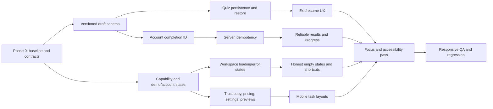

# FETCH refinement implementation plan

## 1. Executive assessment

FETCH already has a coherent visual identity and a working central demo flow. The blue palette, pixel dog, Fredoka and Nunito typography, card language, light and dark themes, desktop sidebar, and mobile More drawer should remain. This phase is **product refinement, not a redesign**.

The repository is more capable than some earlier screenshots and handoff text suggest. It has account-backed paths for StudyPacks, answer checking, completed attempts, calendar events, and Tutor when their services are configured. The browser-local demo is a separate path. The largest remaining weakness is that those two modes are not always distinguished accurately in the interface. The other high-risk areas are unfinished quiz recovery, mobile Calendar, quiz focus transitions, and signup consent.

The implementation strategy is to establish truthful capability and persistence contracts first, then polish the complete learning journey, then adapt task layouts for phones, and finally verify accessibility and responsive behavior across the product. Working architecture should be extended selectively. No new global store or replacement design system is justified.

**Current verification baseline:** `npm run typecheck` and `npm run lint` pass. `npm test` fails before the generation tests execute because Vitest imports `server-only` through the generation route; seven other unit tests pass. I did not run the full browser suite in this planning turn. Its source contains at least one stale Tutor assertion expecting “Send · Coming soon,” while the current button says “Send to FETCH.” No project files were edited.

I used the installed UI/UX Pro Max, Taste, Impeccable, frontend-design, React, and [Web Interface Guidelines](https://github.com/vercel-labs/web-interface-guidelines) as review aids. I found no separate installed `no-ai-slop` skill. FETCH’s [PRODUCT.md](<C:/Users/LEGION/Documents/FETCH 2.0/PRODUCT.md>) and [DESIGN.md](<C:/Users/LEGION/Documents/FETCH 2.0/DESIGN.md>) remain the design authority.

## 2. Verified findings matrix

“Accessibility impact” below identifies a risk to test or remediate; it is not a claim that a full WCAG audit has been completed. Complexity is relative to this repository.

### A. Trust and product-state communication

**1. Signup consent and legal documents — UNRESOLVED · Critical · Medium engineering complexity.**  
**Verified behavior:** The last signup step requires agreement to Terms and Privacy Policy, but neither document is linked; the text itself says production documents must be supplied. The checkbox blocks continuation. [SignupWizard](<C:/Users/LEGION/Documents/FETCH 2.0/src/components/auth/signup-wizard.tsx:92>) can create a Supabase account when configured. **UX/accessibility impact:** A user cannot inspect what they supposedly accept; the consent is misleading and inaccessible as a reviewable decision. **Dependencies:** Owner-supplied, approved documents and their version identifiers are required for public signup. **Solution:** Remove the false consent claim in development/demo flows. Gate public account signup until real, keyboard-accessible Terms and Privacy pages are available; then require an unchecked consent control with links, a field-level error, and server-recorded document versions and acceptance time. Do not draft legal terms as an engineering placeholder. **Acceptance:** No account-creation screen claims agreement to unopened or nonexistent documents; production consent is recorded against exact versions. **Tests:** Component keyboard/link/validation tests, E2E signup in configured and unconfigured modes, manual screen-reader review.

**2. Demo Settings versus Account Settings — UNRESOLVED · High · Medium.**  
**Verified behavior:** Settings always shows “Development fixture,” a fixed `fetch_student` username, locally saves the displayed name, and exports only `fetch-development-fixture-v1`, even though the workspace supports account mode. [Settings](<C:/Users/LEGION/Documents/FETCH 2.0/src/app/app/(workspace)/settings/page.tsx:49>) and [DemoProvider](<C:/Users/LEGION/Documents/FETCH 2.0/src/components/app/demo-provider.tsx:25>) are involved. Home and Progress also make browser-local claims without checking mode. **UX/accessibility impact:** Users can misunderstand what was saved or exported; status text does not accurately describe the result. **Dependencies:** A mode-aware profile read/update contract and explicit account-export scope. **Solution:** Render separate Demo and Account content from one typed workspace mode. Label each action by destination: “Save in this browser,” “Save to account,” and “Export browser demo data.” Read account profile data rather than showing fixture identity. If account export is unavailable, do not offer an apparently complete export. Keep theme preference explicitly device-local. Show load, save, failure, and sign-out states. **Acceptance:** An account user never sees fixture identity or receives `{}` labeled as their account export; demo users see exactly which browser data is involved. **Tests:** Mode-specific component tests, account integration tests, export-content assertions, sign-out/re-entry tests.

**3. Marketing and pricing availability — PARTIALLY RESOLVED · High · Low–Medium.**  
**Verified behavior:** [Pricing](<C:/Users/LEGION/Documents/FETCH 2.0/src/components/landing/pricing.tsx:18>) says the Free offer is planned, marks Pro Max “Coming soon,” calls ₱49 proposed, and states that purchases are unavailable. Those are good safeguards. Yet blue checkmarks present proposed limits and features beside currently usable ones, and “Get started free” can be read as entry to an enforced plan. **UX/accessibility impact:** Availability requires reading a separate note and inferring which individual feature is live. **Dependencies:** The approved pricing preview in PRODUCT.md; no payment provider is needed. **Solution:** Define editorial availability for each listed feature: Available in demo, Account feature, Preview, Planned, or Coming soon. Put concise text badges beside individual claims, use a different icon from the completion check for planned items, and keep the proposed price qualified at the price itself. Do not promise unlimited generation. **Acceptance:** A visitor can identify what works today without reading a footnote. **Tests:** Pricing content assertions, keyboard/zoom review, snapshot review in both themes.

**4. Preview social and Live actions — PARTIALLY RESOLVED · Medium · Medium.**  
**Verified behavior:** [Friends](<C:/Users/LEGION/Documents/FETCH 2.0/src/app/app/(workspace)/friends/page.tsx:33>) clearly states after interaction that search, invitation, and profile sharing are unconnected. [Live](<C:/Users/LEGION/Documents/FETCH 2.0/src/app/app/(workspace)/live/page.tsx:39>) labels its page-local code experiment and says no multiplayer connection occurs. However, the initial search, invite, share, create, and join affordances still resemble production actions. The schema contains social tables, but these pages do not use a delivered social flow. **UX/accessibility impact:** Users spend effort on a control whose named outcome cannot occur. **Dependencies:** A shared capability model; no social backend implementation is required for this refinement. **Solution:** Retain the useful local code experiment as “Try a room-code preview.” Disable or replace search/invite/share actions with a clear preview explanation before input. Never copy a purported live profile link. **Acceptance:** Every active control produces its stated outcome; every prototype action states its local scope before use. **Tests:** E2E preview behavior, copy assertions, keyboard disabled-state review.

### B. Core study journey

**5. First visit to Home — PARTIALLY RESOLVED · Medium · Medium.**  
**Verified behavior:** [Home](<C:/Users/LEGION/Documents/FETCH 2.0/src/app/app/(workspace)/home/page.tsx:13>) has a helpful banner, Create StudyPack panel, recent packs, and study summary. With no data, banner and form repeat the same creation prompt and the empty study-rhythm card adds height. **UX/accessibility impact:** The working input is farther down on a phone, increasing first-use effort. **Dependencies:** Reliable loading-versus-empty workspace state. **Solution:** Define four Home states: first visit (short explanation and visible paste form), has packs (direct recent-pack action), has attempts (recent result plus next action), returning (resume an unfinished session if present). Preserve a restrained mascot moment. Suppress empty analytics until there is an attempt. **Acceptance:** At 390px, the working paste field follows one clear introduction without duplicate creation CTAs. **Tests:** State-driven component tests, desktop/mobile first-run and returning-user E2E.

**6. Material intake — PARTIALLY RESOLVED · High · Medium.**  
**Verified behavior:** Paste works. PDF and Link are selectable tabs, then reveal disabled controls and a “coming soon” message. Paste’s 80-character minimum appears in placeholder text; Generate is disabled until it is met. [CreatePackPanel](<C:/Users/LEGION/Documents/FETCH 2.0/src/components/study/create-pack-panel.tsx:19>) also ignores the generator response’s `warning` text. **UX/accessibility impact:** Users discover availability late and have no persistent field-specific explanation for a disabled submit. The handmade tabs have `role="tab"` but no complete tab keyboard/panel relationship. **Dependencies:** Shared availability, form, and status patterns. **Solution:** Show “Available” or “Coming soon” on each material option before selection. Keep only the working Paste flow interactive, or use a proper tab primitive if preview panels remain. Provide persistent helper text and a live “N more characters needed” count, then announce readiness. Preserve text and title on generation failure. Surface the returned provider/fixture warning in the result. **Acceptance:** Users know why Generate is unavailable without testing the button; PDF/Link cannot masquerade as functional upload/extraction. **Tests:** Character-boundary and failed-request component tests, keyboard tab tests, E2E intake success/failure.

**7. Question-count expectation — UNRESOLVED · Medium · Low–Medium.**  
**Verified behavior:** The UI requests 3–12 and says “6 questions”; [fixtureQuestions](<C:/Users/LEGION/Documents/FETCH 2.0/src/app/api/generate/route.ts:17>) may return fewer according to source sentences. The configured AI path instead requires the exact requested count. **UX impact:** A valid four-question fixture result looks like an incomplete six-question generation. **Accessibility impact:** The discrepancy is not announced. **Dependencies:** Generator metadata or comparison of requested and returned counts. **Solution:** Label the selection “Up to N questions” in the shared form. Return/display `requestedCount` and `generatedCount`; explain a smaller fixture output in plain language near the created pack, without implying an AI failure. Preserve exact-count validation in the AI path. **Acceptance:** Six requested/four generated is explicitly explained. **Tests:** Unit count boundaries and E2E short-source generation.

**8. Answers before studying — PARTIALLY RESOLVED · High · Low–Medium.**  
**Verified behavior:** Account questions omit keys, but demo questions in [StudyPackDetail](<C:/Users/LEGION/Documents/FETCH 2.0/src/components/study/study-pack-detail.tsx:86>) print `Answer: …` before practice. A `NotePencil` icon alongside each card looks actionable but has no action. **UX impact:** Demo practice loses active-recall value; the icon suggests unavailable editing. **Accessibility impact:** The decorative icon can create ambiguity in the accessibility tree. **Dependencies:** Demo/account answer rules. **Solution:** Show prompt previews without answers by default. For demo-only review, offer an explicit per-question Reveal Answer action, with an announced expanded state; account answers remain server-controlled until checked. Remove the pencil until editing exists. **Acceptance:** Opening a new pack never reveals keys automatically; deliberate reveal works only where the key is available. **Tests:** Demo/account component tests and keyboard reveal test.

**9. Unfinished quiz protection — UNRESOLVED · High · High.**  
**Verified behavior:** [StudySession](<C:/Users/LEGION/Documents/FETCH 2.0/src/components/study/study-session.tsx:16>) keeps index, selected/current answer, feedback, checked state, and submitted answers in React state. Refresh or navigation discards them. The completed account attempt is written only at the end. **UX/accessibility impact:** Lost work can cause repeat answers and uncertainty after an interrupted save. **Dependencies:** A versioned draft model; account completion needs server-side idempotency because the current `complete_study_attempt` function inserts a new row each call. **Solution:** Persist one draft per pack and data scope, with session ID, ordered question IDs, index, answers, feedback state, timestamps, and completion state. Validate the pack fingerprint on restore, expire drafts after 30 days, and offer Resume/Discard. Persist after each meaningful transition and debounced text input; show a warning if browser storage is unavailable. Keep explicit Exit confirmation when leaving an unfinished session, while ordinary reload/back remains safe through restoration. For account completion, add a client attempt ID enforced uniquely server-side so a lost response/retry cannot create duplicate attempts. Clear the draft only after confirmed completion. **Acceptance:** Refresh, route change, and browser restart restore progress; a completion retry writes one attempt. **Tests:** Draft schema/migration unit tests, storage-failure component tests, account idempotency integration test, desktop/mobile interruption E2E.

**10. Question and result transitions — UNRESOLVED · High · Medium.**  
**Verified behavior:** The component changes questions/results in place with no intentional scroll or focus handoff. In the inspected mobile demo, Results inherited the quiz scroll offset and opened with its top content cropped. **UX/accessibility impact:** Sighted users can miss the result header; keyboard and screen-reader users may stay focused on a disappearing button. **Dependencies:** Shared transition/focus utility and stable heading refs. **Solution:** On new question, scroll the question heading into view and move programmatic focus there; after Check Answer, announce concise feedback and move focus to its heading or region without unexpectedly skipping the explanation; on Results, reset scroll and focus the result heading. Respect reduced motion. **Acceptance:** All three transitions open with relevant content visible and a predictable focus target, including with the mobile bar or music player present. **Tests:** Playwright focus/scroll assertions, keyboard-only and screen-reader walkthroughs.

**11. Demo feedback copy — UNRESOLVED · Low · Low.**  
**Verified behavior:** Quiz feedback says “Reporting coming soon,” while a completed demo attempt appears in browser-local Progress. [StudySession](<C:/Users/LEGION/Documents/FETCH 2.0/src/components/study/study-session.tsx:187>). **UX impact:** The product contradicts itself. **Accessibility impact:** The misleading text is read aloud with feedback. **Dependencies:** The shared mode/copy vocabulary. **Solution:** Before final completion, say “This result will be saved in this browser when you finish”; after confirmed completion, say it was saved. Account copy says “saved to your account” only after server confirmation. **Acceptance:** Persistence statements match the actual state and mode. **Tests:** Demo/account copy assertions and completed-attempt E2E.

**12. Progress to next action — PARTIALLY RESOLVED · Medium · Medium.**  
**Verified behavior:** [Progress](<C:/Users/LEGION/Documents/FETCH 2.0/src/app/app/(workspace)/progress/page.tsx:13>) uses real attempts for streak, average, activity, and history, but gives no data-backed recommendation. It renders “1 days” and always says data is based on practice “in this browser,” even in account mode. **UX/accessibility impact:** Historical numbers do not answer “what should I study now?”; chart information could be more semantic for screen readers. **Dependencies:** Attempt ordering, packs, shared mode copy. **Solution:** Add a deterministic recommendation: resume a saved draft first; otherwise retry the most recent pack with a score below a plainly stated threshold; otherwise revisit the most recent pack or make a new one. Label it as a simple suggestion, not “Smart Review.” Fix pluralization and mode copy. Offer a text/list equivalent for the seven-day chart. **Acceptance:** Every nonempty Progress state has one relevant next action supported by stored data. **Tests:** Recommendation and pluralization unit tests, chart accessibility test, E2E next-action navigation.

### C. Calendar and Messages

**13. Mobile Calendar default — UNRESOLVED · Medium · Medium.**  
**Verified behavior:** [Calendar](<C:/Users/LEGION/Documents/FETCH 2.0/src/app/app/(workspace)/calendar/page.tsx:33>) initializes to Week at every width; the week canvas has a 620px minimum width and scrolls horizontally on a 390px phone. **UX/accessibility impact:** Most days are initially hidden with weak discovery cues. **Dependencies:** A responsive, hydration-safe initial-view decision. **Solution:** First mobile visit opens Agenda; tablet/desktop can keep Week. Preserve an explicit user-selected view for the current device. Wait until the client viewport decision is known before drawing the initial calendar to avoid a Week-to-Agenda flash; retain Week with visible horizontal cue and selected-day navigation. **Acceptance:** A fresh 390px visit shows useful upcoming events without horizontal scrolling. **Tests:** 375/390/768 viewport and view-preference tests.

**14. Calendar keyboard model — UNRESOLVED · High · High.**  
**Verified behavior:** Week renders 24 hourly buttons for each of seven days—168 slot tab stops—plus event buttons. [Calendar](<C:/Users/LEGION/Documents/FETCH 2.0/src/app/app/(workspace)/calendar/page.tsx:330>). **Accessibility impact:** Keyboard traversal is impractical. **UX impact:** The grid is hard to operate without a pointer. **Dependencies:** Selected-slot state and a clearly documented keyboard pattern. **Solution:** Retain the prominent New Event form path. For grid interaction, use one roving tab stop for the selected slot; arrow keys move by hour/day, Home/End move to bounds, Enter/Space opens a prefilled editor, and the selected slot scrolls into view. Event buttons remain individually discoverable. Give the grid concise instructions and a selected-slot announcement. **Acceptance:** A keyboard user can create an event at any slot without tabbing through 168 controls. **Tests:** Focus-count, arrow-key, boundary, event-edit, and screen-reader tests.

**15. Useful Calendar scroll and event editor — PARTIALLY RESOLVED · Medium · Medium–High.**  
**Verified behavior:** The grid starts at midnight in a 680px internal scroller. The editor has Radix dialog behavior on smaller widths, focuses the title, validates end time, and confirms deletion—these parts are already present. Its mobile fixed panel has its own scroll, while Save/Cancel are near the bottom of a long form. [Calendar editor](<C:/Users/LEGION/Documents/FETCH 2.0/src/app/app/(workspace)/calendar/page.tsx:462>). **UX/accessibility impact:** Relevant hours and actions may be out of sight; the software keyboard can obscure the field or actions. **Dependencies:** Calendar view decision and a reusable sheet layout. **Solution:** On initial Day/Week render, scroll the calendar container to current time or the first upcoming event; do not unexpectedly repeat that scroll after a user moves it. Use a mobile sheet with a single scrollable form area and sticky action footer, safe-area and `visualViewport` allowance, and error focus near the invalid field. Restore focus to the actual trigger on close. **Acceptance:** At 390×844 with the keyboard open, Title/Date/Time and Save/Cancel remain reachable without conflicting page/calendar/sheet scroll. **Tests:** Mobile viewport and keyboard simulation, event CRUD/validation E2E, manual phone QA.

**16. Mobile Messages composer — PARTIALLY RESOLVED · High · Medium.**  
**Verified behavior:** The composer works and delivery is honestly labeled local preview. The page also sets `min-h-[100dvh]`, a 720px panel, and a 520px conversation area, which pushes the composer below the first mobile viewport. [Messages](<C:/Users/LEGION/Documents/FETCH 2.0/src/app/app/(workspace)/messages/page.tsx:28>). **UX/accessibility impact:** The primary action is hard to reach and may be covered by the keyboard or mobile navigation. The entire message area is an `aria-live` region, risking excessive announcements as history grows. **Dependencies:** Shared mobile shell heights/safe-area measurements. **Solution:** Phone: compact conversation identity, bounded message scroller, composer anchored above the bottom bar/keyboard. Tablet: proportionate split when space allows. Desktop: preserve two-pane layout. Announce only new message/status, not the entire history. State clearly that preview messages disappear on refresh. **Acceptance:** At 390×844, the composer remains visible while messages scroll; focused input and Send stay clear of the keyboard and bottom navigation. **Tests:** Component send/empty tests, Playwright mobile scroll/focus, manual software-keyboard test.

### D. Navigation and secondary tools

**17. Start studying shortcut — UNRESOLVED · Medium · Low–Medium.**  
**Verified behavior:** The sidebar sends users with packs to the StudyPacks list, whereas Home’s recent-pack action goes directly to study. [AppShell](<C:/Users/LEGION/Documents/FETCH 2.0/src/components/app/app-shell.tsx:181>). **UX impact:** An avoidable intermediate step. **Accessibility impact:** Extra navigation. **Dependencies:** Shared recent-pack/draft selection. **Solution:** Resolve destination in this order: resumable draft, most recently studied existing pack, most recently created pack, then Home material form. Use “Resume studying” when a draft exists. **Acceptance:** The shortcut opens the chosen session directly and has a sensible empty fallback. **Tests:** Four destination unit/component cases and E2E links.

**18. Empty-state controls — PARTIALLY RESOLVED · Medium · Low–Medium.**  
**Verified behavior:** StudyPacks, Progress, and Friends have explanatory empty states, but StudyPacks still presents search/sort with zero packs, Friends shows All/Online with zero friends, and Progress leads with four zero cards. **UX impact:** Controls and metrics compete with the one useful first action. **Accessibility impact:** Unproductive tab stops and verbose zero information. **Dependencies:** Provider loading versus genuinely empty state. **Solution:** Use shared empty-state composition principles—specific title, one sentence of context, one primary action—without forcing every page into the same visual card. Reveal organization controls only when content exists; show a compact Progress first-session invitation before analytics. **Acceptance:** Loading is never rendered as “empty,” and zero-data pages expose one obvious next step. **Tests:** Loading/empty/populated component states and keyboard-order checks.

**19. StudyPacks list state — UNRESOLVED · Medium · Medium.**  
**Verified behavior:** Query and sort are local `useState`; navigating away loses them. [StudyPacks](<C:/Users/LEGION/Documents/FETCH 2.0/src/app/app/(workspace)/study-packs/page.tsx:8>). **UX/accessibility impact:** Back navigation does not restore the user’s place; changed results are not clearly announced. **Dependencies:** Next 16 URL-state pattern. **Solution:** Canonicalize `q` and `sort` in search parameters, validate allowed sort values, debounce search URL replacement, and use history semantics that preserve Back after opening a pack. Keep filtering client-side because the current collection already lives in the provider; wrap `useSearchParams` appropriately or pass parsed page `searchParams` into a small client browser component. The repository’s installed Next docs describe `useSearchParams` as read-only and its prerendering/Suspense behavior. **Acceptance:** `/app/study-packs?q=biology&sort=studied` restores the exact view after refresh and Back. **Tests:** URL parser unit cases, history/deep-link E2E, no-result announcement test.

**20. Tutor availability and hierarchy — PARTIALLY RESOLVED · Medium · Medium.**  
**Verified behavior:** Unlike the earlier handoff, configured account Tutor now has a real server route, streaming replies, quota, and saved conversations. Demo/unconfigured Send is disabled and availability text is present, but the composer and suggestions still invite a question before the limitation becomes prominent. The page shows an “Account tutor” badge whenever `tutorAvailable` is true, even though availability also depends on mode and service health. [Tutor](<C:/Users/LEGION/Documents/FETCH 2.0/src/app/app/(workspace)/tutor/page.tsx:136>) and [route](<C:/Users/LEGION/Documents/FETCH 2.0/src/app/api/tutor/route.ts>) are involved. **UX/accessibility impact:** Users may type an unsendable question; a failed history load is currently swallowed. **Dependencies:** Runtime capability/status contract. **Solution:** In unavailable states, show the reason and next action before an inactive composer. In available account mode, compact mobile introduction, keep selected pack context close to the composer, surface load/stream/save failures with retry, and preserve draft text on failure. Never synthesize a Tutor reply. **Acceptance:** Send is offered only when it can make a real request; service errors are visible and the typed question remains recoverable. **Tests:** Capability-state component tests, mocked stream success/failure E2E, 390px viewport review.

**21. Music Studio distinctions — ALREADY RESOLVED for the requested functional boundary · Low residual polish · Low.**  
**Verified behavior:** [Music Studio](<C:/Users/LEGION/Documents/FETCH 2.0/src/app/app/(workspace)/music/page.tsx:74>) says files stay on the device and must be reselected after refresh; it provides actual browser playback. YouTube uses a validated URL and official player with fallback. Curated music explicitly says no licensed tracks exist. File and URL errors appear in their respective sections. **UX/accessibility impact:** The central truth requirement is met. Minor concern: selectable curated genre chips suggest a library, although each leads to an honest empty collection. **Dependencies:** None for the current refinement. **Solution:** Preserve behavior; optionally simplify the curated empty state and recheck the fixed audio player against the mobile composer, quiz, timer, and safe areas. **Acceptance:** No curated track is shown as playable without content; local and external playback limits remain explicit. **Tests:** Existing audio/URL tests plus overlay and screen-reader QA. No rewrite is warranted.

**22. Signup length and mobile keyboard — UNRESOLVED · Medium · Medium.**  
**Verified behavior:** Six steps require course and goal before account creation; multiple steps use `autoFocus`. A requested username can silently become `null` on profile uniqueness failure in signup/callback code, while the review step displays the requested value. A failed email-confirmation callback redirects to `?auth=confirmation-failed`, but the login card does not display that query state. [SignupWizard](<C:/Users/LEGION/Documents/FETCH 2.0/src/components/auth/signup-wizard.tsx:10>) and [callback](<C:/Users/LEGION/Documents/FETCH 2.0/src/app/auth/callback/route.ts:20>). **UX/accessibility impact:** Avoidable signup friction, mobile keyboard jumps, and unclear identity/recovery outcomes. **Dependencies:** Legal gate from issue 1 and a real username validation/reservation decision. **Solution:** Keep account creation to email, password, and the minimum required profile identity; move subject/goal to skippable post-signup onboarding. Do not auto-focus on mobile. Validate username availability before claiming it, or defer username selection until the server can confirm it; never silently discard a selected name. Surface confirmation failure with a recovery action. **Acceptance:** A phone user can finish or exit signup without obscured buttons, and sees the actual final username/account outcome. **Tests:** Full phone signup/confirmation/recovery journey, duplicate-username case, keyboard/paste/password-manager review.

## 3. Architectural changes

1. **Typed capability and state vocabulary.** Add a small server-derived capability contract for real execution (`demo`/`account`, AI generation configured, Tutor configured, social preview, account data load status) and a separate editorial availability map for marketing (`available`, `preview`, `planned`, `coming soon`). Do not infer a working service solely from a button’s existence. Shared badges, helper text, and disabled reasons should consume these states. This eliminates contradictory labels scattered across Pricing, Home, Tutor, Settings, Friends, and Live.

2. **Explicit workspace load states.** `DemoProvider` already exposes `ready` and `syncError`, but most pages render empty collections before readiness and the shell can say “Synced to your account” even when loading failed. Preserve the provider, strengthen its contract to `loading | ready | error`, add retry for account loading, and render loading/error/empty separately. Validate browser data before using it; do not silently erase the only demo copy on parse failure. Catch demo persistence failures and explain that work may not survive refresh.

3. **Versioned quiz draft model.** Keep drafts separate from the existing `fetch-development-fixture-v1` collection so old packs and attempts remain compatible. Proposed key: `fetch-study-draft-v1:<demo-or-account-id>:<pack-id>`. Store schema version, session ID, pack/question fingerprint, position, current answer, checked/feedback state, submitted answers, timestamps, and completion state. Validate and expire on read; never let one signed-in account restore another’s draft. No answer keys need to be added to account pack payloads.

4. **Idempotent account completion.** Client-side disabling is insufficient: the current database function inserts a new `study_sessions` row for each successful repeat request. A persisted client attempt ID, unique per user, must travel through the attempt API into a narrow schema/RPC change. Repeated completion returns the original attempt. This is the one backend-facing change needed to make account recovery truthful; it does not entail building social, billing, or new AI systems.

5. **URL-owned collection state.** Keep only shareable or navigable state—StudyPacks query/sort, and later any actual pagination—in the URL. Keep temporary form text in component state and durable study drafts in scoped browser storage. This avoids using a broad global store for unrelated concerns.

6. **Reusable interaction patterns, selectively.** Add small primitives or hooks for an accessible status/availability label, form-field helper/error relationship, focus handoff after state replacement, empty-state composition, and mobile-sheet footer/focus restoration. Reuse Radix where already installed. Do not make one giant “universal screen” component: the Calendar, quiz, and Messages layouts have different jobs.

7. **Copy contract.** Use “StudyPack” for the saved set, “study session” for active practice, “attempt” for a completed record, “result” for its score, “demo” for browser-local data, “preview” for an experiment, and “account” only for authenticated persistence. Status messages must describe the state *after* the action actually succeeds. Preserve FETCH’s friendly tone without jokes in errors, privacy, or consent.

## 4. Phased implementation plan

### Phase 0 — Verification and contracts

**Goal:** Establish a trustworthy baseline and settle the few shared models before UI edits.  
**Tasks:** Record the current routes and mode behavior; fix the Vitest `server-only` test boundary without weakening production server-only protection; update stale E2E expectations; specify capability states, draft schema, idempotency contract, and current-versus-planned feature copy. Confirm account Auth redirect configuration with test accounts before claiming that path works end to end.  
**Likely files:** `vitest.config.ts`, generation tests, `tests/e2e/redesign.spec.ts`, `src/components/app/demo-provider.tsx`, `src/lib/demo-types.ts`, PRODUCT/DESIGN or a small implementation note. **Proposed new files:** `src/lib/feature-availability.ts`, `src/lib/study-session-draft.ts`.  
**State/model changes:** Written contracts only at first; no user-data migration yet.  
**Dependencies/risks:** Existing staged and unstaged work must be preserved. Supabase/Auth and AI configuration may differ by environment.  
**Tests/exit:** Lint, typecheck, unit suite all pass; current E2E expectations match current copy; no tracked user changes are overwritten.

### Phase 1 — Trust and truthful states

**Goal:** Every visible action accurately describes its availability and persistence.  
**Tasks:** Resolve signup legal presentation; attach per-feature pricing availability; separate demo/account Settings and export scope; distinguish provider fixture from AI generation; refine Friends/Live preview affordances; correct mode-specific Home/Progress/shell text; show workspace loading and sync failure distinctly.  
**Likely files:** Signup, Pricing, Settings, Friends, Live, Home, Progress, CreatePackPanel, AppShell, DemoProvider, workspace layout. **Proposed new files:** a small availability badge or notice component if repetition warrants it; account profile endpoint only if required by the selected save behavior.  
**State/model changes:** Runtime capabilities and editorial availability remain separate; account profile fields come from account data, not demo localStorage.  
**Dependencies/risks:** Approved legal documents block public consent; account export scope must be honest; no payment implementation.  
**Tests/exit:** Mode matrix tests pass. A reviewer can tell what works now, what is local, and what is unavailable without triggering a failed action.

### Phase 2 — Complete study journey and recovery

**Goal:** Make creation through next action resilient and clear.  
**Tasks:** Compact first-run Home; fix material availability/validation, count wording, and warning display; hide initial answers; add draft restore/discard; make account completion idempotent; implement focus/scroll transitions; correct feedback copy; add data-backed Progress recommendation and chart text equivalent.  
**Likely files:** Home, CreatePackPanel, generation route/fixture tests, StudyPackDetail, StudySession, Progress, DemoProvider, attempt route, `supabase/schemas/core.sql` and a generated migration **only for idempotency**. **Proposed new files:** draft parser/storage utility, recommendation utility, focused interaction tests.  
**State/model changes:** Versioned scoped draft; client attempt ID; no migration of existing packs/attempts.  
**Dependencies/risks:** Account completion schema change must precede retry UX. Storage quota/private mode needs a visible fallback. Existing account answer-key privacy must remain intact.  
**Tests/exit:** The full critical journey, including mid-quiz refresh, passes on desktop and mobile; one finished action creates one attempt.

### Phase 3 — Mobile task layouts

**Goal:** Make Calendar, Messages, and Tutor usable as phone tasks rather than compressed desktop pages.  
**Tasks:** Adaptive Calendar initial view, accessible roving slot model, useful time scroll, mobile event sheet; Messages bounded conversation area and visible composer; Tutor availability-first layout and recoverable draft; verify overlays against bottom navigation and global audio/timer controls.  
**Likely files:** Calendar, Messages, Tutor, AppShell, MusicProvider, TimerProvider, globals.css. **Proposed new files:** a reusable mobile sheet frame only if Calendar and another surface genuinely share it.  
**State/model changes:** Calendar view preference; selected grid slot.  
**Dependencies/risks:** Dialog focus and visual viewport behavior; calendar event CRUD must not regress.  
**Tests/exit:** At 390×844, primary controls remain visible with the software keyboard; Calendar is operable without 168 tab stops.

### Phase 4 — Navigation and secondary tools

**Goal:** Remove unnecessary steps and premature controls.  
**Tasks:** Direct Start Studying resolver; conditionally reveal empty-state controls; URL-backed StudyPacks query/sort; simplify signup and make username outcome truthful; retain Music Studio behavior with only targeted copy/overlay polish.  
**Likely files:** AppShell, StudyPacks, Progress, Friends, SignupWizard, auth callback, Music page/provider. **Proposed new files:** recent-study destination selector and URL-state parser, if useful outside the page.  
**State/model changes:** Query/sort in URL; optional onboarding data separated from account creation.  
**Dependencies/risks:** Legal gate from Phase 1; changing signup order must not break email confirmation/profile creation.  
**Tests/exit:** Back restores list state; shortcut destinations are deterministic; mobile signup succeeds without forced optional preferences.

### Phase 5 — Accessibility and system consistency

**Goal:** Close interaction gaps across the finished flows.  
**Tasks:** Apply the shared focus, form, status, and empty-state patterns; audit tabs, dialogs, charts, calendar, quiz, and messaging; measure contrast and target sizes in both themes; verify skip links, headings, reduced motion, error recovery, and focus restoration.  
**Likely files:** Shared UI components, globals.css, signup, CreatePackPanel, StudySession, Progress, Calendar, Messages, and any affected page. **Proposed new files:** focused test helpers rather than a general accessibility framework.  
**State/model changes:** None beyond small interaction state.  
**Dependencies/risks:** A mechanical scan cannot verify whether announcements and focus order make sense.  
**Tests/exit:** Automated checks plus keyboard and screen-reader walkthroughs meet the acceptance criteria below.

### Phase 6 — Responsive and visual QA

**Goal:** Preserve FETCH’s identity while removing layout and copy inconsistencies.  
**Tasks:** Review all routes and meaningful states at required widths, 200% zoom, light/dark, reduced motion, and keyboard-open phone; align typography, density, borders, status colors, and content length with DESIGN.md. Correct only observed defects.  
**Likely files:** Targeted pages and `globals.css`; no replacement theme.  
**State/model changes:** None.  
**Dependencies/risks:** Fixed audio/timer bars and mobile nav can obscure unrelated forms.  
**Tests/exit:** Screenshots and visual comparison are reviewed; no clipped content or blocked controls.

### Phase 7 — Regression and readiness review

**Goal:** Confirm the phase works as one product.  
**Tasks:** Run all checks, critical E2E and failure paths, account/demo mode matrix, and final copy/availability audit. Reconcile stale handoff text with actual behavior after implementation. Review the final diff for accidental changes to existing user work.  
**Likely files:** Tests and documentation only if findings require them.  
**State/model changes:** None.  
**Dependencies/risks:** Public signup still cannot be declared ready without approved legal documents; AI/social/payment features retain their real configuration boundaries.  
**Tests/exit:** Definition of Done below is satisfied with evidence, and any external-service limits are explicitly recorded.

## 5. File-by-file change map

The following paths exist now; “likely” does not mean every file must change:

| Existing file or group | Likely change |
|---|---|
| [src/components/auth/signup-wizard.tsx](<C:/Users/LEGION/Documents/FETCH 2.0/src/components/auth/signup-wizard.tsx>) | Consent gate, shorter required journey, field validation, mobile focus, truthful username outcome. |
| [src/components/auth/login-card.tsx](<C:/Users/LEGION/Documents/FETCH 2.0/src/components/auth/login-card.tsx>), [src/app/auth/callback/route.ts](<C:/Users/LEGION/Documents/FETCH 2.0/src/app/auth/callback/route.ts>) | Confirmation-error feedback and profile-result handling. |
| [src/components/landing/pricing.tsx](<C:/Users/LEGION/Documents/FETCH 2.0/src/components/landing/pricing.tsx>), [src/app/page.tsx](<C:/Users/LEGION/Documents/FETCH 2.0/src/app/page.tsx>) | Per-feature availability and truthful CTA language. |
| [src/components/app/demo-provider.tsx](<C:/Users/LEGION/Documents/FETCH 2.0/src/components/app/demo-provider.tsx>), [src/app/app/(workspace)/layout.tsx](<C:/Users/LEGION/Documents/FETCH 2.0/src/app/app/(workspace)/layout.tsx>) | Explicit workspace load/error state, scoped identity/capability props, storage failure handling. |
| [src/components/app/app-shell.tsx](<C:/Users/LEGION/Documents/FETCH 2.0/src/components/app/app-shell.tsx>) | Direct study destination, accurate sync label, session-aware navigation, overlay clearance. |
| [src/app/app/(workspace)/home/page.tsx](<C:/Users/LEGION/Documents/FETCH 2.0/src/app/app/(workspace)/home/page.tsx>) | First-run, returning, and mode-specific hierarchy. |
| [src/components/study/create-pack-panel.tsx](<C:/Users/LEGION/Documents/FETCH 2.0/src/components/study/create-pack-panel.tsx>), [src/app/api/generate/route.ts](<C:/Users/LEGION/Documents/FETCH 2.0/src/app/api/generate/route.ts>) | Intake states, validation, generated-count metadata, provider warning. |
| [src/components/study/study-pack-detail.tsx](<C:/Users/LEGION/Documents/FETCH 2.0/src/components/study/study-pack-detail.tsx>) | Answer conceal/reveal, remove inactive pencil, resume entry. |
| [src/components/study/study-session.tsx](<C:/Users/LEGION/Documents/FETCH 2.0/src/components/study/study-session.tsx>), [src/lib/demo-types.ts](<C:/Users/LEGION/Documents/FETCH 2.0/src/lib/demo-types.ts>) | Draft state machine, recovery, focus transitions, accurate save states. |
| [src/app/api/study-packs/[packId]/attempts/route.ts](<C:/Users/LEGION/Documents/FETCH 2.0/src/app/api/study-packs/[packId]/attempts/route.ts>), [supabase/schemas/core.sql](<C:/Users/LEGION/Documents/FETCH 2.0/supabase/schemas/core.sql>) | Narrow account-completion idempotency contract. Migration generated by the repository’s declarative-schema workflow. |
| [src/app/app/(workspace)/progress/page.tsx](<C:/Users/LEGION/Documents/FETCH 2.0/src/app/app/(workspace)/progress/page.tsx>), [src/lib/study-stats.ts](<C:/Users/LEGION/Documents/FETCH 2.0/src/lib/study-stats.ts>) | Recommendation, pluralization, mode copy, chart text equivalent. |
| [src/app/app/(workspace)/calendar/page.tsx](<C:/Users/LEGION/Documents/FETCH 2.0/src/app/app/(workspace)/calendar/page.tsx>), [src/lib/calendar-layout.ts](<C:/Users/LEGION/Documents/FETCH 2.0/src/lib/calendar-layout.ts>) | Adaptive view, keyboard grid, time scroll, mobile editor. |
| [src/app/app/(workspace)/messages/page.tsx](<C:/Users/LEGION/Documents/FETCH 2.0/src/app/app/(workspace)/messages/page.tsx>) | Phone conversation/composer layout and restrained announcements. |
| [src/app/app/(workspace)/friends/page.tsx](<C:/Users/LEGION/Documents/FETCH 2.0/src/app/app/(workspace)/friends/page.tsx>), [src/app/app/(workspace)/live/page.tsx](<C:/Users/LEGION/Documents/FETCH 2.0/src/app/app/(workspace)/live/page.tsx>) | Honest preview affordances and empty-state controls. |
| [src/app/app/(workspace)/tutor/page.tsx](<C:/Users/LEGION/Documents/FETCH 2.0/src/app/app/(workspace)/tutor/page.tsx>) | Availability-first hierarchy, mobile composer, history errors. |
| [src/app/app/(workspace)/music/page.tsx](<C:/Users/LEGION/Documents/FETCH 2.0/src/app/app/(workspace)/music/page.tsx>), [src/components/tools/music-provider.tsx](<C:/Users/LEGION/Documents/FETCH 2.0/src/components/tools/music-provider.tsx>) | Only bounded copy and fixed-player coexistence fixes if QA finds them. |
| [src/app/app/(workspace)/settings/page.tsx](<C:/Users/LEGION/Documents/FETCH 2.0/src/app/app/(workspace)/settings/page.tsx>) | Separate Demo/Account actions, profile and export truth. |
| [src/app/globals.css](<C:/Users/LEGION/Documents/FETCH 2.0/src/app/globals.css>), [src/components/ui/badge.tsx](<C:/Users/LEGION/Documents/FETCH 2.0/src/components/ui/badge.tsx>) | Small shared status, focus, sheet, and theme adjustments. |
| [tests/e2e/fetch.spec.ts](<C:/Users/LEGION/Documents/FETCH 2.0/tests/e2e/fetch.spec.ts>), [tests/e2e/redesign.spec.ts](<C:/Users/LEGION/Documents/FETCH 2.0/tests/e2e/redesign.spec.ts>), [vitest.config.ts](<C:/Users/LEGION/Documents/FETCH 2.0/vitest.config.ts>) | Recovery and mode coverage; repair stale/broken baseline. |

**Proposed new files, not present today:** `src/lib/feature-availability.ts`, `src/lib/study-session-draft.ts`, `src/lib/study-recommendation.ts`, and corresponding focused tests. A profile endpoint or legal-consent schema/file is **conditional** on the approved account behavior and actual legal documents; it must not be created as a placeholder.

## 6. User-flow acceptance criteria

- **Given** a new demo user, **when** they open Home at 390px, **then** they see one clear explanation and can reach the working paste field without passing duplicate creation prompts.
- **Given** fewer than 80 characters, **when** material is entered, **then** the field states the remaining requirement and Generate’s unavailable state has a readable reason.
- **Given** six requested questions and four valid fixture questions, **when** generation finishes, **then** the pack reports four created and explains the difference without implying failure.
- **Given** a new StudyPack, **when** its detail page opens, **then** answers are concealed until deliberate demo reveal or submitted-answer feedback.
- **Given** an unfinished local session, **when** the page is refreshed or revisited, **then** FETCH restores the same question, typed/selected answer, checked feedback, and progress.
- **Given** a restored draft whose pack questions changed or whose 30-day lifetime expired, **when** it is opened, **then** FETCH explains why it cannot resume and offers a clean start without corrupting saved attempts.
- **Given** an account attempt whose completion response is lost, **when** completion is retried with the same client attempt ID, **then** the same stored result is returned and no second attempt is inserted.
- **Given** a question or result transition, **when** the new state appears, **then** its heading or feedback is visible and receives intentional focus/announcement.
- **Given** a completed attempt, **when** Progress opens, **then** the displayed metrics derive from that attempt and one next action leads to an existing pack or draft.
- **Given** a saved StudyPacks search, **when** a pack is opened and browser Back is used, **then** the prior query, sort, and result list return.
- **Given** a demo user, **when** Settings exports data, **then** the file contains the clearly described browser-demo scope; an account user is never told this is a full account export.
- **Given** unavailable social or Tutor service, **when** its screen opens, **then** that fact is visible before the user spends effort composing a request.

## 7. Mobile acceptance criteria

At **390×844**, Home exposes the active creation path early; quiz progress, Exit, response, feedback, and Next remain usable; Results starts at its heading; Calendar first opens Agenda, retains Week as an option, and its editor’s Save/Cancel remain reachable with the keyboard open; Messages keeps the composer above the bottom bar and keyboard; Tutor puts availability and its composer in task order; and fixed music/timer controls do not cover focus or submit actions. Repeat at **375×812**.

At **768×1024**, verify intentional tablet layouts rather than accidental desktop columns. At **1024×768**, check the sidebar transition and shorter-height sheets. At **1440px**, retain the current desktop hierarchy and readable line lengths. At 200% zoom, no task may require two-dimensional page scrolling to reach its primary action; intentional Calendar grid scrolling must have an accessible equivalent.

## 8. Accessibility acceptance criteria

Target WCAG 2.2 AA with manual verification. A keyboard user can traverse signup, material intake, quiz, Progress, Calendar, Messages, and settings in a logical order with visible focus; every modal/sheet traps and restores focus appropriately; sticky navigation and players do not fully obscure a focused control. Form errors are inline, connected to their inputs, and a multi-error submit focuses a summary or first invalid field. Status changes distinguish polite progress from urgent errors.

The quiz announces feedback once, then makes the next action discoverable. The Progress chart has an equivalent ordered textual summary. Calendar uses one roving slot stop rather than 168 sequential stops, documents its keys, and provides New Event as an alternative. The material selector has complete tab semantics if kept as tabs. Both themes meet measured text/non-text contrast requirements; control targets remain usable on touch screens; 200% zoom and reduced-motion mode preserve the full journey. Automated axe results supplement, rather than replace, keyboard and screen-reader walkthroughs.

## 9. Test plan

| Level | Required coverage |
|---|---|
| Unit | Capability mapping; draft parse/version/expiry/fingerprint; recommendation ordering; count messaging; pluralization; URL query normalization; calendar slot movement and boundaries. |
| Component | Demo/account Settings; signup validation and legal states; Paste minimum; answer reveal; draft resume/discard; feedback focus; empty/loading/error states; Tutor unavailable and request failure. |
| Integration | Account profile save/export scope; workspace load failure/retry; account attempt idempotency; generation provider and warning; legal consent recording once approved. |
| E2E | Full new/demo journey on desktop and mobile: Home → paste → generate → pack → quiz → refresh → resume → results → Progress → next action. Repeat key failure paths: storage blocked, generation 502, account workspace 503, grading failure, completion response loss, Tutor stream failure, Calendar validation. |
| Accessibility | Axe on meaningful states, keyboard scripts for Calendar and dialogs, manual NVDA or equivalent screen-reader walkthrough, focus/scroll assertions. |
| Responsive/visual | Screenshots at 375×812, 390×844, 768×1024, 1024×768, and 1440px in light/dark; 200% zoom; reduced motion; software keyboard; short/long titles and material. |
| Regression | `npm run lint`, `npm run typecheck`, `npm test`, `npm run test:e2e`, `npm run build`, detector on changed UI, and reviewed diff. Repair the current unit-test import failure before relying on a green unit suite. |

## 10. Dependency graph

Legal documents are a separate **public-signup release gate**. They do not block improving the demo, quiz, Calendar, or accessibility. Real AI credentials, a payment provider, and social delivery are not prerequisites for this refinement plan; their controls must simply remain truthful.

## 11. Risk register

| Risk | Mitigation and verification |
|---|---|
| Existing staged/unstaged user work is disturbed | Work against the current tree, inspect each diff, avoid broad rewrites or resets, and retain unrelated changes. |
| Old browser-local packs or attempts stop loading | Keep the existing storage key and data shape; use a separate versioned draft key; test pre-existing stored fixtures and malformed data. |
| Storage is unavailable or full | Continue the active session in memory, report that it cannot be resumed after closing, and never silently claim a save. |
| An account retry creates duplicate attempts | Require client attempt ID plus server uniqueness and repeat-response behavior; test lost-response retry. |
| A signed-in user sees another account’s local draft | Scope drafts by verified account ID, clear or isolate on sign-out, and test switching accounts in one browser. |
| Answers leak earlier than intended | Preserve account question payload without keys; reveal demo keys only by explicit action or feedback; test network payload and UI. |
| Mode/capability detection is wrong during loading or outage | Model loading and failure explicitly; do not turn service failure into an empty-data or “synced” claim. |
| Calendar changes regress event CRUD | Preserve existing date/time validation, same-day limit, edit/delete confirmation, and account/demo persistence tests. |
| Mobile fixed elements obscure controls | Test with nav, music player, timer, dialog, and software keyboard together, including focus-not-obscured checks. |
| Accessibility appears “green” only in automation | Require manual keyboard and screen-reader sign-off on the critical flow. |
| Planned features are marketed as live | Review every landing claim and preview control against a capability/availability inventory during Phase 7. |
| Historical documentation misstates current behavior | Update handoff and overview documents only after implementation is verified; the current handoff contains older Tutor/signup descriptions. |

## 12. Definition of Done

- [ ] FETCH’s existing visual identity and navigation character are preserved.
- [ ] All 22 findings have either a verified fix or an explicit **ALREADY RESOLVED** decision with regression coverage.
- [ ] Public signup never requests consent to unavailable documents; approved documents and versioned consent are required before that release.
- [ ] Demo and account screens accurately identify identity, persistence, export scope, loading, and failure.
- [ ] Marketing labels each planned or preview feature near the claim; no checkout or nonexistent service is implied.
- [ ] The complete study journey works on desktop and mobile, including interrupted-session recovery and a data-backed next action.
- [ ] Account attempt completion is idempotent; no duplicate result appears after retry.
- [ ] Answer keys remain concealed until the appropriate review moment.
- [ ] Calendar and Messages are usable at 390px with keyboard and software keyboard; Calendar does not impose 168 tab stops.
- [ ] StudyPacks query/sort survives refresh and Back through the URL.
- [ ] Focus, announcements, forms, charts, dialogs, contrast, zoom, and reduced motion pass automated **and manual** checks.
- [ ] Lint, typecheck, unit, E2E, and build pass from the repaired baseline; screenshots and failure-path evidence are reviewed.
- [ ] Existing local data remains readable, and no unrelated user work has been overwritten.

No implementation or source-file modification was performed in this turn.
